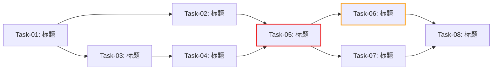

# 开发任务计划: [功能名称]

## 0. 任务概览 (Task Overview)
*   **总任务数**: [N] 个
*   **预计总工时**: [X] 分钟（约 [Y] 小时）
*   **开发方法**: TDD（测试驱动开发）— 每个任务按 Red-Green-Refactor 循环执行
*   **关键里程碑**:
    *   阶段一完成：[日期或工时]
    *   阶段二完成：[日期或工时]
    *   整体完成：[日期或工时]
*   **风险任务**: [列出技术难度高的任务编号]
*   **阻塞任务**: [列出被多个任务依赖的关键任务编号]

### 依赖关系图
> 用 Mermaid 展示任务间的依赖关系和关键路径

### 可并行任务组
> 标注可以同时推进的任务，缩短整体工期

| 并行组 | 可同时执行的任务 | 说明 |
| :--- | :--- | :--- |
| 并行组 1 | Task-02 + Task-03 | 数据访问层与页面组件互不依赖，可同时开发 |
| 并行组 2 | Task-07 + Task-08 | 异常处理与性能优化互不依赖 |

## 1. 准备工作 (Preparation)
- [ ] **Prep-01**: 创建功能分支 `feature/xxx`
    *   说明：从 main/develop 分支创建新分支
    *   验证：分支创建成功
- [ ] **Prep-02**: 确认依赖库/环境就绪
    *   说明：检查技术方案中提到的新依赖是否已安装
    *   验证：项目可正常启动
- [ ] **Prep-03**: 确认测试环境就绪
    *   说明：确认测试框架已配置，能正常运行测试
    *   验证：能成功运行现有测试套件（如有）

## 2. 开发任务 (Development Tasks)
> 按依赖顺序排列，每个任务耗时 < 2h (120m)
> 每个任务按 TDD 循环执行：RED（写测试）→ GREEN（写实现）→ REFACTOR（重构）

### 阶段一：数据层 (Data Layer)
> 先完成数据库设计和数据访问层
>
> **阶段完成标准**: [例如：数据库表已创建且可用、数据访问层 CRUD 操作正常、相关单元测试全部通过]

- [ ] **Task-01**: [任务标题]
    *   **通俗解释**: [用一句话说明这个任务完成后的可感知变化，例如："做完这步后，系统就有了一个专门存放 xxx 信息的'仓库'，后续所有 xxx 数据都会存到这里。"]
    *   **说明**: 创建 xxx 表 / 修改 xxx 表结构
    *   **涉及文件**: `migrations/xxx.sql` 或 `models/xxx.js`
    *   **测试文件**: `tests/unit/xxx.test.js`
    *   **参考**: 技术方案 Sec 3.1
    *   **对应AC**: AC-001
    *   **预估工时**: 60m
    *   **依赖**: 无
    *   **验证标准**（TDD RED 阶段的测试依据）:
        - [ ] 数据库迁移脚本可成功执行，无语法错误
        - [ ] 表包含所有必需字段，类型和约束符合设计文档
        - [ ] 索引创建成功

- [ ] **Task-02**: [任务标题]
    *   **通俗解释**: [例如："做完这步后，代码就能对 xxx 数据进行增删改查了，相当于给仓库配了管理员。"]
    *   **说明**: 实现 xxx 数据访问层（DAO/Repository）
    *   **涉及文件**: `repositories/xxx.js`
    *   **测试文件**: `tests/unit/xxx-repository.test.js`
    *   **参考**: 技术方案 Sec 3.1
    *   **对应AC**: AC-001
    *   **预估工时**: 90m
    *   **依赖**: Task-01
    *   **验证标准**（TDD RED 阶段的测试依据）:
        - [ ] 调用 create({...}) 成功创建记录并返回完整对象
        - [ ] 调用 findByPhone('13800138000') 返回匹配的用户对象
        - [ ] 查询不存在的手机号返回 null
        - [ ] 创建重复手机号记录时抛出约束错误

### 阶段二：表现层 (Presentation Layer)
> 实现前端页面与交互组件
>
> **阶段完成标准**: [例如：所有页面组件可正常渲染、交互逻辑（表单验证、状态管理）可用、使用 Mock 数据时完整流程可走通]

- [ ] **Task-03**: [任务标题]
    *   **通俗解释**: [例如："做完这步后，用户打开页面就能看到 xxx 的界面了，虽然数据还是假的，但样子和最终版一样。"]
    *   **说明**: 实现 xxx 页面组件
    *   **涉及文件**: `components/xxx.jsx`, `pages/xxx.jsx`
    *   **测试文件**: `tests/components/xxx.test.jsx`
    *   **参考**: 技术方案 Sec 2.2
    *   **对应AC**: AC-004
    *   **预估工时**: 60m
    *   **依赖**: Task-01 (数据结构确定后即可开始)
    *   **验证标准**（TDD RED 阶段的测试依据）:
        - [ ] 组件能正常渲染，包含所有必需的 UI 元素
        - [ ] 响应式布局在移动端/桌面端均正常显示
        - [ ] 点击 [按钮] 触发预期的事件处理

- [ ] **Task-04**: [任务标题]
    *   **通俗解释**: [例如："做完这步后，页面上的按钮、表单都能正常响应操作了，比如点提交会校验、填错了会提示。"]
    *   **说明**: 实现 xxx 交互逻辑 (状态管理/表单验证)
    *   **涉及文件**: `components/xxx.jsx`
    *   **测试文件**: `tests/components/xxx-form.test.jsx`
    *   **参考**: 技术方案 Sec 2.2
    *   **对应AC**: AC-005
    *   **预估工时**: 90m
    *   **依赖**: Task-03
    *   **验证标准**（TDD RED 阶段的测试依据）:
        - [ ] 输入合法数据提交后，表单状态正确更新
        - [ ] 输入为空时，显示"[字段名]不能为空"错误提示
        - [ ] 输入非法格式时，显示对应的格式错误提示
        - [ ] 提交过程中按钮显示加载状态，防止重复提交

### 阶段三：业务逻辑层 (Business Logic Layer)
> 实现核心业务逻辑，并对接表现层与数据层
>
> **阶段完成标准**: [例如：API 接口可正常调用且返回格式正确、前端已对接真实 API、核心业务逻辑完整可用]

- [ ] **Task-05**: [任务标题]
    *   **通俗解释**: [例如："做完这步后，前端页面显示的就不再是写死的假数据了，而是从后端服务器实时获取的真实数据。"]
    *   **说明**: 实现 xxx API 接口并对接前端
    *   **涉及文件**: `controllers/xxx.js`, `services/xxx.js`, `components/xxx.jsx`
    *   **测试文件**: `tests/unit/xxx-service.test.js`, `tests/integration/xxx-api.test.js`
    *   **参考**: 技术方案 Sec 2.2
    *   **对应AC**: AC-002
    *   **预估工时**: 120m
    *   **依赖**: Task-02, Task-04
    *   **风险标注**: 涉及前后端联调
    *   **验证标准**（TDD RED 阶段的测试依据）:
        - [ ] POST /api/xxx 传入合法参数，返回 200 和预期的 JSON 结构
        - [ ] 传入缺失必填字段，返回 400 和具体的错误信息
        - [ ] 未登录状态访问，返回 401
        - [ ] 前端调用 API 后能正确渲染返回数据

- [ ] **Task-06**: [任务标题]
    *   **通俗解释**: [例如："做完这步后，系统就拥有了 xxx 的核心计算能力，比如能根据规则自动算出结果。"]
    *   **说明**: 实现 xxx 核心算法
    *   **涉及文件**: `services/xxx.js`
    *   **测试文件**: `tests/unit/xxx-algorithm.test.js`
    *   **参考**: 技术方案 Sec 4.1
    *   **对应AC**: AC-003
    *   **预估工时**: 120m
    *   **依赖**: Task-05
    *   **阻塞标注**: 后续任务依赖
    *   **验证标准**（TDD RED 阶段的测试依据）:
        - [ ] 输入 [典型数据] 时，输出 [预期结果]
        - [ ] 输入 [边界数据] 时，输出 [预期边界结果]
        - [ ] 输入 [非法数据] 时，抛出 [预期错误]
        - [ ] 处理 [大数据量] 时，执行时间 < [阈值]ms

### 阶段四：接口对接层 (Mock → Real API Integration)
> 条件阶段：仅当技术方案中存在 Mock 数据或模拟接口时才需要此阶段。将所有 Mock 替换为真实接口调用，确保功能从"演示可用"升级为"生产可用"。
>
> **阶段完成标准**: [例如：所有 Mock 数据已替换为真实 API 调用、代码中无遗留 Mock 引用、真实数据环境下完整业务流程跑通]

- [ ] **Task-XX**: 替换 xxx 模块的 Mock 数据为真实 API
    *   **通俗解释**: [例如："做完这步后，xxx 模块显示的就不再是写死的假数据了，而是从真实服务器获取的实时数据。"]
    *   **说明**: 移除 xxx 模块中的 Mock 数据/模拟接口，替换为真实 API 调用；适配真实接口的数据格式差异
    *   **涉及文件**: `services/xxx.js`, `api/xxx.js`, `mocks/xxx.js`（移除）
    *   **测试文件**: `tests/integration/xxx-real-api.test.js`
    *   **参考**: 技术方案 Sec X.X (API 设计章节)
    *   **对应AC**: AC-XXX
    *   **预估工时**: 60m
    *   **依赖**: Task-05 (对应 API 接口已实现)
    *   **验证标准**（TDD RED 阶段的测试依据）:
        - [ ] Mock 文件/Mock 数据已移除或仅保留开发环境 fallback
        - [ ] 前端调用真实 API 且数据展示正确
        - [ ] 接口异常时有合理的错误处理（非白屏/崩溃）

- [ ] **Task-XX**: 真实接口联调验证
    *   **通俗解释**: [例如："做完这步后，整个功能在真实数据环境下完整跑通一遍，确认没有因为换掉假数据而出现的问题。"]
    *   **说明**: 在真实接口环境下进行完整流程联调，验证数据格式适配、边界值处理、加载状态和错误状态
    *   **涉及文件**: 涉及所有已对接真实接口的模块
    *   **测试文件**: `tests/integration/xxx-e2e.test.js`
    *   **参考**: 需求文档验收标准
    *   **对应AC**: 所有 AC
    *   **预估工时**: 90m
    *   **依赖**: 所有 Mock 替换任务完成
    *   **风险标注**: 真实数据可能暴露 Mock 阶段未覆盖的边界情况
    *   **验证标准**（TDD RED 阶段的测试依据）:
        - [ ] 所有页面在真实数据下展示正常（含空数据、大量数据场景）
        - [ ] 完整业务流程在真实接口下跑通
        - [ ] 无遗留的 Mock 引用（代码中搜索确认）

### 阶段五：异常处理与优化 (Error Handling & Optimization)
> 完善异常处理和性能优化
>
> **阶段完成标准**: [例如：所有异常场景都有友好的用户提示、性能指标达标、缓存策略生效]

- [ ] **Task-07**: [任务标题]
    *   **通俗解释**: [例如："做完这步后，系统在出错时不会白屏或卡死，而是会友好地告诉用户哪里出了问题、该怎么办。"]
    *   **说明**: 实现异常场景处理
    *   **涉及文件**: `services/xxx.js`, `components/xxx.jsx`
    *   **测试文件**: `tests/unit/xxx-errors.test.js`, `tests/components/xxx-error-states.test.jsx`
    *   **参考**: 技术方案 Sec 5
    *   **对应AC**: AC-006 (异常场景)
    *   **预估工时**: 60m
    *   **依赖**: Task-05
    *   **验证标准**（TDD RED 阶段的测试依据）:
        - [ ] 网络请求失败时，界面显示重试按钮和错误提示
        - [ ] 权限不足时，返回 403 并跳转到无权限页
        - [ ] 数据为空时，显示空状态页而非空白页
        - [ ] 服务端返回 500 时，前端显示友好的错误提示

- [ ] **Task-08**: [任务标题]
    *   **通俗解释**: [例如："做完这步后，页面加载和操作响应会明显变快，重复访问的数据不会每次都重新请求。"]
    *   **说明**: 性能优化和缓存实现
    *   **涉及文件**: `services/xxx.js`, `utils/cache.js`
    *   **测试文件**: `tests/unit/xxx-cache.test.js`
    *   **参考**: 技术方案 Sec 6
    *   **对应AC**: 非功能需求
    *   **预估工时**: 60m
    *   **依赖**: Task-07
    *   **验证标准**（TDD RED 阶段的测试依据）:
        - [ ] 首次请求后，相同请求命中缓存不再访问数据库
        - [ ] 缓存过期后，重新从数据库获取最新数据
        - [ ] 数据更新后，相关缓存被正确清除

### 阶段性集成验证 (Stage Integration Verification)
> 所有任务完成后，运行全量测试并进行端到端验证

- [ ] **Verify-01**: 全量测试运行
    *   **说明**: 运行所有阶段产出的测试套件，确保无回归
    *   **验证标准**:
        - [ ] 所有单元测试通过
        - [ ] 所有集成测试通过
        - [ ] 所有组件测试通过
        - [ ] 测试覆盖率 > 80%

- [ ] **Verify-02**: 端到端验证
    *   **说明**: 按照验收标准逐项进行端到端验证
    *   **验证标准**:
        - [ ] 完整业务流程走通
        - [ ] 所有 AC 验收标准通过
        - [ ] 无阻塞性问题

## 3. 验收标准检查清单 (AC Checklist)
> 确保所有验收标准都有对应的任务

| 验收标准ID | 验收标准描述 | 对应任务 | 状态 |
| :--- | :--- | :--- | :--- |
| AC-001 | [描述] | Task-01, Task-02 | 待完成 |
| AC-002 | [描述] | Task-05 | 待完成 |
| AC-003 | [描述] | Task-06 | 待完成 |
| AC-004 | [描述] | Task-03 | 待完成 |
| AC-005 | [描述] | Task-04 | 待完成 |

## 4. 验证计划 (Verification Plan)
> 根据实际任务和验收标准动态生成，每个检查项必须关联到具体的任务编号或 AC

### 4.1 TDD 过程验证（每个任务内部）
- [ ] RED：测试编写完成后运行，确认全部失败
- [ ] GREEN：实现代码后运行，确认全部通过
- [ ] REFACTOR：重构后运行，确认仍全部通过

### 4.2 阶段验证检查点
> 每个阶段完成后，按照该阶段的「阶段完成标准」逐项验证

| 阶段 | 验证动作 | 关联任务 | 通过标准 |
| :--- | :--- | :--- | :--- |
| 阶段一完成后 | [例如：执行数据层单元测试] | Task-01, Task-02 | [例如：CRUD 测试全部通过] |
| 阶段二完成后 | [例如：使用 Mock 数据走通完整 UI 流程] | Task-03, Task-04 | [例如：所有页面可正常渲染和交互] |
| 阶段三完成后 | [例如：前后端联调测试] | Task-05, Task-06 | [例如：API 返回正确、前端展示正常] |
| ... | ... | ... | ... |

### 4.3 验收标准逐项验证
> 对照需求文档的 AC，明确每条 AC 的验证方式和关联任务

| AC | 验证方式 | 关联任务 | 状态 |
| :--- | :--- | :--- | :--- |
| AC-001 | [例如：运行 Task-01、Task-02 的单元测试] | Task-01, Task-02 | 待验证 |
| AC-002 | [例如：调用 API 验证返回格式，检查前端数据展示] | Task-05 | 待验证 |
| ... | ... | ... | ... |

### 4.4 最终验证（所有阶段完成后）
- [ ] 运行全量测试套件（覆盖率 > 80%）
- [ ] 按照验收标准逐项端到端验证
- [ ] 代码规范检查（Linter + 类型检查）
- [ ] 性能测试（响应时间、并发量）
- [ ] 安全测试（权限校验、数据校验）

### 4.5 上线前检查
- [ ] 代码审查（Code Review）
- [ ] 文档更新（API 文档、README）
- [ ] 数据库迁移脚本验证（如适用）
- [ ] 回滚方案准备（如适用）

## 5. 风险与注意事项 (Risks & Notes)
*   **技术风险**: [列出风险任务及应对方案]
*   **依赖风险**: [列出外部依赖或阻塞任务]
*   **时间风险**: [如果工时超出预期，哪些任务可以延后]
*   **质量保证**: 每个任务通过 TDD 循环保证代码质量，阶段性集成验证保证整体稳定性
