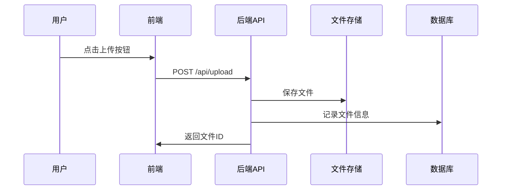

# 技术设计文档: [功能名称]

## 0. 设计概要 (Design Summary)
*   **功能描述**：[一句话描述这个功能]
*   **影响范围**：[列出涉及的模块，例如：用户模块、权限模块]
*   **技术难点**：[如果有，列出关键技术挑战]
*   **依赖关系**：[是否依赖其他功能或外部服务]

## 1. 架构概览 (Architecture Overview)
*   简述改动涉及的模块及其交互关系。
*   **UI/逻辑映射**：说明前端组件如何消费后端 API（例如：Login 组件点击时调用 /api/login）。
*   数据流向说明（从用户操作到数据存储的完整链路）。
*   (推荐) Mermaid 流程图或时序图。

**示例**：


## 2. API 设计 (API Design)
> 遵循项目约定的 API 风格（RESTful / GraphQL / RPC）

### 2.1 接口列表
| 接口名称 | 方法 | 路径 | 描述 | 对应验收标准 |
| :--- | :--- | :--- | :--- | :--- |
| [接口1] | POST | /api/xxx | ... | AC-001 |

### 2.2 接口详情
#### 接口 1: [接口名称]
*   **路径**: `METHOD /path/to/resource`
*   **描述**: [接口功能说明]
*   **鉴权**: [是否需要登录/权限]
*   **Request**:
    ```json
    {
      "field1": "string",
      "field2": 123
    }
    ```
*   **Response (成功)**:
    ```json
    {
      "code": 200,
      "data": { ... }
    }
    ```
*   **Response (失败)**:
    ```json
    {
      "code": 400,
      "message": "错误描述"
    }
    ```
*   **异常处理**:
    *   参数校验失败 → 返回 400
    *   权限不足 → 返回 403
    *   [其他异常场景]

## 3. 数据库设计 (Database Schema)
> 遵循项目数据库规范

### 3.1 新增表
#### 表名: `table_name`
*   **用途**: [表的业务含义]
*   **字段定义**:
    | 字段名 | 类型 | 约束 | 说明 |
    | :--- | :--- | :--- | :--- |
    | id | BIGINT | PK, AUTO_INCREMENT | 主键 |
    | user_id | BIGINT | NOT NULL, INDEX | 用户ID |
    | created_at | TIMESTAMP | DEFAULT CURRENT_TIMESTAMP | 创建时间 |
*   **索引**:
    *   PRIMARY KEY: `id`
    *   INDEX: `idx_user_id` (user_id)
*   **创建 SQL**:
    ```sql
    CREATE TABLE table_name (
      id BIGINT PRIMARY KEY AUTO_INCREMENT,
      user_id BIGINT NOT NULL,
      created_at TIMESTAMP DEFAULT CURRENT_TIMESTAMP,
      INDEX idx_user_id (user_id)
    );
    ```

### 3.2 修改表
#### 表名: `existing_table`
*   **变更说明**: [为什么要修改]
*   **变更 SQL**:
    ```sql
    ALTER TABLE existing_table ADD COLUMN new_field VARCHAR(255);
    ```
*   **数据迁移**: [是否需要数据迁移脚本]

## 4. 核心逻辑与算法 (Core Logic)
> 描述关键业务逻辑的处理流程

### 4.1 [核心流程名称]
*   **触发条件**: [什么时候执行]
*   **处理步骤**:
    1. 步骤1：[描述]
    2. 步骤2：[描述]
    3. 步骤3：[描述]
*   **伪代码** (可选):
    ```
    function handleUpload(file):
      if file.size > MAX_SIZE:
        throw Error("文件过大")
      
      fileId = storage.save(file)
      db.insert({ fileId, userId, timestamp })
      
      return fileId
    ```
*   **状态机** (如果涉及状态流转):
    ```
    [待审核] --审核通过--> [已通过]
    [待审核] --审核拒绝--> [已拒绝]
    ```

### 4.2 [其他核心逻辑]
*   ...

## 5. 异常处理 (Error Handling)
> 针对需求文档中的异常场景和边界条件，设计具体的处理方案

| 异常场景 | 对应验收标准 | 处理方案 | 用户提示 |
| :--- | :--- | :--- | :--- |
| 网络请求失败 | AC-001 | 重试3次，失败后提示用户 | "网络异常，请稍后重试" |
| 数据为空 | AC-002 | 显示空状态页 | "暂无数据" |
| 权限不足 | AC-003 | 返回403，跳转到无权限页 | "您没有访问权限" |

## 6. 安全与性能 (Security & Performance)
*   **鉴权机制**: [如何验证用户身份和权限]
*   **数据校验**: [输入参数如何校验]
*   **限流策略**: [是否需要限流，如何限流]
*   **缓存策略**: [哪些数据需要缓存，缓存时长]
*   **性能指标**: [响应时间、并发量等要求]
*   **安全考虑**: [敏感数据加密、SQL注入防护等]

## 7. 验收标准映射 (AC Mapping)
> 确保每个验收标准都有对应的技术实现

| 验收标准ID | 验收标准描述 | 对应技术实现 |
| :--- | :--- | :--- |
| AC-001 | 用户可以上传文件 | API: POST /api/upload |
| AC-002 | 文件大小限制10MB | API参数校验 + 前端校验 |
| AC-003 | 上传失败显示错误 | 异常处理 + 错误提示组件 |

## 8. 技术决策说明 (Technical Decisions)
*   **决策1**: [为什么选择这个方案而不是其他方案]
    *   理由：[性能更好 / 更易维护 / 符合现有架构]
*   **决策2**: [是否引入新的库或技术]
    *   理由：[解决了什么问题]

## 9. 风险与注意事项 (Risks & Notes)
*   **技术风险**: [可能遇到的技术问题]
*   **兼容性**: [是否影响现有功能]
*   **性能影响**: [是否会影响系统性能]
*   **回滚方案**: [如果上线后出问题，如何回滚]
