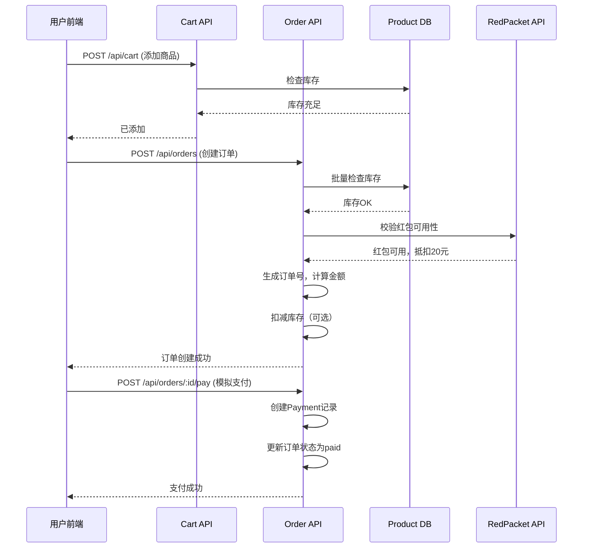

# CRM系统核心功能技术方案

> **版本**: v1.0  
> **日期**: 2026-04-10  
> **状态**: 待评审  
> **涉及模块**: 数据统计、视频营销、产品销售、红包系统

---

## 📋 项目概述

### 1.1 背景与目标

当前CRM系统存在以下问题：
- ❌ 数据统计页面（statistics/index.vue）**完全硬编码**，数据不真实
- ❌ 缺少完整的电商功能（商品、购物车、订单）
- ❌ 红包功能仅有表结构，未实现业务逻辑
- ❌ 视频与产品未关联，无法形成营销闭环

### 1.2 技术约束

| 约束项 | 说明 |
|--------|------|
| **前端框架** | UniApp + Vue3 (Composition API) |
| **后端框架** | Express.js + MongoDB (Mongoose) |
| **文件存储** | 本地服务器 /uploads 目录 + Nginx 静态服务 |
| **支付方式** | 模拟支付（数据库记录交易，预留微信/支付宝接口） |
| **部署环境** | Linux服务器 (120.55.195.40)，PM2进程管理 |

---

## 🎯 功能模块一：数据统计全面升级

### 1.1 当前问题分析

**文件位置**: `src/pages/admin/statistics/index.vue` (第142-210行)

**硬编码数据清单**:
```javascript
// 统计卡片 - 完全假数据
statCards = [
  { value: '128', label: '新增用户' },      // ❌ 硬编码
  { value: '1,024', label: '活跃用户' },     // ❌ 硬编码
  { value: '5,678', label: '视频观看' },      // ❌ 硬编码
  { value: '¥12,345', label: '充值金额' }    // ❌ 硬编码
]

// 时间切换 - 也是预设数据
handleTimeChange() {
  baseValues[0] = [{ value: '128' }, ...]   // 今日
  baseValues[1] = [{ value: '892' }, ...]   // 本周
  // ...
}

// 热门视频 - 假数据
topVideos = [
  { title: 'HIIT燃脂训练', views: '2,341' }  // ❌ 假数据
]
```

### 1.2 技术方案

#### A. 新增后端API接口

**接口1: 获取统计数据概览**
```
GET /api/statistics/overview?period=today|week|month|year

Response:
{
  "success": true,
  "data": {
    "period": "today",
    "timestamp": "2026-04-10T00:00:00Z",
    "cards": [
      {
        "key": "newUsers",          // 新增用户
        "label": "新增用户",
        "value": 128,
        "trend": 12.5,              // 环比增长率%
        "chartData": [40, 60, 45...] // 迷你图表数据(近7天)
      },
      {
        "key": "activeUsers",       // 活跃用户
        "label": "活跃用户",
        "value": 1024,
        "trend": 8.3
      },
      {
        "key": "videoViews",        // 视频观看次数
        "label": "视频观看",
        "value": 5678,
        "trend": -2.4
      },
      {
        "key": "revenue",           // 营收金额
        "label": "营收金额",
        "value": 12345,
        "trend": 23.1,
        "prefix": "¥"
      },
      {
        "key": "orderCount",        // 订单数量 (新增)
        "label": "订单数",
        "value": 89,
        "trend": 15.2
      },
      {
        "key": "redPacketSent",     // 红包发放数 (新增)
        "label": "红包发放",
        "value": 256,
        "trend": 45.6
      }
    ],
    "userGrowthChart": {            // 用户增长趋势图
      "xLabels": ["周一", "周二"...],
      "datasets": [
        { "label": "新增用户", "data": [85, 92, 78...] },
        { "label": "活跃用户", "data": [120, 135, 128...] }
      ]
    }
  }
}
```

**接口2: 获取热门视频排行**
```
GET /api/statistics/top-videos?limit=10&period=week

Response:
{
  "success": true,
  "data": {
    "list": [
      {
        "_id": "xxx",
        "title": "测试视频",
        "views": 2341,              // 观看次数
        "completionRate": 80.2,     // 完播率%
        "duration": 15,             // 时长(秒)
        "category": "其他"
      }
    ]
  }
}
```

**接口3: 获取数据洞察**
```
GET /api/statistics/insights?period=week

Response:
{
  "success": true,
  "data": {
    "insights": [
      {
        "type": "growth",
        "title": "用户增长强劲",
        "desc": "本周新增用户同比增长12.5%，主要来源为社交分享",
        "icon": "📈"
      },
      {
        "type": "optimization",
        "title": "完播率提升建议",
        "desc": "热门视频平均完播率达76%，建议增加晚间内容推送",
        "icon": "💡"
      }
    ]
  }
}
```

#### B. 后端核心逻辑实现

**文件**: `server/routes/statistics.js` (新建)

```javascript
// 关键查询逻辑示例
async function getOverview(period) {
  const now = new Date()
  const periodMap = {
    'today': new Date(now.setHours(0, 0, 0, 0)),
    'week': new Date(now.setDate(now.getDate() - 7)),
    'month': new Date(now.setMonth(now.getMonth() - 1)),
    'year': new Date(now.setFullYear(now.getFullYear() - 1))
  }
  const startDate = periodMap[period]
  
  // 并行查询所有统计数据
  const [newUsers, activeUsers, videoViews, orders, redPackets] = await Promise.all([
    User.countDocuments({ createdAt: { $gte: startDate } }),
    VideoWatch.distinct('userId', { createdAt: { $gte: startDate } }).length,
    VideoWatch.countDocuments({ createdAt: { $gte: startDate } }),
    Order.countDocuments({ createdAt: { $gte: startDate, status: 'completed' }),
    RedPacketRecord.countDocuments({ claimedAt: { $gte: startDate } })
  ])
  
  // 计算环比增长率
  const prevPeriodStart = getPreviousPeriodStart(period)
  const prevNewUsers = await User.countDocuments({
    createdAt: { $gte: prevPeriodStart, $lt: startDate }
  })
  const trend = prevNewUsers > 0 
    ? ((newUsers - prevNewUsers) / prevNewUsers * 100).toFixed(1) 
    : 0
    
  return { newUsers, activeUsers, videoViews, orders, redPackets, trend }
}
```

#### C. 数据库新增集合（可选）

如果需要高性能统计，可创建**预聚合集合**:

```javascript
// server/models/DailyStats.js (新建)
const DailyStatsSchema = new Schema({
  date: { type: Date, required: true, unique: true },       // 统计日期
  newUsers: { type: Number, default: 0 },                     // 新增用户数
  activeUsers: { type: Number, default: 0 },                  // 活跃用户数
  videoViews: { type: Number, default: 0 },                   // 观看次数
  orderCount: { type: Number, default: 0 },                   // 订单数
  revenue: { type: Number, default: 0 },                      // 营收额
  redPacketClaimed: { type: Number, default: 0 },             // 红包领取数
  createdAt: { type: Date, default: Date.now }
})

// 复合索引
DailyStatsSchema.index({ date: 1 }, { unique: true })
```

**定时任务** (每日凌晨统计):
```javascript
// server/crons/daily-stats.js (新建)
node-cron.schedule('0 0 * * *', async () => {
  const today = new Date()
  today.setHours(0, 0, 0, 0)
  
  await DailyStats.findOneAndUpdate(
    { date: today },
    {
      $setOnInsert: { date: today },
      newUsers: await User.count({...}),
      activeUsers: await VideoWatch.distinct('userId',{...}).length,
      // ... 其他统计
    },
    { upsert: true, new: true }
  )
})
```

#### D. 前端改造要点

**文件**: `src/pages/admin/statistics/index.vue`

**改动点**:
1. ✅ 删除所有硬编码数据（第142-210行）
2. ✅ 在 `onMounted` 中调用 `/api/statistics/overview`
3. ✅ `handleTimeChange` 改为重新请求API（带不同period参数）
4. ✅ `refreshChart` 改为真实刷新（不是随机数）
5. ✅ `topVideos` 从 `/api/statistics/top-videos` 获取
6. ✅ `insights` 从 `/api/statistics/insights` 获取
7. ✅ 添加加载状态和错误处理

**代码示例**:
```typescript
// 替换硬编码的 statCards
const statCards = ref([])
const loading = ref(false)

async function loadStatistics(period = 'today') {
  loading.value = true
  try {
    const res = await uni.request({ url: '/api/statistics/overview', data: { period } })
    if (res.data.success) {
      statCards.value = res.data.data.cards
      chartData.value = res.data.data.userGrowthChart
    }
  } finally {
    loading.value = false
  }
}

onMounted(() => {
  loadStatistics('today')
  loadTopVideos()
  loadInsights()
})
```

### 1.3 验收标准映射

| AC编号 | 验收标准 | 技术实现点 | 状态 |
|--------|----------|------------|------|
| STAT-001 | 打开统计页面显示真实数据 | GET /api/statistics/overview | ⏳待开发 |
| STAT-002 | 切换时间维度（今日/本周/本月/本年）数据变化 | period参数查询 | ⏳待开发 |
| STAT-003 | 显示环比增长率和趋势箭头 | trend字段计算 | ⏳待开发 |
| STAT-004 | 用户增长趋势图显示真实数据 | userGrowthChart聚合 | ⏳待开发 |
| STAT-005 | 热门视频排行来自数据库 | VideoWatch聚合查询 | ⏳待开发 |
| STAT-006 | 刷新按钮重新拉取最新数据 | 重新调用API | ⏳待开发 |
| STAT-007 | 新增订单数和红包发放数指标 | Order/RedPacket查询 | ⏳待开发 |
| STAT-008 | 数据为空时显示友好提示 | 前端空状态处理 | ⏳待开发 |

---

## 🎬 功能模块二：视频营销功能完善

### 2.1 当前状态

**已有功能**:
- ✅ 视频上传（Multer + ffprobe提取时长）
- ✅ 视频播放（HTML5 video标签）
- ✅ 视频观看记录（VideoWatch模型）
- ✅ 视频列表管理

**缺失功能**:
- ❌ 视频与产品/商品关联
- ❌ 视频分类体系完善
- ❌ 视频推荐机制
- ❌ 视频营销数据分析

### 2.2 技术方案

#### A. 数据库模型扩展

**修改现有Video模型** (`server/models/Video.js`):
```javascript
const VideoSchema = new Schema({
  // ... 现有字段保持不变
  
  // 新增字段
  productId: { type: Schema.Types.ObjectId, ref: 'Product' },  // 关联商品ID
  productIds: [{ type: Schema.Types.ObjectId, ref: 'Product' }], // 多商品关联
  categoryPath: { type: String },  // 分类路径: "健康/营养/维生素"
  tags: [{ type: String }],        // 标签数组
  isMarketing: { type: Boolean, default: false },  // 是否营销视频
  marketingType: {                // 营销类型
    type: String,
    enum: ['product_intro', 'tutorial', 'testimonial', 'live']
  },
  ctaText: { type: String },      // 行动号召文字（如"立即购买"）
  ctaLink: { type: String },      // 行动号召链接（商品详情页URL）
  conversionRate: { type: Number, default: 0 },  // 转化率
  viewToOrderCount: { type: Number, default: 0 }, // 观看后下单数
  
  // SEO相关
  seoTitle: { type: String },
  seoDescription: { type: String },
  seoKeywords: [{ type: String }]
})

// 复合索引（提升查询性能）
VideoSchema.index({ categoryPath: 1, status: 1, createdAt: -1 })
VideoSchema.index({ productId: 1, isMarketing: 1 })
```

#### B. 新增API接口

**接口1: 获取营销视频列表**
```
GET /api/videos/marketing?category=xxx&page=1&pageSize=10

Query参数:
- category: 分类筛选
- productId: 关联商品筛选
- sortBy: 排序方式 (views|conversion|recent)

Response:
{
  "success": true,
  "data": {
    "list": [{
      "_id": "xxx",
      "title": "维生素C补充指南",
      "videoUrl": "/uploads/videos/xxx.mp4",
      "coverImage": "/uploads/covers/xxx.jpg",
      "productId": "prod_xxx",
      "productName": "天然维生素C片",
      "productPrice": 99.00,
      "viewCount": 1234,
      "conversionRate": 12.5,
      "ctaText": "立即购买",
      "ctaLink": "/pages/user/product/detail?id=prod_xxx"
    }],
    "pagination": {...}
  }
}
```

**接口2: 关联视频到商品**
```
PUT /api/videos/:id/link-product
Body:
{
  "productId": "prod_xxx",
  "ctaText": "查看详情并购买"
}

Response:
{
  "success": true,
  "message": "关联成功",
  "data": { "video": {...} }
}
```

**接口3: 视频转化追踪**
```
POST /api/videos/:id/conversion
Body:
{
  "action": "click_cta" | "view_product" | "add_to_cart",
  "userId": "user_xxx"
}

Response:
{
  "success": true,
  "message": "转化事件已记录"
}
```

#### C. 前端页面设计

**新增页面**: 
- `src/pages/admin/video/marketing-list.vue` (营销视频管理)
- `src/pages/user/video/marketing.vue` (用户端营销视频展示)

**关键交互流程**:
```
用户浏览营销视频 → 观看视频 → 显示商品卡片(悬浮) → 点击CTA → 商品详情页 → 加入购物车 → 下单
```

**视频播放器增强** (`src/pages/user/video/player.vue`):
```vue
<!-- 在视频下方显示关联商品 -->
<view class="related-product" v-if="videoInfo.productId">
  <image :src="product.coverImage" mode="aspectFill" />
  <view class="product-info">
    <text class="name">{{ product.name }}</text>
    <text class="price">¥{{ product.price }}</text>
  </view>
  <button @tap="goToProduct">立即购买</button>
</view>
```

### 2.3 验收标准映射

| AC编号 | 验收标准 | 实现点 |
|--------|----------|--------|
| VIDEO-001 | 管理员可为视频关联商品 | PUT /link-product 接口 |
| VIDEO-002 | 视频播放时显示商品卡片 | 前端player.vue改造 |
| VIDEO-003 | 记录视频→购买转化漏斗 | POST /conversion 接口 |
| VIDEO-004 | 营销视频列表支持分类筛选 | GET /marketing 接口 |
| VIDEO-005 | 统计各视频转化率 | conversionRate计算逻辑 |

---

## 🛍️ 功能模块三：产品销售（电商）功能

### 3.1 功能范围

**本次实现**:
- ✅ 商品管理（CRUD + 分类 + 上架/下架）
- ✅ 商品详情展示
- ✅ 购物车（添加/删除/修改数量）
- ✅ 订单管理（创建/支付/发货/完成/取消）
- ✅ 模拟支付（数据库记录，预留真实支付接口）

**不在本次范围**:
- ❌ 微信/支付宝真实支付SDK集成（预留接口）
- ❌ 物流跟踪API对接
- ❌ 优惠券/满减活动（后续迭代）
- ❌ 库存管理（简化版，暂不做库存扣减）

### 3.2 数据库设计

#### A. 商品表 (Product)

**新建文件**: `server/models/Product.js`

```javascript
const ProductSchema = new Schema({
  // 基本信息
  name: { type: String, required: true, maxlength: 100 },         // 商品名称
  description: { type: String },                                  // 详细描述
  category: {                                                    // 分类
    type: String,
    required: true,
    enum: ['vitamin', 'supplement', 'health_food', 'equipment', 'other']
  },
  subCategory: { type: String },                                 // 子分类
  
  // 价格信息
  price: { type: Number, required: true, min: 0 },               // 现价
  originalPrice: { type: Number, min: 0 },                       // 原价
  currency: { type: String, default: 'CNY' },                    // 货币单位
  
  // 图片
  coverImage: { type: String },                                   // 主图URL
  images: [{ type: String }],                                     // 详情图列表
  
  // 库存（简化版）
  stock: { type: Number, default: 0, min: 0 },                   // 库存数量
  stockStatus: {                                                  // 库存状态
    type: String,
    enum: ['in_stock', 'low_stock', 'out_of_stock'],
    default: 'in_stock'
  },
  
  // 销售信息
  salesCount: { type: Number, default: 0 },                       // 销量
  viewCount: { type: Number, default: 0 },                        // 浏览量
  rating: { type: Number, min: 0, max: 5, default: 5 },           // 评分
  reviewCount: { type: Number, default: 0 },                      // 评价数
  
  // 关联
  relatedVideoId: { type: Schema.Types.ObjectId, ref: 'Video' }, // 关联视频
  tags: [{ type: String }],                                      // 标签
  
  // 规格（可选，如不同规格不同价格）
  variants: [{
    name: { type: String },             // 规格名称（如"100粒装"）
    price: { type: Number },            // 该规格价格
    stock: { type: Number }             // 该规格库存
  }],
  
  // 状态
  status: {
    type: String,
    enum: ['draft', 'active', 'inactive', 'archived'],
    default: 'draft'
  },
  isRecommended: { type: Boolean, default: false },              // 是否推荐
  isNew: { type: Boolean, default: false },                      // 是否新品
  isHot: { type: Boolean, default: false },                      // 是否热销
  
  // SEO
  slug: { type: String, unique: true },                          // URL友好的标识符
  
  createdBy: { type: Schema.Types.ObjectId, ref: 'User' },
  createdAt: { type: Date, default: Date.now },
  updatedAt: { type: Date, default: Date.now }
})

// 索引
ProductSchema.index({ category: 1, status: 1, salesCount: -1 })
ProductSchema.index({ status: 1, isRecommended: 1, createdAt: -1 })
ProductSchema.index({ name: 'text', description: 'text' })  // 全文搜索
```

#### B. 购物车表 (Cart)

**新建文件**: `server/models/Cart.js`

```javascript
const CartItemSchema = new Schema({
  userId: { type: Schema.Types.ObjectId, ref: 'User', required: true },
  productId: { type: Schema.Types.ObjectId, ref: 'Product', required: true },
  quantity: { type: Number, required: true, min: 1, default: 1 },
  variantName: { type: String },          // 选择的规格名称
  price: { type: Number, required: true }, // 添加时的价格（快照）
  addedAt: { type: Date, default: Date.now }
})

// 复合唯一索引：同一用户同一商品只能有一条记录
CartItemSchema.index({ userId: 1, productId: 1 }, { unique: true })
```

#### C. 订单表 (Order)

**新建文件**: `server/models/Order.js`

```javascript
const OrderSchema = new Schema({
  // 订单编号
  orderNo: {                                                       // 订单号（如：202604100001）
    type: String,
    required: true,
    unique: true
  },
  
  // 用户信息
  userId: { type: Schema.Types.ObjectId, ref: 'User', required: true },
  userName: { type: String },
  userPhone: { type: String },
  
  // 商品明细
  items: [{
    productId: { type: Schema.Types.ObjectId, ref: 'Product' },
    productName: { type: String },
    productImage: { type: String },
    quantity: { type: Number, required: true, min: 1 },
    price: { type: Number, required: true },          // 单价（快照）
    variantName: { type: String },
    subtotal: { type: Number }                           // 小计
  }],
  
  // 金额
  totalAmount: { type: Number, required: true },         // 总金额
  discountAmount: { type: Number, default: 0 },           // 优惠金额
  finalAmount: { type: Number, required: true },         // 实付金额
  shippingFee: { type: Number, default: 0 },             // 运费
  
  // 支付信息
  paymentMethod: {                                          // 支付方式
    type: String,
    enum: ['mock', 'wechat', 'alipay'],
    default: 'mock'
  },
  paymentStatus: {                                         // 支付状态
    type: String,
    enum: ['pending', 'paid', 'failed', 'refunded'],
    default: 'pending'
  },
  paidAt: { type: Date },                                  // 支付时间
  transactionId: { type: String },                         // 第三方交易号（预留）
  
  // 收货地址
  shippingAddress: {
    receiverName: { type: String, required: true },
    receiverPhone: { type: String, required: true },
    province: { type: String, required: true },
    city: { type: String, required: true },
    district: { type: String, required: true },
    detailAddress: { type: String, required: true },
    postalCode: { type: String }
  },
  
  // 物流信息
  logisticsCompany: { type: String },
  trackingNo: { type: String },
  shippedAt: { type: Date },
  deliveredAt: { type: Date },
  
  // 订单状态
  status: {
    type: String,
    enum: [
      'pending_payment',   // 待支付
      'paid',              // 已支付
      'shipping',          // 发货中
      'delivered',         // 已送达
      'completed',         // 已完成
      'cancelled',         // 已取消
      'refunded'           // 已退款
    ],
    default: 'pending_payment'
  },
  
  // 备注
  buyerRemark: { type: String },                            // 买家备注
  sellerRemark: { type: String },                           // 卖家备注
  
  // 红包抵扣（关联红包功能）
  redPacketUsed: { type: Schema.Types.ObjectId, ref: 'RedPacketRecord' },
  redPacketDiscount: { type: Number, default: 0 },
  
  // 时间戳
  createdAt: { type: Date, default: Date.now },
  updatedAt: { type: Date, default: Date.now }
})

// 索引
OrderSchema.index({ userId: 1, createdAt: -1 })
OrderSchema.index({ orderNo: 1 }, { unique: true })
OrderSchema.index({ status: 1, createdAt: -1 })

// 自动生成订单号
OrderSchema.pre('save', function(next) {
  if (!this.orderNo) {
    const date = new Date().toISOString().slice(0,10).replace(/-/g,'')
    const random = Math.floor(Math.random() * 10000).toString().padStart(4, '0')
    this.orderNo = `${date}${random}`
  }
  next()
})
```

#### D. 支付记录表 (Payment)

**新建文件**: `server/models/Payment.js`

```javascript
const PaymentSchema = new Schema({
  orderId: { type: Schema.Types.ObjectId, ref: 'Order', required: true },
  orderNo: { type: String, required: true },
  userId: { type: Schema.Types.ObjectId, ref: 'User', required: true },
  
  amount: { type: Number, required: true },                   // 支付金额
  method: { type: String, enum: ['mock', 'wechat', 'alipay'] },
  
  // 第三方信息（预留）
  transactionId: { type: String },                           // 第三方流水号
  prepayId: { type: String },                                // 预支付ID（微信）
  
  status: {
    type: String,
    enum: ['created', 'processing', 'success', 'failed', 'closed'],
    default: 'created'
  },
  
  callbackData: { type: Schema.Types.Mixed },                 // 回调原始数据
  
  createdAt: { type: Date, default: Date.now },
  paidAt: { type: Date }
})
```

### 3.3 API接口设计

#### 商品管理API

```
# 商品列表（用户端）
GET /api/products?page=1&pageSize=10&category=vitamin&sort=sales|price|new
Response: { success, data: { list: [...], pagination: {} } }

# 商品详情
GET /api/products/:id
Response: { success, data: { product: {...}, relatedProducts: [...] } }

# 商品搜索
GET /api/products/search?keyword=维生素
Response: { success, data: { list: [...] } }

# 管理端：创建商品
POST /api/admin/products
Body: { name, description, category, price, images[], ... }
Response: { success, data: { product: {...} } }

# 管理端：更新商品
PUT /api/admin/products/:id
Body: { ... }
Response: { success, message: "更新成功" }

# 管理端：上下架
PATCH /api/admin/products/:id/status
Body: { status: "active" | "inactive" }
Response: { success, message: "操作成功" }
```

#### 购物车API

```
# 获取购物车
GET /api/cart
Response: { 
  success, 
  data: {
    items: [{
      _id, productId, quantity, price,
      product: { name, coverImage, stock, ... }
    }],
    totalAmount: 299.00,
    itemCount: 3
  } 
}

# 添加到购物车
POST /api/cart
Body: { productId: "xxx", quantity: 1, variantName: "" }
Response: { success, message: "已添加到购物车" }

# 更新购物车数量
PUT /api/cart/item/:itemId
Body: { quantity: 2 }
Response: { success, message: "更新成功" }

# 删除购物车项
DELETE /api/cart/item/:itemId
Response: { success, message: "已删除" }

# 清空购物车
DELETE /api/cart/clear
Response: { success, message: "购物车已清空" }
```

#### 订单API

```
# 创建订单
POST /api/orders
Body: {
  items: [{ productId, quantity, variantName }],
  shippingAddress: { receiverName, receiverPhone, province, city, district, detailAddress },
  buyerRemark: "",
  redPacketId: ""  // 可选，使用的红包
}
Response: { 
  success, 
  data: { 
    order: { orderNo, totalAmount, finalAmount, items: [...] },
    redirectUrl: "/pages/user/order/detail?id=xxx"
  } 
}

# 订单列表
GET /api/orders?status=pending_payment|paid|all&page=1
Response: { success, data: { list: [...], pagination: {} } }

# 订单详情
GET /api/orders/:id
Response: { success, data: { order: {...} } }

# 模拟支付
POST /api/orders/:id/pay
Body: { paymentMethod: "mock" }
Response: { 
  success, 
  message: "支付成功",
  data: { 
    payment: { transactionId: "MOCK_20260410001", paidAt: "..." },
    order: { status: "paid", paymentStatus: "paid" }
  }
}

# 取消订单
POST /api/orders/:id/cancel
Response: { success, message: "订单已取消" }

# 确认收货
POST /api/orders/:id/confirm
Response: { success, message: "确认收货成功" }
```

### 3.4 核心业务流程

#### A. 下单流程



#### B. 模拟支付逻辑

```javascript
// server/routes/order.js
async function mockPayment(orderId, userId) {
  const order = await Order.findById(orderId)
  
  if (order.status !== 'pending_payment') {
    throw new Error('订单状态不允许支付')
  }
  
  if (order.userId.toString() !== userId.toString()) {
    throw new Error('无权操作此订单')
  }
  
  // 创建支付记录
  const payment = await Payment.create({
    orderId: order._id,
    orderNo: order.orderNo,
    userId: order.userId,
    amount: order.finalAmount,
    method: 'mock',
    transactionId: `MOCK_${Date.now()}_${Math.random().toString(36).substr(2,9)}`,
    status: 'success',
    paidAt: new Date()
  })
  
  // 更新订单状态
  order.paymentStatus = 'paid'
  order.status = 'paid'
  order.paidAt = new Date()
  order.transactionId = payment.transactionId
  await order.save()
  
  // 更新商品销量
  for (const item of order.items) {
    await Product.findByIdAndUpdate(item.productId, {
      $inc: { salesCount: item.quantity }
    })
  }
  
  return { payment, order }
}
```

### 3.5 前端页面清单

| 页面路径 | 功能 | 优先级 |
|---------|------|--------|
| `src/pages/user/product/list.vue` | 商品列表（分类筛选、搜索、排序） | P0 |
| `src/pages/user/product/detail.vue` | 商品详情（图片轮播、规格选择、加入购物车） | P0 |
| `src/pages/user/cart/index.vue` | 购物车（数量修改、删除、结算） | P0 |
| `src/pages/user/order/create.vue` | 确认订单（地址选择、红包使用、提交） | P0 |
| `src/pages/user/order/list.vue` | 订单列表（Tab切换不同状态） | P0 |
| `src/pages/user/order/detail.vue` | 订单详情（支付、取消、确认收货） | P0 |
| `src/pages/admin/product/list.vue` | 商品管理（CRUD、上下架） | P0 |
| `src/pages/admin/product/edit.vue` | 商品编辑（表单、图片上传） | P0 |
| `src/pages/admin/order/list.vue` | 订单管理（查看、发货） | P1 |

---

## 🧧 功能模块四：红包系统

### 4.1 业务场景

根据你选择的**任务型红包**，主要场景包括：
1. **观看视频红包**: 用户完整观看指定视频后可领取
2. **购买商品红包**: 购买指定商品后获得红包奖励
3. **新人注册红包**: 新用户首次登录领取
4. **分享红包**: 分享给好友后双方均可领取

### 4.2 数据库设计（扩展现有RedPacket）

#### A. 红包主表扩展

**修改**: `server/models/RedPacket.js` (已有基础表结构)

```javascript
// 新增字段
const RedPacketSchema = new Schema({
  // ... 保持原有字段
  
  // 任务类型（新增）
  taskType: {
    type: String,
    enum: [
      'watch_video',      // 观看视频
      'purchase_product', // 购买商品
      'register',         // 新人注册
      'share',            // 分享邀请
      'checkin',          // 签到
      'manual'            // 手动发放（管理员直接发）
    ],
    required: true
  },
  
  // 任务配置
  taskConfig: {
    targetId: { type: Schema.Types.ObjectId },  // 关联的视频/商品ID
    targetType: { type: String, enum: ['Video', 'Product'] },
    requiredDuration: { type: Number },          // 视频需观看时长(秒)
    minPurchaseAmount: { type: Number },         // 最低消费金额
    shareCount: { type: Number },               // 需分享人数
    checkinDays: { type: Number },              // 连续签到天数
  },
  
  // 领取限制
  claimRules: {
    maxClaimsPerUser: { type: Number, default: 1 },  // 每用户最多领几次
    levelRequired: { type: Number },                  // 最低会员等级
    newUserOnly: { type: Boolean, default: false },   // 仅限新用户
    vipOnly: { type: Boolean, default: false },       // 仅限VIP
    claimStartTime: { type: Date },                   // 可领取时间窗口开始
    claimEndTime: { type: Date },                     // 可领取时间窗口结束
  },
  
  // 使用规则
  usageRules: {
    minOrderAmount: { type: Number, default: 0 },     // 最低使用金额
    applicableCategories: [{ type: String }],          // 适用商品分类
    expireAfterClaim: { type: Number, default: 30 },  // 领取后N天过期
    canStack: { type: Boolean, default: false },       // 是否可叠加其他优惠
  },
  
  // 状态机
  status: {
    type: String,
    enum: ['draft', 'active', 'paused', 'expired', 'finished', 'cancelled'],
    default: 'draft'
  },
  
  // 统计
  stats: {
    sentCount: { type: Number, default: 0 },        // 已发放数
    claimedCount: { type: Number, default: 0 },     // 已领取数
    usedCount: { type: Number, default: 0 },        // 已使用数
    expiredCount: { type: Number, default: 0 },     // 过期数
    totalAmountSent: { type: Number, default: 0 },  // 已发放总金额
    totalAmountUsed: { type: Number, default: 0 },  // 已使用总金额
  }
})
```

#### B. 红包领取记录表 (RedPacketRecord)

**新建文件**: `server/models/RedPacketRecord.js`

```javascript
const RedPacketRecordSchema = new Schema({
  redPacketId: { type: Schema.Types.ObjectId, ref: 'RedPacket', required: true },
  userId: { type: Schema.Types.ObjectId, ref: 'User', required: true },
  userPhone: { type: String },
  
  amount: { type: Number, required: true },           // 领取金额
  status: {
    type: String,
    enum: ['available', 'used', 'expired', 'refunded'],
    default: 'available'
  },
  
  // 任务完成记录
  taskCompletedAt: { type: Date },                    // 任务完成时间
  taskEvidence: {                                     // 任务凭证
    videoWatchDuration: { type: Number },             // 观看时长
    orderId: { type: Schema.Types.ObjectId },         // 关联订单
    shareTargetUserId: { type: Schema.Types.ObjectId } // 分享对象
  },
  
  // 使用记录
  usedAt: { type: Date },
  usedOrderId: { type: Schema.Types.ObjectId },       // 使用的订单
  usedAmount: { type: Number },                       // 抵扣金额
  
  // 有效期
  expiresAt: { type: Date },                          // 过期时间
  
  createdAt: { type: Date, default: Date.now }
})

// 复合索引：防止重复领取
RedPacketRecordSchema.index(
  { redPacketId: 1, userId: 1 },
  { partialFilterExpression: { status: 'available' } }
)
```

### 4.3 API接口设计

#### 红包管理（管理员）

```
# 创建红包活动
POST /api/admin/red-packets
Body: {
  title: "新人专享红包",
  description: "注册即领10元红包",
  type: "fixed",                    // fixed | random
  totalAmount: 10000,               // 总金额(分)
  totalCount: 1000,                 // 总数量
  taskType: "register",             // 任务类型
  claimRules: {
    newUserOnly: true,
    maxClaimsPerUser: 1
  },
  usageRules: {
    minOrderAmount: 5000,          // 满50元可用
    expireAfterClaim: 30
  },
  startTime: "2026-04-10T00:00:00Z",
  endTime: "2026-05-10T23:59:59Z"
}
Response: { success, data: { redPacket: {...} } }

# 红包列表
GET /api/admin/red-packets?status=active&page=1
Response: { success, data: { list: [...], pagination: {} } }

# 红包详情（含统计数据）
GET /api/admin/red-packets/:id
Response: { 
  success, 
  data: { 
    redPacket: {...},
    stats: { sentCount, claimedCount, usedCount, utilizationRate }
  } 
}

# 手动发放给指定用户
POST /api/admin/red-packets/:id/send
Body: { userIds: ["user1", "user2"], amounts: [100, 200] }
Response: { success, message: "发放成功", data: { records: [...] } }
```

#### 红包领取和使用（用户）

```
# 查询可领取的红包列表
GET /api/red-packets/available?taskType=watch_video&targetId=video_xxx
Response: { 
  success, 
  data: {
    list: [{
      _id, title, amountRange: "1-10元",
      taskType, taskConfig,
      canClaim: true,
      reason: ""  // 不可领取的原因
    }]
  }
}

# 领取红包
POST /api/red-packets/:id/claim
Body: { 
  taskEvidence: { videoWatchDuration: 900 }  // 任务凭证
}
Response: { 
  success, 
  message: "领取成功！获得8.88元红包",
  data: { record: { amount: 888, expiresAt: "..." } }
}

# 我的红包列表
GET /api/my/red-packets?status=available|used|expired
Response: { 
  success, 
  data: {
    available: [...],   // 可用
    used: [...],        // 已用
    expired: [...]      // 已过期
  }
}

# 下单时使用红包
POST /api/orders (在创建订单接口中携带)
Body: {
  ...,
  redPacketId: "record_xxx"  // 红包记录ID
}
# 后端会自动计算抵扣金额
```

### 4.4 核心业务逻辑

#### A. 领取红包流程

```javascript
// server/routes/red-packet.js
async function claimRedPacket(redPacketId, userId, evidence) {
  const session = await mongoose.startSession()
  session.startTransaction()
  
  try {
    // 1. 检查红包是否存在且有效
    const redPacket = await RedPacket.findById(redPacketId).session(session)
    if (!redPacket || redPacket.status !== 'active') {
      throw new Error('红包不存在或已失效')
    }
    
    // 2. 检查是否在领取时间内
    const now = new Date()
    if (now < redPacket.startTime || now > redPacket.endTime) {
      throw new Error('不在领取时间范围内')
    }
    
    // 3. 检查用户是否已达到领取上限
    const existingClaims = await RedPacketRecord.countDocuments({
      redPacketId,
      userId,
      status: { $in: ['available', 'used'] }
    }).session(session)
    
    if (existingClaims >= redPacket.claimRules.maxClaimsPerUser) {
      throw new Error(`您已领取过该红包${existingClaims}次`)
    }
    
    // 4. 验证任务完成情况
    await validateTaskCompletion(redPacket.taskType, userId, evidence, session)
    
    // 5. 检查剩余数量和金额
    if (redPacket.remainingCount <= 0 || redPacket.remainingAmount <= 0) {
      throw new Error('红包已被抢光')
    }
    
    // 6. 计算领取金额
    let amount = 0
    if (redPacket.type === 'fixed') {
      amount = redPacket.totalAmount / redPacket.totalCount
    } else {
      // 随机红包算法（二倍均值法）
      amount = calculateRandomAmount(redPacket)
    }
    amount = Math.round(amount)  // 转为分
    
    // 7. 创建领取记录
    const expiresAt = new Date()
    expiresAt.setDate(expiresAt.getDate() + redPacket.usageRules.expireAfterClaim)
    
    const record = await RedPacketRecord.create([{
      redPacketId,
      userId,
      amount,
      status: 'available',
      taskCompletedAt: now,
      taskEvidence: evidence,
      expiresAt
    }], { session })
    
    // 8. 更新红包统计
    await RedPacket.updateOne(
      { _id: redPacketId },
      {
        $inc: {
          remainingCount: -1,
          remainingAmount: -amount,
          'stats.sentCount': 1,
          'stats.claimedCount': 1,
          'stats.totalAmountSent': amount
        }
      },
      { session }
    )
    
    // 9. 检查是否发完
    const updated = await RedPacket.findById(redPacketId).session(session)
    if (updated.remainingCount <= 0) {
      updated.status = 'finished'
      await updated.save({ session })
    }
    
    await session.commitTransaction()
    
    return {
      success: true,
      record: record[0],
      message: `领取成功！获得¥{(amount / 100).toFixed(2)}红包`
    }
    
  } catch (error) {
    await session.abortTransaction()
    throw error
  }
}
```

#### B. 任务验证逻辑

```javascript
async function validateTaskCompletion(taskType, userId, evidence, session) {
  switch (taskType) {
    case 'watch_video':
      const watchRecord = await VideoWatch.findOne({
        userId,
        videoId: evidence.videoId,
        watchedDuration: { $gte: evidence.requiredDuration }
      }).session(session)
      
      if (!watchRecord) {
        throw new Error('请先完整观看视频')
      }
      break
      
    case 'purchase_product':
      const order = await Order.findOne({
        userId,
        'items.productId': evidence.productId,
        status: 'completed'
      }).session(session)
      
      if (!order) {
        throw new Error('请先购买指定商品')
      }
      break
      
    case 'register':
      // 注册任务通常在前端判断即可
      break
      
    case 'share':
      // 检查分享记录
      const shareRecord = await ShareRecord.findOne({
        fromUserId: userId,
        toUserId: evidence.targetUserId,
        status: 'registered'  // 对方已注册才算
      }).session(session)
      
      if (!shareRecord) {
        throw new Error('分享任务尚未完成')
      }
      break
      
    default:
      throw new Error('不支持的任务类型')
  }
}
```

#### C. 红包使用（下单时抵扣）

```javascript
// 在创建订单接口中使用
async function applyRedPacket(orderData) {
  if (!orderData.redPacketId) return { discount: 0 }
  
  const record = await RedPacketRecord.findById(orderData.redPacketId)
  
  // 验证红包可用性
  if (!record || record.status !== 'available') {
    throw new Error('红包不可用')
  }
  
  if (new Date() > record.expiresAt) {
    // 自动标记过期
    record.status = 'expired'
    await record.save()
    throw new Error('红包已过期')
  }
  
  if (orderData.totalAmount < record.redPacket.usageRules.minOrderAmount) {
    throw new Error(`订单金额不足¥${record.redPacket.usageRules.minOrderAmount / 100}`)
  }
  
  // 计算抵扣金额（不超过订单金额）
  const discount = Math.min(record.amount, orderData.totalAmount)
  
  return {
    discount,
    redPacketRecord: record
  }
}
```

### 4.5 定时任务（过期处理）

```javascript
// server/crons/red-packet-expiry.js
const cron = require('node-cron')

// 每小时检查一次过期红包
cron.schedule('0 * * * *', async () => {
  console.log('检查过期红包...')
  
  // 1. 将过期的available红包标记为expired
  const result = await RedPacketRecord.updateMany(
    {
      status: 'available',
      expiresAt: { $lt: new Date() }
    },
    { $set: { status: 'expired' } }
  )
  
  console.log(`已过期 ${result.n} 个红包`)
  
  // 2. 检查红包活动是否到期
  await RedPacket.updateMany(
    {
      status: 'active',
      endTime: { $lt: new Date() }
    },
    { $set: { status: 'expired' } }
  )
})
```

### 4.6 前端页面清单

| 页面路径 | 功能 | 优先级 |
|---------|------|--------|
| `src/pages/admin/red-packet/list.vue` | 红包活动管理（创建、编辑、统计） | P0 |
| `src/pages/admin/red-packet/create.vue` | 创建红包（表单、规则配置） | P0 |
| `src/pages/user/red-packet/center.vue` | 我的红包中心（可用/已用/过期） | P0 |
| `src/pages/user/red-packet/claim.vue` | 领取红包页面 | P0 |
| `src/components/RedPacketCard.vue` | 红包卡片组件（复用） | P0 |

---

## 📁 项目结构与文件清单

### 新建文件

```
server/
├── models/
│   ├── Product.js              # 商品模型
│   ├── Cart.js                 # 购物车模型
│   ├── Order.js                # 订单模型
│   ├── Payment.js              # 支付记录模型
│   └── RedPacketRecord.js      # 红包领取记录模型
├── routes/
│   ├── statistics.js           # 统计API（新增）
│   ├── product.js              # 商品API（新增）
│   ├── cart.js                 # 购物车API（新增）
│   ├── order.js                # 订单API（新增）
│   └── red-packet.js           # 红包API（扩展）
├── crons/
│   ├── daily-stats.js          # 每日统计任务
│   └── red-packet-expiry.js    # 红包过期检查
└── utils/
    ├── order-no-generator.js   # 订单号生成器
    └── red-packet-algorithm.js # 红包金额算法

src/
├── pages/
│   ├── admin/
│   │   ├── product/
│   │   │   ├── list.vue        # 商品管理列表
│   │   │   └── edit.vue        # 商品编辑
│   │   ├── order/
│   │   │   └── list.vue        # 订单管理
│   │   └── red-packet/
│   │       ├── list.vue        # 红包活动列表
│   │       └── create.vue      # 创建红包
│   └── user/
│       ├── product/
│       │   ├── list.vue        # 商品列表
│       │   └── detail.vue      # 商品详情
│       ├── cart/
│       │   └── index.vue       # 购物车
│       ├── order/
│       │   ├── create.vue      # 确认订单
│       │   ├── list.vue        # 订单列表
│       │   └── detail.vue      # 订单详情
│       └── red-packet/
│           ├── center.vue      # 红包中心
│           └── claim.vue       # 领取红包
├── components/
│   ├── ProductCard.vue         # 商品卡片组件
│   ├── CartItem.vue            # 购物车项组件
│   ├── OrderCard.vue           # 订单卡片组件
│   └── RedPacketCard.vue       # 红包卡片组件
└── api/
    ├── product.ts              # 商品API封装
    ├── cart.ts                 # 购物车API封装
    ├── order.ts                # 订单API封装
    └── red-packet.ts           # 红包API封装
```

### 修改文件

```
server/
├── models/
│   ├── Video.js                # 扩展（添加商品关联字段）
│   └── RedPacket.js            # 扩展（添加任务型字段）
├── routes/
│   └── video.js                # 扩展（添加营销视频接口）
└── server.js                   # 修改（注册新路由）

src/
├── pages/
│   ├── admin/
│   │   ├── dashboard.vue       # 修改（添加快捷入口）
│   │   └── statistics/
│   │       └── index.vue       # 大改（替换硬编码为API调用）
│   └── user/
│       └── video/
│           └── player.vue      # 修改（添加商品关联展示）
└── pages.admin.json            # 修改（添加新页面路由）
└── pages.user.json             # 修改（添加新页面路由）
```

---

## 🗓️ 开发计划与里程碑

### Phase 1: 数据库与基础架构 (预计2天)

**Day 1**:
- [ ] 创建所有新的Mongoose模型（Product, Cart, Order, Payment, RedPacketRecord）
- [ ] 扩展现有模型（Video, RedPacket）
- [ ] 设计并创建数据库索引
- [ ] 编写数据迁移脚本（如有需要）

**Day 2**:
- [ ] 创建后端路由骨架（statistics, product, cart, order, red-packet）
- [ ] 实现基础的CRUD接口（商品管理）
- [ ] 配置server.js注册新路由
- [ ] 单元测试：模型验证、API基础功能

### Phase 2: 核心业务逻辑 (预计3天)

**Day 3**:
- [ ] 实现统计API（overview, top-videos, insights）
- [ ] 实现购物车API（添加、修改、删除、清空）
- [ ] 实现订单创建逻辑（库存检查、金额计算、订单号生成）
- [ ] 实现模拟支付逻辑

**Day 4**:
- [ ] 实现红包领取逻辑（任务验证、金额计算、防刷机制）
- [ ] 实现红包使用逻辑（下单抵扣、过期处理）
- [ ] 实现视频-商品关联逻辑
- [ ] 实现定时任务（每日统计、红包过期）

**Day 5**:
- [ ] 集成测试：完整下单流程（浏览→加购→下单→支付）
- [ ] 集成测试：红包完整生命周期（创建→领取→使用→过期）
- [ ] 性能测试：批量查询优化
- [ ] 边界测试：并发、异常场景

### Phase 3: 前端页面开发 (预计3天)

**Day 6-7**:
- [ ] 商品模块：列表、详情、搜索、分类筛选
- [ ] 购物车模块：展示、数量修改、结算跳转
- [ ] 订单模块：确认订单、支付、列表、详情

**Day 8**:
- [ ] 统计页面重构（替换硬编码，动态数据）
- [ ] 红包模块：领取、我的红包、使用
- [ ] 视频营销：播放器增强（商品卡片）、营销视频列表

### Phase 4: 测试与部署 (预计2天)

**Day 9**:
- [ ] 端到端测试：管理员视角（商品上架、订单管理、红包发放、数据统计）
- [ ] 端到端测试：用户视角（浏览、购买、领红包、查看统计）
- [ ] 兼容性测试：H5/App/小程序多端适配
- [ ] Bug修复

**Day 10**:
- [ ] 服务器部署（上传代码、安装依赖、PM2重启）
- [ ] Nginx配置更新（如有新静态资源目录）
- [ ] 数据库初始化（种子数据、测试数据导入）
- [ ] 生产环境验证
- [ ] 文档编写（API文档、部署手册、用户指南）

---

## ✅ 验收标准总表

### 数据统计模块 (STAT)

| ID | 验收标准 | 测试方法 |
|----|----------|----------|
| STAT-001 | 统计页面打开时从API加载真实数据 | Mock API返回数据，验证页面渲染 |
| STAT-002 | 支持4种时间维度切换，数据正确变化 | 分别请求today/week/month/year，验证数值 |
| STAT-003 | 显示环比增长率和趋势箭头 | 验证trend字段的正负和百分比显示 |
| STAT-004 | 用户增长趋势图显示近7天数据 | 验证xLabels和datasets数据点 |
| STAT-005 | 热门视频排行来自VideoWatch聚合 | 创建测试视频观看记录，验证排名 |
| STAT-006 | 刷新按钮重新请求API | 点击后验证loading状态和新数据 |
| STAT-007 | 新增订单数和红包发放数指标 | 创建订单和红包后验证数值更新 |
| STAT-008 | 无数据时显示友好提示 | 清空数据库，验证空状态UI |

### 视频营销模块 (VIDEO)

| ID | 验收标准 | 测试方法 |
|----|----------|----------|
| VIDEO-001 | 管理员可为视频关联商品 | 调用PUT /link-product，验证DB更新 |
| VIDEO-002 | 视频播放器底部显示关联商品卡片 | 传入productId，验证UI渲染 |
| VIDEO-003 | 点击商品卡片跳转到商品详情 | 验证navigateTo URL正确 |
| VIDEO-004 | 记录视频转化事件（点击CTA等） | 调用POST /conversion，验证DB记录 |
| VIDEO-005 | 营销视频列表支持分类筛选 | 传入category参数，验证过滤结果 |
| VIDEO-006 | 统计各视频转化率 | 查询conversionCount/viewCount |

### 产品销售模块 (SHOP)

| ID | 验收标准 | 测试方法 |
|----|----------|----------|
| SHOP-001 | 商品列表支持分页、分类、排序 | 传入不同参数，验证响应 |
| SHOP-002 | 商品详情展示完整信息（图片、价格、描述） | 验证页面渲染 |
| SHOP-003 | 可添加商品到购物车 | POST /cart，验证Cart记录创建 |
| SHOP-004 | 购物车可修改数量和删除商品 | PUT/DELETE /cart/item/:id |
| SHOP-005 | 可创建订单（包含地址、商品、金额） | POST /orders，验证Order记录 |
| SHOP-006 | 模拟支付成功后订单状态变为paid | POST /orders/:id/pay，验证状态流转 |
| SHOP-007 | 订单列表按状态Tab切换 | GET /orders?status=xxx |
| SHOP-008 | 管理员可上下架商品 | PATCH /products/:id/status |
| SHOP-009 | 订单金额计算正确（含运费、折扣） | 边界值测试 |
| SHOP-010 | 库存不足时提示用户 | 设置stock=0，尝试添加到购物车 |

### 红包模块 (REDPACKET)

| ID | 验收标准 | 测试方法 |
|----|----------|----------|
| RP-001 | 管理员可创建任务型红包活动 | POST /admin/red-packets，验证DB记录 |
| RP-002 | 用户完成任务后可领取红包 | POST /claim，传入taskEvidence |
| RP-003 | 同一用户不能重复领取同一红包 | 第二次调用应报错 |
| RP-004 | 红包金额随机（如果是random类型） | 多次领取，验证金额分布 |
| RP-005 | 红包有过期时间，过期自动失效 | 修改expiresAt为过去时间，验证状态 |
| RP-006 | 下单时可使用红包抵扣 | 创建订单时传redPacketId，验证finalAmount减少 |
| RP-007 | 红包满足最低消费金额才能使用 | 设置minOrderAmount，小额订单应报错 |
| RP-008 | 红包中心显示可用/已用/过期三个Tab | GET /my/red-packets，验证分组 |
| RP-009 | 红包活动有开始和结束时间控制 | 未开始或已结束时应不可领取 |
| RP-010 | 红包统计准确（发放/领取/使用/过期数） | 创建多个红包记录，验证stats字段 |

---

## 🔒 安全性与性能考虑

### 安全性

1. **权限控制**:
   - 所有写操作（POST/PUT/DELETE）必须验证JWT token
   - 管理员接口（/api/admin/*）需要role=admin
   - 用户只能操作自己的数据（购物车、订单、红包）

2. **输入验证**:
   - 使用Joi或express-validator进行参数校验
   - 金额字段必须为正数，且合理范围内
   - 手机号格式验证
   - SQL注入/NoSQL注入防护（Mongoose自带）

3. **防刷机制**:
   - 红包领取频率限制（IP+用户维度）
   - 下单频率限制
   - 敏感操作添加验证码（可选）

### 性能优化

1. **数据库索引**:
   - 所有查询字段都已建立索引
   - 复合索引优化多条件查询
   - 文本索引支持商品搜索

2. **缓存策略**:
   - 热门商品列表缓存（Redis或内存，可选）
   - 统计数据缓存（DailyStats预聚合）
   - 静态资源CDN（图片等）

3. **查询优化**:
   - 统计查询使用aggregation pipeline
   - 避免N+1查询（使用populate限制字段）
   - 分页查询必须有limit

---

## 📝 附录

### A. 环境变量扩展 (.env)

```env
# 新增配置
PAYMENT_MOCK_MODE=true                    # 模拟支付模式
PAYMENT_WECHAT_APP_ID=                   # 微信支付AppID（预留）
PAYMENT_WECHAT_MCH_ID=                   # 商户号（预留）
RED_PACKET_DEFAULT_EXPIRE_DAYS=30        # 红包默认有效期
ORDER_AUTO_CANCEL_HOURS=24               # 未支付订单自动取消时间
STATISTICS_CACHE_TTL=300                 # 统计数据缓存时间(秒)
```

### B. 部署脚本更新

需要在 `deploy_server.py` 中确保：
- 新建的model文件都被上传
- 新的路由文件都被上传
- npm install 安装新依赖（如果有）
- PM2 restart 重启服务

### C. 测试数据脚本

```javascript
// server/scripts/seed-data.js (可选)
// 用于插入测试商品、红包等活动
```

---

## ❓ 待确认事项

在开始开发前，请确认以下问题：

1. **商品分类体系**: 是否需要更细的分类（如：维生素→维生素C→天然VC）？还是目前的一级分类足够？

2. **物流功能**: 本次是否需要简单的物流状态更新（管理员手动填写快递单号），还是完全不需要？

3. **红包金额范围**: 任务型红包的金额范围大概是多少？（如：1-10元，10-50元？）

4. **数据保留**: 统计数据的保留周期是多久？（永久保存还是只保留1年？）

5. **多语言**: 是否需要支持国际化（中文/英文切换）？

---

**文档版本历史**:
- v1.0 (2026-04-10): 初稿，包含4个功能模块的完整技术方案
