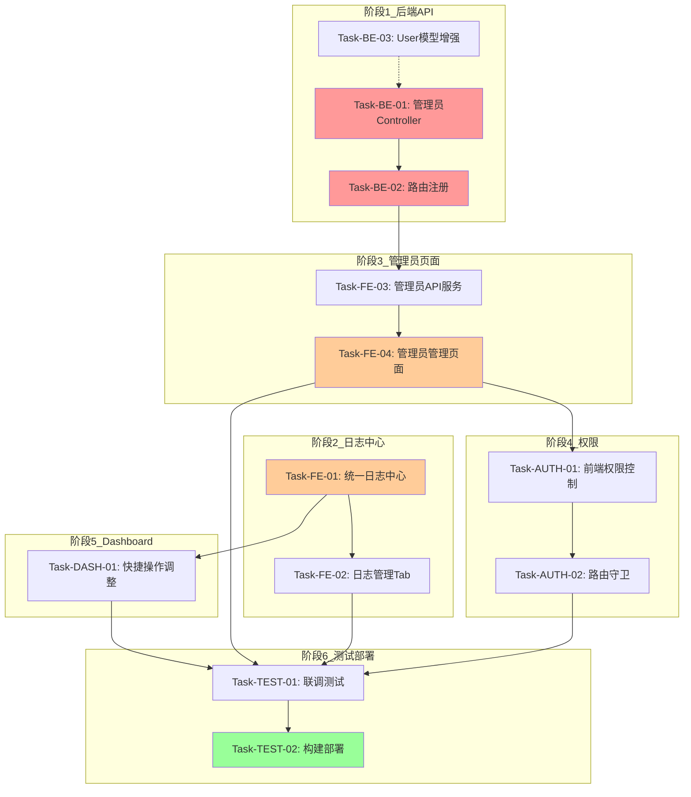

# 权限体系重构与日志中心优化 - 任务规划

**版本**: v1.0  
**日期**: 2026-04-15  
**开发模式**: TDD（测试驱动开发）  
**预估总工时**: 480分钟 (~8小时)

---

## 1. 任务概览

### 1.1 阶段统计

| 阶段 | 任务数 | 工时 | 说明 |
|------|--------|------|------|
| **阶段1: 后端API** | 3 | 90min | 管理员管理6个接口 |
| **阶段2: 日志中心重构** | 2 | 80min | 合并为3Tab统一页面 |
| **阶段3: 管理员管理前端** | 2 | 90min | CRUD完整页面 |
| **阶段4: 权限集成** | 2 | 60min | 前后端权限对接 |
| **阶段5: Dashboard优化** | 1 | 30min | 入口调整 |
| **阶段6: 测试部署** | 2 | 130min | 联调+部署 |
| **总计** | **12** | **480min** | |

### 1.2 执行顺序

```
阶段1 (后端API) 
    ↓
阶段2 (日志中心) ← 可与阶段1部分并行
    ↓
阶段3 (管理员页面) ← 依赖阶段1的API
    ↓
阶段4 (权限集成) ← 依赖阶段2,3
    ↓
阶段5 (Dashboard) ← 依赖阶段2
    ↓
阶段6 (测试部署) ← 所有阶段完成后
```

---

## 2. 详细任务清单

### **阶段1: 后端API - 管理员管理接口**

#### Task-BE-01: 创建管理员Controller

**状态**: 待开始  
**工时**: 30分钟  
**优先级**: 🔒 最高

**任务描述**: 创建管理员管理的控制器文件，实现6个API接口

**通俗解释**: 创建一个"管理员服务台"，提供增删改查管理员的6个服务窗口

**技术实现**:
- 文件: `server/controllers/adminUserController.js`
- 实现方法:
  1. `getAdminUsers(req, res)` - GET /api/admin/users （列表，分页）
  2. `createAdminUser(req, res)` - POST /api/admin/users （创建）
  3. `updateAdminUser(req, res)` - PUT /api/admin/users/:id （编辑）
  4. `toggleUserStatus(req, res)` - PUT /api/admin/users/:id/status （启用/禁用）
  5. `resetPassword(req, res)` - PUT /api/admin/users/:id/password （重置密码）
  6. `deleteAdminUser(req, res)` - DELETE /api/admin/users/:id （软删除）

**对应验收标准**: AC-ADMIN-001 ~ AC-ADMIN-009

**验证标准**:
- [ ] Controller文件创建完成
- [ ] 6个方法全部实现
- [ ] 每个方法包含参数校验（express-validator）
- [ ] 每个方法包含权限检查（validateSuperAdminRole）
- [ ] 每个方法返回统一的响应格式 {success, data, error}
- [ ] 编写单元测试覆盖所有方法

---

#### Task-BE-02: 注册管理员路由

**状态**: 待开始  
**工时**: 20分钟  
**优先级**: 🔒 高

**任务描述**: 在路由文件中注册管理员管理的API路由

**通俗解释**: 在系统的"路由表"上标记出管理员管理的6个入口地址

**技术实现**:
- 文件: `server/routes/adminUser.js`
- 路由定义:
```javascript
router.get('/', authenticateToken, validateSuperAdminRole, getAdminUsers)
router.post('/', authenticateToken, validateSuperAdminRole, createAdminUser)
router.put('/:id', authenticateToken, validateSuperAdminRole, updateAdminUser)
router.put('/:id/status', authenticateToken, validateSuperAdminRole, toggleUserStatus)
router.put('/:id/password', authenticateToken, validateSuperAdminRole, resetPassword)
router.delete('/:id', authenticateToken, validateSuperAdminRole, deleteAdminUser)
```

**依赖**: Task-BE-01

**验证标准**:
- [ ] 路由文件创建完成
- [ ] 6个路由全部注册
- [ ] 所有路由都添加了认证和权限中间件
- [ ] 在 server.js 中注册该路由: `app.use('/api/admin/users', adminUserRoutes)`
- [ ] 使用Postman/curl测试每个路由的权限控制

---

#### Task-BE-03: User模型增强（可选）

**状态**: 待开始  
**工时**: 40分钟  
**优先级**: 中

**任务描述**: 为User模型添加管理员相关字段

**通俗解释**: 给"用户档案卡"增加管理员专用的信息字段（角色、状态、权限等）

**技术实现**:
- 文件: `server/models/User.js` (或创建 AdminUser schema)
- 新增/确认字段:
  - role: String (enum: ['super_admin', 'admin', 'user'])
  - status: String (enum: ['active', 'disabled', 'deleted'])
  - permissions: [String]
  - createdBy: ObjectId (ref: 'User')
  - lastLoginAt: Date
  - note: String

**验证标准**:
- [ ] Schema更新完成
- [ ] 字段类型正确
- [ ] 枚举值符合设计
- [ ] 兼容旧数据（新字段有默认值）

---

### **阶段2: 前端重构 - 统一日志中心**

#### Task-FE-01: 重构审计日志为统一日志中心

**状态**: 待开始  
**工时**: 50分钟  
**优先级**: 🔒 高

**任务描述**: 将原来的list.vue和stats.vue合并为一个带Tab切换的统一页面

**通俗解释**: 把原来的"两个独立房间"（审计日志、日志统计）合并为"一个大厅"，里面用隔断分成3个区域

**技术实现**:
- 重命名/修改: `src/pages/admin/audit-log/list.vue` → `src/pages/admin/audit-log/index.vue` (统一入口)
- 页面结构:
```vue
<template>
  <view class="log-center">
    <!-- 页面标题 + 操作按钮 -->
    
    <!-- Tab栏: [日志列表] [数据统计] [日志管理*] -->
    <u-tabs :list="tabList" @change="onTabChange"></u-tabs>
    
    <!-- Tab内容区 -->
    <view v-if="currentTab === 0">
      <!-- 原来的列表页内容 -->
    </view>
    <view v-if="currentTab === 1">
      <!-- 原来的统计页内容 -->
    </view>
    <view v-if="currentTab === 2 && isSuperAdmin">
      <!-- 新增的日志管理Tab -->
    </view>
  </view>
</template>
```

**对应验收标准**: AC-LOG-001 ~ AC-MGMT-006

**验证标准**:
- [ ] 统一页面组件创建完成
- [ ] 3个Tab正常切换
- [ ] Tab3仅super_admin可见（v-if判断）
- [ ] Tab1保留原有筛选、搜索、分页、导出功能
- [ ] Tab2保留原有统计卡片、图表、排行
- [ ] Tab3新增清理、归档功能
- [ ] API调用正确（使用已有的auditLogApi）

---

#### Task-FE-02: 实现日志管理Tab

**状态**: 待开始  
**工时**: 30分钟  
**优先级**: 中

**任务描述**: 实现"日志管理"Tab的内容（仅super_admin可见）

**通俗解释**: 给超级管理员提供一个"工具箱"，可以清理旧日志和管理归档

**技术实现**:
- 在 index.vue 的 Tab3 区域实现:
  - 时间范围选择器（清理多久之前的日志）
  - 预览按钮（显示将删除的数量）
  - 清理按钮（二次确认：输入CONFIRM）
  - 保留策略提示（至少保留7天）
  - 清理进度显示
  - 操作结果反馈

**对应验收标准**: AC-MGMT-001 ~ AC-MGMT-006

**依赖**: Task-FE-01

**验证标准**:
- [ ] 日志管理UI完整实现
- [ ] 时间选择器可用
- [ ] 预览功能显示正确的数量
- [ ] 二次确认机制生效
- [ ] 7天保护机制生效
- [ ] 清理成功后有toast提示
- [ ] 调用 cleanupLogs API成功

---

### **阶段3: 前端新增 - 管理员管理页面**

#### Task-FE-03: 创建管理员API服务层

**状态**: 待开始  
**工时**: 20分钟  
**优先级**: 🔒 高

**任务描述**: 封装管理员管理的API调用方法

**通俗解释**: 创建一个专门负责与管理员服务器对话的"通信员"

**技术实现**:
- 文件: `src/services/adminUserApi.js`
- 方法:
  - `getAdminUsers(params)` - GET 列表
  - `createAdminUser(data)` - POST 创建
  - `updateAdminUser(id, data)` - PUT 编辑
  - `toggleUserStatus(id, status)` - PUT 启用/禁用
  - `resetPassword(id, newPassword)` - PUT 重置密码
  - `deleteAdminUser(id)` - DELETE 删除

**验证标准**:
- [ ] API服务文件创建
- [ ] 6个方法全部实现
- [ ] 包含Token认证头
- [ ] 错误处理完善

---

#### Task-FE-04: 实现管理员管理主页面

**状态**: 待开始  
**工时**: 70分钟  
**优先级**: 🔒 高 ⚠️

**任务描述**: 实现管理员管理的完整CRUD页面（列表+创建+编辑+操作）

**通俗解释**: 制作一个"管理员控制面板"，可以查看所有管理员、创建新的、编辑权限、禁用账号等

**技术实现**:
- 文件: `src/pages/admin/admin-user/list.vue`
- 功能模块:
  1. **顶部操作栏**
     - 标题: "👥 管理员管理"
     - 按钮: "+ 创建管理员"
     - 筛选: [全部] [启用中] [已禁用]
  
  2. **管理员卡片列表**
     - 头像/图标
     - 用户名 + 角色标签 (admin/super_admin)
     - 手机号 (脱敏: 138****8000)
     - 状态标签 (🟢启用 / 🔴禁用)
     - 最后登录时间
     - 操作按钮组: [编辑] [禁用/启用] [重置密码] [删除]
  
  3. **创建/编辑弹窗** (u-popup 或自定义modal)
     - 表单字段: 用户名*, 手机号*, 密码*, 确认密码*, 角色*, 权限(多选), 备注
     - 实时表单验证
     - 提交按钮 + 取消按钮
  
  4. **操作确认弹窗**
     - 禁用确认: "确定要禁用该管理员吗？"
     - 删除确认: 输入用户名确认
     - 重置密码: 输入新密码 + 确认

**对应验收标准**: AC-ADMIN-001 ~ AC-ADMIN-009

**依赖**: Task-FE-03

**验证标准**:
- [ ] 页面UI完整实现
- [ ] 管理员列表正确展示
- [ ] 筛选功能正常
- [ ] 创建表单完整且验证正确
- [ ] 编辑功能正常
- [ ] 禁用/启用功能正常（含不能禁用自己的校验）
- [ ] 重置密码功能正常
- [ ] 删除功能正常（含二次确认）
- [ ] 空状态友好提示
- [ ] Loading状态正确显示

---

### **阶段4: 权限集成**

#### Task-AUTH-01: 前端权限控制实现

**状态**: 待开始  
**工时**: 35分钟  
**priority**: 高

**任务描述**: 根据用户role动态显示/隐藏功能和按钮

**通俗解释**: 安装一套"门禁系统"，不同身份的人看到不同的按钮和菜单

**技术实现**:
- 文件: `src/composables/useAuth.js` (或 `src/utils/auth.js`)
- 核心逻辑:
```javascript
// 从store或localStorage获取当前用户信息
const user = getUserInfo()

// 权限判断函数
const isSuperAdmin = computed(() => user.role === 'super_admin')
const isAdmin = computed(() => ['super_admin', 'admin'].includes(user.role))
const hasPermission = (permission) => user.permissions?.includes(permission)

// 在页面中使用
<view v-if="isSuperAdmin">
  <!-- 仅超级管理员可见的内容 -->
</view>

<u-button v-if="canDelete" @click="handleDelete">删除</u-button>
```

- 应用位置:
  1. Dashboard快捷操作: "👥管理员" 仅 super_admin 可见
  2. 日志中心Tab3: 仅 super_admin 可见
  3. 管理员管理入口: 仅 super_admin 可见
  4. 导出CSV按钮: admin及以上可见
  5. 日志清理按钮: 仅 super_admin 可见

**验证标准**:
- [ ] 权限工具函数创建
- [ ] isSuperAdmin / isAdmin 计算属性正确
- [ ] Dashboard中"👥管理员"入口权限正确
- [ ] 日志中心Tab3权限正确
- [ ] 各按钮权限控制正确
- [ ] 未登录时隐藏所有后台功能

---

#### Task-AUTH-02: 路由守卫配置

**status**: 待开始  
**工时**: 25分钟  
**priority**: 中

**任务描述**: 配置页面级路由守卫，防止无权访问

**通俗解释**: 在每个房间的门口安装"安检门"，没有权限的人无法进入

**技术实现**:
- 文件: `src/permission.js` (或使用uni-app的路由拦截)
- 守卫规则:
```javascript
// 白名单（无需登录即可访问）
const whiteList = ['/pages/login']

// 路由拦截
router.beforeEach((to, from, next) => {
  const token = uni.getStorageSync('token')
  const user = uni.getStorageSync('userInfo')
  
  if (whiteList.includes(to.path)) {
    next() // 白名单直接放行
  } else if (!token) {
    // 未登录，跳转登录页
    next({ path: '/pages/login' })
  } else if (to.meta.requiresAuth && !user) {
    // 需要认证但无用户信息
    next(false)
  } else if (to.meta.requiresSuperAdmin && user.role !== 'super_admin') {
    // 需要超级管理员权限
    uni.showToast({ title: '无权限访问', icon: 'none' })
    next(false)
  } else {
    next() // 放行
  }
})
```

- pages.json中的meta配置:
```json
{
  "path": "pages/admin/admin-user/list",
  "meta": { "requiresSuperAdmin": true }
}
```

**依赖**: Task-AUTH-01

**验证标准**:
- [ ] 路由守卫文件创建
- [ ] 白名单配置正确
- [ ] Token检查生效
- [ ] SuperAdmin权限检查生效
- [ ] 无权限时提示友好
- [ ] 未登录时自动跳转登录页

---

### **阶段5: Dashboard优化**

#### Task-DASH-01: Dashboard快捷操作调整

**状态**: 待开始  
**工时**: 30分钟  
**priority**: 中

**任务描述**: 调整Dashboard的快捷操作入口，合并重复项，新增管理员入口

**通俗解释**: 整理一下"大厅的服务台"，把重复的窗口合并，贴上新服务的指示牌

**技术实现**:
- 文件: `src/pages/admin/dashboard.vue`
- 修改 actions 数组:

**修改前 (9个)**:
```javascript
const actions = [
  { icon: '👥', label: '会员管理', ... },
  { icon: '📚', label: '课程管理', ... },
  { icon: '🎬', label: '视频管理', ... },
  { icon: '🛒', label: '商品管理', ... },
  { icon: '🔔', label: '提醒中心', ... },
  { icon: '📊', label: '数据统计', ... },
  { icon: '📋', label: '审计日志', ... },      // ← 删除
  { icon: '📈', label: '日志统计', ... },       // ← 删除
  { icon: '⚙️', label: '系统设置', ... }
]
```

**修改后 (8个)**:
```javascript
const actions = [
  { icon: '👥', label: '会员管理', ... },
  { icon: '📚', label: '课程管理', ... },
  { icon: '🎬', label: '视频管理', ... },
  { icon: '🛒', label: '商品管理', ... },
  { icon: '🔔', label: '提醒中心', ... },
  { icon: '📊', label: '数据统计', ... },
  { icon: '📋', label: '日志中心', path: '/pages/admin/audit-log/index', bgColor: '...', vIf: isAdmin },  // 合并
  { icon: '👤', label: '管理员', path: '/pages/admin/admin-user/list', bgColor: '...', vIf: isSuperAdmin },  // 新增
  // 移除独立的"系统设置"或保留（根据实际需求）
]
```

**验证标准**:
- [ ] 快捷操作从9个调整为8个
- [ ] "审计日志"+"日志统计"合并为"📋日志中心"
- [ ] 新增"👤管理员"入口（条件渲染）
- [ ] 入口路径正确
- [ ] 条件渲染逻辑正确（根据权限显示/隐藏）

---

### **阶段6: 测试验证与部署**

#### Task-TEST-01: 联调测试

**status**: 待开始  
**工时**: 60分钟  
**priority**: 🔒 高

**任务描述**: 前后端联调，验证所有功能正常工作

**通俗解释**: 进行一次完整的"彩排"，确保前台后台配合默契

**测试范围**:
1. **权限测试**
   - [ ] super_admin能看到所有功能
   - [ ] admin看不到管理员管理和日志管理Tab
   - [ ] 未登录无法访问任何后台页面

2. **日志中心测试**
   - [ ] Tab切换流畅
   - [ ] 列表加载、筛选、搜索正常
   - [ ] 统计图表渲染正确
   - [ ] 导出CSV功能正常
   - [ ] 日志清理功能正常（super_admin）

3. **管理员管理测试**
   - [ ] 列表加载正常
   - [ ] 创建管理员流程完整（表单验证→提交→成功）
   - [ ] 编辑管理员正常
   - [禁用/启用正常（含不能禁用自己的校验）
   - [ ] 重置密码正常
   - [ ] 删除正常（含二次确认）

4. **边界测试**
   - [ ] 空数据显示友好
   - [ ] 网络错误处理优雅
   - [ ] 表单验证提示清晰
   - [ ] 并发操作处理正确

**验证标准**:
- [ ] 所有AC验收标准通过
- [ ] 无明显Bug
- [ ] UI/UX符合设计规范
- [ ] 性能可接受（页面加载<3秒）

---

#### Task-TEST-02: 构建部署上线

**status**: 待开始  
**工时**: 70分钟  
**priority**: 🔒 高

**任务描述**: 重新构建前端，部署到服务器，验证线上环境

**通俗解释**: 把装修好的"新店面"正式对外营业

**步骤**:
1. **构建前端**
   ```bash
   npm run build:admin
   ```

2. **验证构建产物**
   ```bash
   # 检查关键文件
   ls dist-admin/assets/ | grep -E "(admin-user|audit-log)"
   
   # 检查index.html引用
   cat dist-admin/index.html | grep "script.*src"
   ```

3. **部署到服务器**
   ```bash
   sudo cp -r dist-admin/* /var/www/crm-uniapp/admin/
   
   # 添加版本号
   sudo sed -i 's|src="/assets/[^"]*"|src="&?v=DATE"|g' /var/www/crm-uniapp/admin/index.html
   ```

4. **验证线上访问**
   ```bash
   curl -s http://192.168.10.128:8081/ | grep "<title>"
   curl -sI http://192.168.10.128:8081/assets/*.js | head -3
   ```

5. **浏览器测试**
   - 强制刷新 (Ctrl+Shift+R)
   - 登录系统
   - 验证所有新功能

**验证标准**:
- [ ] 构建成功无报错
- [ ] 关键JS文件存在且可访问
- [ ] HTTP 200 OK
- [ ] 页面正常显示
- [ ] 新功能可用（日志中心、管理员管理）
- [ ] 权限控制生效

---

## 3. 依赖关系图



**阻塞任务 (🔒)**:
- Task-BE-01 (Controller) → 阻塞阶段3的所有前端任务
- Task-FE-01 (日志中心) → 阶段5 Dashboard优化

**风险任务 (⚠️)**:
- Task-FE-04 (管理员管理页面) - 功能复杂度高，交互多

---

## 4. 并行执行建议

### **第1轮（后端+基础前端）- 预估120min**
- ✅ Task-BE-01: 管理员Controller (30min)
- ✅ Task-BE-02: 路由注册 (20min)
- ✅ Task-FE-03: 管理员API服务 (20min)
- ✅ Task-FE-01: 统一日志中心重构 (50min)

### **第2轮（核心页面）- 预估100min**
- ✅ Task-FE-02: 日志管理Tab (30min)
- ✅ Task-FE-04: 管理员管理页面 (70min)

### **第3轮（权限+优化）- 预估90min**
- ✅ Task-AUTH-01: 前端权限控制 (35min)
- ✅ Task-AUTH-02: 路由守卫 (25min)
- ✅ Task-DASH-01: Dashboard调整 (30min)

### **第4轮（测试部署）- 预估130min**
- ✅ Task-TEST-01: 联调测试 (60min)
- ✅ Task-TEST-02: 构建部署 (70min)

**总计**: ~440分钟 (~7.5小时，不含休息)

---

## 5. 验收标准检查清单

### 5.1 系统日志中心 (14项)

| AC编号 | 对应任务 | 验证方法 | 状态 |
|--------|----------|----------|------|
| AC-LOG-001 | FE-001 | 日志列表默认显示20条 | ⬜ |
| AC-LOG-002 | FE-001 | 多维度筛选 | ⬜ |
| AC-LOG-003 | FE-001 | 关键词搜索 | ⬜ |
| AC-LOG-004 | FE-001 | 分页功能 | ⬜ |
| AC-LOG-005 | FE-001 | 详情弹窗 | ⬜ |
| AC-LOG-006 | FE-001 | 导出CSV | ⬜ |
| AC-STAT-001 | FE-001 | 今日概览卡片 | ⬜ |
| AC-STAT-002 | FE-001 | 7日趋势图 | ⬜ |
| AC-STAT-003 | FE-001 | 操作分布 | ⬜ |
| AC-MGMT-001 | FE-002 | super_admin可见Tab3 | ⬜ |
| AC-MGMT-002 | FE-002 | admin不可见Tab3 | ⬜ |
| AC-MGMT-003 | FE-002 | 日志清理预览 | ⬜ |
| AC-MGMT-004 | FE-002 | 7天保护 | ⬜ |

### 5.2 管理员管理 (9项)

| AC编号 | 对应任务 | 验证方法 | 状态 |
|--------|----------|----------|------|
| AC-ADMIN-001 | FE-004 | super_admin可访问 | ⬜ |
| AC-ADMIN-002 | FE-004/AUTH | admin不可访问 | ⬜ |
| AC-ADMIN-003 | FE-004 | 创建表单 | ⬜ |
| AC-ADMIN-004 | FE-004 | 创建成功 | ⬜ |
| AC-ADMIN-005 | FE-004 | 重复检测 | ⬜ |
| AC-ADMIN-006 | FE-004 | 禁用/启用 | ⬜ |
| AC-ADMIN-007 | FE-004 | 不能禁用自己 | ⬜ |
| AC-ADMIN-008 | FE-004 | 重置密码 | ⬜ |
| AC-ADMIN-009 | FE-004 | 删除确认 | ⬜ |

### 5.3 Dashboard优化 (4项)

| AC编号 | 对应任务 | 验证方法 | 状态 |
|--------|----------|----------|------|
| AC-DASH-001 | DASH-001 | 快捷操作8个 | ⬜ |
| AC-DASH-002 | DASH-001 | 日志中心合并 | ⬜ |
| AC-DASH-003 | DASH-001/AUTH | 管理员入口权限 | ⬜ |

**总计**: 27项验收标准待验证

---

## 6. 下一步

任务规划已完成，下一步：
1. **TDD实施** - 按 Task 顺序逐一执行（Red → Green → Refactor）
2. **从 Task-BE-01 开始** - 先完成后端API
3. **每完成一个Task** - 更新本文档的状态为 ✅
4. **所有Task完成后** - 进入阶段6测试验证

---

**任务规划版本**: v1.0  
**审核状态**: ✅ 已确认（用户回复"符合 开始实施"）  
**最后更新**: 2026-04-15
