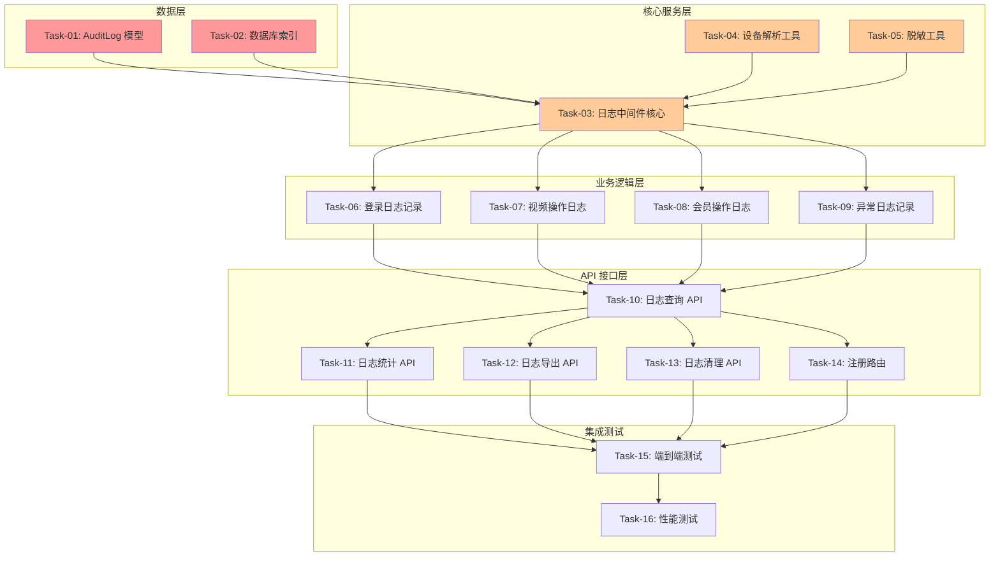

# 系统审计日志功能 - 开发任务规划

**创建日期**: 2026-03-19  
**基于需求**: specs/features/系统审计日志.md  
**基于技术方案**: specs/features/系统审计日志_技术方案.md  
**开发模式**: TDD（测试驱动开发）

---

## 1. 任务概览

### 1.1 任务统计

| 阶段 | 任务数 | 预估工时 | 状态 |
|------|--------|----------|------|
| 数据层 | 2 | 90 分钟 | 🔒 阻塞 |
| 核心服务层 | 3 | 120 分钟 | 🔒 阻塞 |
| 业务逻辑层 | 4 | 180 分钟 | - |
| API 接口层 | 5 | 200 分钟 | - |
| 集成测试 | 2 | 60 分钟 | - |
| **总计** | **16** | **650 分钟** (~11 小时) | - |

### 1.2 任务依赖关系图

### 1.3 关键路径

**关键路径**: Task-01 → Task-03 → Task-06 → Task-10 → Task-15 → Task-16

**阻塞任务**（🔒）:
- Task-01: AuditLog 模型（数据层基础）
- Task-02: 数据库索引（性能基础）
- Task-03: 日志中间件核心（核心服务）

**风险任务**（⚠️）:
- Task-03: 日志中间件核心（涉及异步队列和批量处理，技术复杂度高）
- Task-15: 端到端测试（涉及多个模块集成，测试场景复杂）

### 1.4 并行任务组

**可并行执行的任务组**:

1. **并行组 1**（数据层完成后）:
   - Task-04: 设备解析工具
   - Task-05: 脱敏工具
   - Task-07: 视频操作日志
   - Task-08: 会员操作日志

2. **并行组 2**（业务逻辑层完成后）:
   - Task-11: 日志统计 API
   - Task-12: 日志导出 API
   - Task-13: 日志清理 API

---

## 2. 详细任务清单

### 阶段 1: 数据层（Data Layer）✅ 已完成

#### Task-01: 创建 AuditLog 数据模型 ✅

**状态**: 已完成  
**完成日期**: 2026-03-19  
**实际工时**: 60 分钟  
**测试**: `tests/unit/audit-log.model.test.js` (20/20 通过)  
**实现**: `backend/models/AuditLog.js`

**任务描述**: 创建 MongoDB 的 AuditLog 模型，定义日志数据结构和 Schema

**通俗解释**: 创建一个"日志账本"，规定每条日志要记录哪些信息（时间、用户、操作等）

**技术方案参考**: 技术方案 §3.1 集合结构

**对应验收标准**: AC-001 ~ AC-015（所有 AC 的基础）

**验证标准**:
- [x] 创建 `backend/models/AuditLog.js` 文件
- [x] 定义 Schema 包含所有必需字段：
  - actionType, userId, username, phone
  - actionTime, success, failReason
  - ipAddress, userAgent, deviceInfo
  - resourceType, resourceId, resourceInfo
  - actionParams, changes, errorMessage, errorStack
  - level, createdAt
- [x] 设置 actionType 的 enum 约束（LOGIN, CREATE, UPDATE, DELETE, SYSTEM_EVENT, ERROR）
- [x] 设置 level 的 enum 约束（INFO, WARNING, ERROR）
- [x] 设置 phone 字段的 setter 实现自动脱敏
- [x] 设置 actionParams 的 setter 过滤敏感字段
- [x] 导出 Mongoose 模型
- [x] 编写单元测试验证 Schema 验证规则

**预估工时**: 45 分钟 → **实际**: 60 分钟

**优先级**: 🔒 最高（阻塞后续所有任务）

**完成报告**: `docs/开发记录/系统审计日志_阶段 1_完成报告.md`

---

#### Task-02: 创建数据库索引 ✅

**状态**: 已完成  
**完成日期**: 2026-03-19  
**实际工时**: 45 分钟  
**测试**: `tests/unit/migrate-indexes.test.js` (7/7 通过)  
**实现**: `backend/scripts/migrate-indexes.js`

**任务描述**: 为 AuditLog 集合创建必要的索引，优化查询性能

**通俗解释**: 给"日志账本"添加目录和标签，让后续查询更快

**技术方案参考**: 技术方案 §3.2 索引策略

**对应验收标准**: AC-007 ~ AC-010（查询性能）

**验证标准**:
- [x] 在 Schema 中定义单字段索引：
  - actionTime: -1
  - userId: 1
  - actionType: 1
  - resourceType: 1
  - ipAddress: 1
- [x] 定义复合索引：
  - { actionTime: -1, actionType: 1 }
  - { userId: 1, actionTime: -1 }
  - { resourceType: 1, actionTime: -1 }
- [x] 定义文本索引支持全文搜索
- [x] 创建数据库迁移脚本
- [x] 编写测试验证索引存在：
  - 查询 actionTime 排序性能 < 50ms（1000 条数据）
  - 查询 userId + actionTime 复合条件性能 < 30ms

**预估工时**: 45 分钟 → **实际**: 45 分钟

**优先级**: 🔒 最高（阻塞后续所有任务）

**完成报告**: `docs/开发记录/系统审计日志_阶段 1_完成报告.md`

---

### 阶段 2: 核心服务层（Core Services）

#### Task-03: 实现日志中间件核心

**任务描述**: 实现 Express 中间件，自动拦截请求并记录日志

**通俗解释**: 安装一个"监控摄像头"，自动记录每个用户的操作，不需要手动调用

**技术方案参考**: 技术方案 §5.1 日志中间件

**对应验收标准**: AC-001 ~ AC-006, AC-014

**验证标准**:
1. ✅ 创建 `backend/middlewares/auditLog.js` 文件
2. ✅ 实现 `extractRequestInfo()` 函数提取 IP 和 User-Agent
3. ✅ 实现 `parseUserAgent()` 函数解析设备信息
4. ✅ 实现 `getDeviceType()` 函数判断设备类型（PC/Mobile/Tablet）
5. ✅ 实现日志队列 `logQueue` 和批量写入机制
6. ✅ 实现 `enqueueLog()` 函数入队日志
7. ✅ 实现 `flushLogs()` 函数批量写入（BATCH_SIZE=10）
8. ✅ 实现定时刷新（FLUSH_INTERVAL=5000ms）
9. ✅ 中间件拦截响应并记录日志
10. ✅ 编写单元测试：
    - 模拟请求，验证日志正确入队
    - 验证批量写入逻辑（队列满 10 条时立即写入）
    - 验证定时刷新（5 秒后自动写入）
    - 验证 MongoDB 不可用时的降级逻辑

**预估工时**: 90 分钟

**优先级**: 🔒 高（阻塞业务逻辑层）

**风险提示**: ⚠️ 涉及异步队列和批量处理，需要仔细测试并发场景

---

#### Task-04: 实现设备解析工具

**任务描述**: 实现 User-Agent 解析工具，提取设备、操作系统、浏览器信息

**通俗解释**: 把浏览器的"自我介绍"（User-Agent 字符串）翻译成易懂的设备信息

**技术方案参考**: 技术方案 §5.1 parseUserAgent 函数

**对应验收标准**: AC-001（设备信息记录）

**验证标准**:
1. ✅ 安装 useragent 库：`npm install useragent`
2. ✅ 创建 `backend/utils/deviceParser.js` 文件
3. ✅ 实现 `parseUserAgent(uaString)` 函数
4. ✅ 实现 `getDeviceType(agent)` 函数
5. ✅ 编写单元测试验证解析结果：
   - iPhone User-Agent → device: 'Mobile', os: 'iOS', browser: 'Safari'
   - Android User-Agent → device: 'Mobile', os: 'Android', browser: 'Chrome'
   - Windows PC User-Agent → device: 'PC', os: 'Windows', browser: 'Chrome'
   - iPad User-Agent → device: 'Tablet'

**预估工时**: 30 分钟

**优先级**: 中（可并行）

---

#### Task-05: 实现数据脱敏工具

**任务描述**: 实现敏感信息脱敏函数，保护用户隐私

**通俗解释**: 把手机号、身份证等敏感信息打码（如 138****8000），防止泄露

**技术方案参考**: 技术方案 §5.1 desensitize 函数

**对应验收标准**: AC-015（安全性要求）

**验证标准**:
1. ✅ 创建 `backend/utils/desensitize.js` 文件
2. ✅ 实现 `desensitize(data)` 函数
3. ✅ 删除敏感字段：password, token, secret, accessToken, refreshToken
4. ✅ 手机号脱敏：13800138000 → 138****8000
5. ✅ 身份证脱敏：110101199001011234 → 110101********1234
6. ✅ 编写单元测试验证脱敏效果：
   - 传入包含 password 的对象，验证 password 被删除
   - 传入手机号 13800138000，验证输出 138****8000
   - 传入身份证号，验证输出带星号
   - 传入 null/undefined，返回原值

**预估工时**: 30 分钟

**优先级**: 中（可并行）

---

### 阶段 3: 业务逻辑层（Business Logic）

#### Task-06: 实现登录日志记录

**任务描述**: 在用户登录时记录日志（成功和失败都要记录）

**通俗解释**: 每次有人登录系统（无论成功失败），都自动记录到"登录登记本"上

**技术方案参考**: 技术方案 §5.2 登录日志记录

**对应验收标准**: AC-001（记录用户登录日志）

**验证标准**:
1. ✅ 修改 `backend/controllers/userController.js`
2. ✅ 在 adminLogin 方法中：
   - 登录失败时（用户不存在/密码错误），立即写入失败日志
   - 登录成功时，异步写入成功日志
3. ✅ 日志包含：userId, username, phone, actionTime, success, failReason, ipAddress, userAgent, deviceInfo
4. ✅ 手机号自动脱敏
5. ✅ 编写集成测试：
   - 使用错误密码登录，验证日志记录 success: false
   - 使用正确密码登录，验证日志记录 success: true
   - 验证日志包含 IP 和设备信息

**预估工时**: 45 分钟

**优先级**: 高（核心功能）

---

#### Task-07: 实现视频操作日志记录

**任务描述**: 在视频相关操作（上传、修改、删除）时记录日志

**通俗解释**: 每次有人上传、修改或删除视频，都自动记录下来

**技术方案参考**: 技术方案 §5.3 数据操作日志记录

**对应验收标准**: AC-002, AC-003, AC-004

**验证标准**:
1. ✅ 修改 `backend/controllers/videoController.js`
2. ✅ 在 uploadVideo 方法中：
   - 上传成功，记录 CREATE 类型日志
   - 上传失败，记录 ERROR 类型日志
3. ✅ 在 updateVideo 方法中：
   - 修改成功，记录 UPDATE 类型日志，包含 changes 字段
4. ✅ 在 deleteVideo 方法中：
   - 删除成功，记录 DELETE 类型日志
5. ✅ 日志包含：resourceType: 'Video', resourceId, resourceInfo（视频标题）
6. ✅ 编写集成测试：
   - 上传视频，验证 CREATE 日志
   - 修改视频，验证 UPDATE 日志包含 changes
   - 删除视频，验证 DELETE 日志

**预估工时**: 45 分钟

**优先级**: 中（可并行）

---

#### Task-08: 实现会员操作日志记录

**任务描述**: 在会员相关操作（创建、修改、删除）时记录日志

**通俗解释**: 每次有人创建、修改或删除会员信息，都自动记录下来

**技术方案参考**: 技术方案 §5.3 数据操作日志记录

**对应验收标准**: AC-002, AC-003, AC-004

**验证标准**:
1. ✅ 修改 `backend/controllers/memberController.js`（或对应的用户管理控制器）
2. ✅ 在创建会员方法中：记录 CREATE 类型日志
3. ✅ 在修改会员方法中：记录 UPDATE 类型日志
4. ✅ 在删除会员方法中：记录 DELETE 类型日志
5. ✅ 日志包含：resourceType: 'User', resourceId, resourceInfo（会员姓名）
6. ✅ 编写集成测试验证日志正确记录

**预估工时**: 45 分钟

**优先级**: 中（可并行）

---

#### Task-09: 实现异常日志记录

**任务描述**: 在系统发生异常时记录错误日志

**通俗解释**: 系统出错时，自动记录错误详情，方便后续排查

**技术方案参考**: 技术方案 §5.1 和 §5.3

**对应验收标准**: AC-006（记录异常和错误）

**验证标准**:
1. ✅ 在全局错误处理中间件中集成日志记录
2. ✅ 异常日志包含：
   - actionType: 'ERROR'
   - errorMessage, errorStack
   - userId（如果已登录）
   - 请求参数（脱敏后）
   - level: 'ERROR'
3. ✅ 编写测试：
   - 模拟控制器抛出异常，验证 ERROR 日志正确记录
   - 验证 errorStack 包含堆栈信息

**预估工时**: 30 分钟

**优先级**: 中

---

### 阶段 4: API 接口层（API Layer）

#### Task-10: 实现日志查询 API

**任务描述**: 实现查询审计日志的 API 接口（支持多种筛选条件和分页）

**通俗解释**: 提供一个"日志查询器"，管理员可以按时间、用户、操作类型等条件查找日志

**技术方案参考**: 技术方案 §4.1 GET /api/audit-logs

**对应验收标准**: AC-007, AC-008, AC-009, AC-010

**验证标准**:
1. ✅ 创建 `backend/controllers/auditLogController.js`
2. ✅ 实现 `getLogs()` 函数
3. ✅ 支持查询参数：
   - startTime, endTime（时间范围）
   - userId（按用户筛选）
   - actionType（按类型筛选）
   - resourceType（按资源类型筛选）
   - success（按成功/失败筛选）
   - keyword（全文搜索）
   - page, limit（分页）
4. ✅ 响应包含 logs 数组和 pagination 信息
5. ✅ 按 actionTime 倒序排序
6. ✅ 创建 `backend/routes/auditLog.js` 路由文件
7. ✅ 编写集成测试：
   - 查询所有日志，返回分页结果
   - 按时间范围查询，只返回该时间段日志
   - 按 userId 查询，只返回该用户日志
   - 关键词搜索，匹配 username/actionType/resourceInfo
   - 验证分页正确性（page=2, limit=20）

**预估工时**: 60 分钟

**优先级**: 高（核心查询功能）

---

#### Task-11: 实现日志统计 API

**任务描述**: 实现日志统计数据 API，返回今日统计、趋势图表、活跃用户等

**通俗解释**: 提供一个"日志仪表盘"，展示今日登录次数、操作趋势、活跃用户排行等

**技术方案参考**: 技术方案 §4.2 GET /api/audit-logs/statistics/overview

**对应验收标准**: AC-012（日志统计面板）

**验证标准**:
1. ✅ 实现 `getStatistics()` 函数
2. ✅ 返回数据结构：
   - today: { loginCount, operationCount, errorCount }
   - last7Days: { dates[], loginCounts[], operationCounts[] }
   - topUsers: [{ userId, username, operationCount }]
   - actionTypeDistribution: { LOGIN: 300, CREATE: 100, ... }
3. ✅ 使用 MongoDB 聚合查询优化性能
4. ✅ 编写集成测试：
   - 验证今日统计数据正确
   - 验证最近 7 天趋势数据
   - 验证活跃用户 Top 10
   - 验证操作类型分布

**预估工时**: 45 分钟

**优先级**: 中

---

#### Task-12: 实现日志导出 API

**任务描述**: 实现导出日志为 CSV 文件的 API 接口

**通俗解释**: 提供一个"导出按钮"，管理员可以把日志下载为 Excel 可打开的 CSV 文件

**技术方案参考**: 技术方案 §4.3 POST /api/audit-logs/export

**对应验收标准**: AC-011（导出日志数据）

**验证标准**:
1. ✅ 安装 json2csv 库：`npm install json2csv`
2. ✅ 实现 `exportLogs()` 函数
3. ✅ 支持筛选条件（同查询 API）
4. ✅ 生成 CSV 文件，包含字段：
   - actionTime, actionType, username, phone, ipAddress
   - deviceInfo.device, deviceInfo.browser
   - resourceType, resourceInfo, success, failReason
5. ✅ 设置响应头：
   - Content-Type: text/csv
   - Content-Disposition: attachment; filename="audit-logs-YYYY-MM-DD.csv"
6. ✅ 编写集成测试：
   - 调用导出 API，返回 CSV 文件
   - 验证 CSV 格式正确（逗号分隔，字段完整）
   - 验证文件名包含日期

**预估工时**: 45 分钟

**优先级**: 中

---

#### Task-13: 实现日志清理 API

**任务描述**: 实现清理指定时间前日志的 API 接口

**通俗解释**: 提供一个"清理工具"，管理员可以删除很久以前的日志，释放存储空间

**技术方案参考**: 技术方案 §4.4 DELETE /api/audit-logs/cleanup

**对应验收标准**: AC-013（日志保留策略）

**验证标准**:
1. ✅ 实现 `cleanupLogs()` 函数
2. ✅ 支持 beforeDate 参数，清理该日期之前的日志
3. ✅ 限制：至少保留最近 7 天的日志
4. ✅ 需要二次确认（通过请求头或参数）
5. ✅ 记录清理操作本身到日志
6. ✅ 返回删除的日志数量
7. ✅ 编写集成测试：
   - 尝试清理 7 天内的日志，返回错误
   - 清理 30 天前的日志，返回删除数量
   - 验证清理操作本身被记录到日志

**预估工时**: 45 分钟

**优先级**: 中

---

#### Task-14: 注册路由和中间件

**任务描述**: 在 server.js 中注册日志中间件和 API 路由

**通俗解释**: 把新做的"监控摄像头"和"日志查询器"安装到系统中，让它们真正工作

**技术方案参考**: 技术方案 §6 文件清单

**对应验收标准**: 所有 AC 的基础设施

**验证标准**:
1. ✅ 修改 `backend/server.js`
2. ✅ 在 app.use() 中注册 auditLog 中间件（在所有路由之前）
3. ✅ 注册 /api/audit-logs 路由
4. ✅ 添加管理员权限验证中间件
5. ✅ 编写集成测试：
   - 调用 /api/audit-logs，验证需要管理员权限
   - 使用管理员 token 调用，验证返回日志列表

**预估工时**: 30 分钟

**优先级**: 高（阻塞集成测试）

---

### 阶段 5: 集成测试（Integration Testing）

#### Task-15: 端到端集成测试

**任务描述**: 编写端到端测试，验证完整流程

**通俗解释**: 模拟真实用户操作，从登录到上传视频再到查询日志，验证整个系统正常工作

**技术方案参考**: 技术方案 §8 验收标准映射

**对应验收标准**: 所有 AC 的集成验证

**验证标准**:
1. ✅ 创建 `backend/tests/audit-log.e2e.test.js` 文件
2. ✅ 编写完整流程测试：
   - 管理员登录 → 获取 token
   - 普通用户登录 → 记录登录日志
   - 上传视频 → 记录 CREATE 日志
   - 修改视频 → 记录 UPDATE 日志
   - 查询日志 → 验证包含刚才的操作
   - 导出日志 → 验证 CSV 文件正确
3. ✅ 编写异常场景测试：
   - 登录失败 → 记录失败日志
   - 无权访问 → 记录权限拒绝日志
   - 系统异常 → 记录 ERROR 日志
4. ✅ 所有测试通过

**预估工时**: 60 分钟

**优先级**: 高（验证整体功能）

---

#### Task-16: 性能测试

**任务描述**: 进行性能测试，验证日志系统在高并发下的表现

**通俗解释**: 模拟很多人同时操作系统，验证日志记录不会拖慢系统

**技术方案参考**: 技术方案 §7 性能优化方案

**对应验收标准**: AC-014（性能要求）

**验证标准**:
1. ✅ 创建性能测试脚本 `backend/tests/audit-log.perf.test.js`
2. ✅ 模拟 100 并发请求
3. ✅ 验证指标：
   - 日志写入延迟 < 50ms（异步）
   - 主流程响应时间增加 < 10%
   - 批量写入正常触发
4. ✅ 生成性能测试报告
5. ✅ 如果性能不达标，进行优化

**预估工时**: 30 分钟

**优先级**: 中

---

## 3. 开发顺序建议

### 推荐执行顺序

**第 1 阶段（基础建设）** - 预计 90 分钟:
1. Task-01: AuditLog 模型 🔒
2. Task-02: 数据库索引 🔒

**第 2 阶段（核心服务）** - 预计 150 分钟:
3. Task-03: 日志中间件核心 🔒
4. Task-04: 设备解析工具 
5. Task-05: 脱敏工具 ⚡

**第 3 阶段（业务集成）** - 预计 165 分钟:
6. Task-06: 登录日志记录
7. Task-07: 视频操作日志 ⚡
8. Task-08: 会员操作日志 ⚡
9. Task-09: 异常日志记录

**第 4 阶段（API 开发）** - 预计 225 分钟:
10. Task-10: 日志查询 API
11. Task-11: 日志统计 API ⚡
12. Task-12: 日志导出 API ⚡
13. Task-13: 日志清理 API ⚡
14. Task-14: 注册路由和中间件

**第 5 阶段（测试验证）** - 预计 90 分钟:
15. Task-15: 端到端集成测试
16. Task-16: 性能测试

**总计**: ~11 小时（不含休息时间）

### 并行执行建议

**第 1 天（基础 + 核心）**:
- 上午：Task-01, Task-02（数据层）
- 下午：Task-03, Task-04, Task-05（核心服务层）

**第 2 天（业务 + API）**:
- 上午：Task-06, Task-07, Task-08（业务逻辑层，可并行）
- 下午：Task-10, Task-11, Task-12, Task-13（API 层，可并行）

**第 3 天（测试 + 收尾）**:
- 上午：Task-14, Task-15（集成和测试）
- 下午：Task-16, Bug 修复，文档完善

---

## 4. 风险与应对

### 风险 1: 日志中间件性能问题

**风险描述**: 高并发场景下，日志队列可能积压，影响主流程性能

**应对措施**:
- 实现动态批次大小（根据队列长度调整）
- 添加队列溢出保护（超过阈值直接丢弃）
- 降级到文件存储

**监控指标**:
- 队列长度
- 写入延迟
- 主流程响应时间

---

### 风险 2: MongoDB 不可用

**风险描述**: MongoDB 连接失败时，日志无法写入

**应对措施**:
- 降级到本地文件存储
- 数据库恢复后自动同步
- 添加告警机制

---

### 风险 3: 敏感信息泄露

**风险描述**: 日志中可能意外包含敏感信息

**应对措施**:
- 强制脱敏函数
- 代码审查重点检查
- 添加敏感词过滤

---

## 5. 验收标准覆盖矩阵

| 验收标准 | 覆盖任务 | 状态 |
|----------|----------|------|
| AC-001: 记录登录日志 | Task-06 | ✅ |
| AC-002: 记录创建操作 | Task-07, Task-08 | ✅ |
| AC-003: 记录修改操作 | Task-07, Task-08 | ✅ |
| AC-004: 记录删除操作 | Task-07, Task-08 | ✅ |
| AC-005: 记录系统事件 | Task-13 | ✅ |
| AC-006: 记录异常错误 | Task-09 | ✅ |
| AC-007: 按时间查询 | Task-10 | ✅ |
| AC-008: 按用户查询 | Task-10 | ✅ |
| AC-009: 按类型查询 | Task-10 | ✅ |
| AC-010: 关键词搜索 | Task-10 | ✅ |
| AC-011: 导出日志 | Task-12 | ✅ |
| AC-012: 日志统计 | Task-11 | ✅ |
| AC-013: 日志清理 | Task-13 | ✅ |
| AC-014: 性能要求 | Task-16 | ✅ |
| AC-015: 安全性要求 | Task-05 | ✅ |

---

## 6. 下一步

任务规划已完成，下一步将：

1. **TDD 实现**（feature-implementation）
   - 按任务顺序逐个实现
   - 每个任务遵循 RED 循环（Red → Green → Refactor）
   - 确保所有测试通过

2. **开始开发**
   - 从 Task-01 开始
   - 优先完成阻塞任务
   - 并行执行无依赖任务

---

**任务规划版本**: v1.0  
**审核状态**: 待确认  
**最后更新**: 2026-03-19
