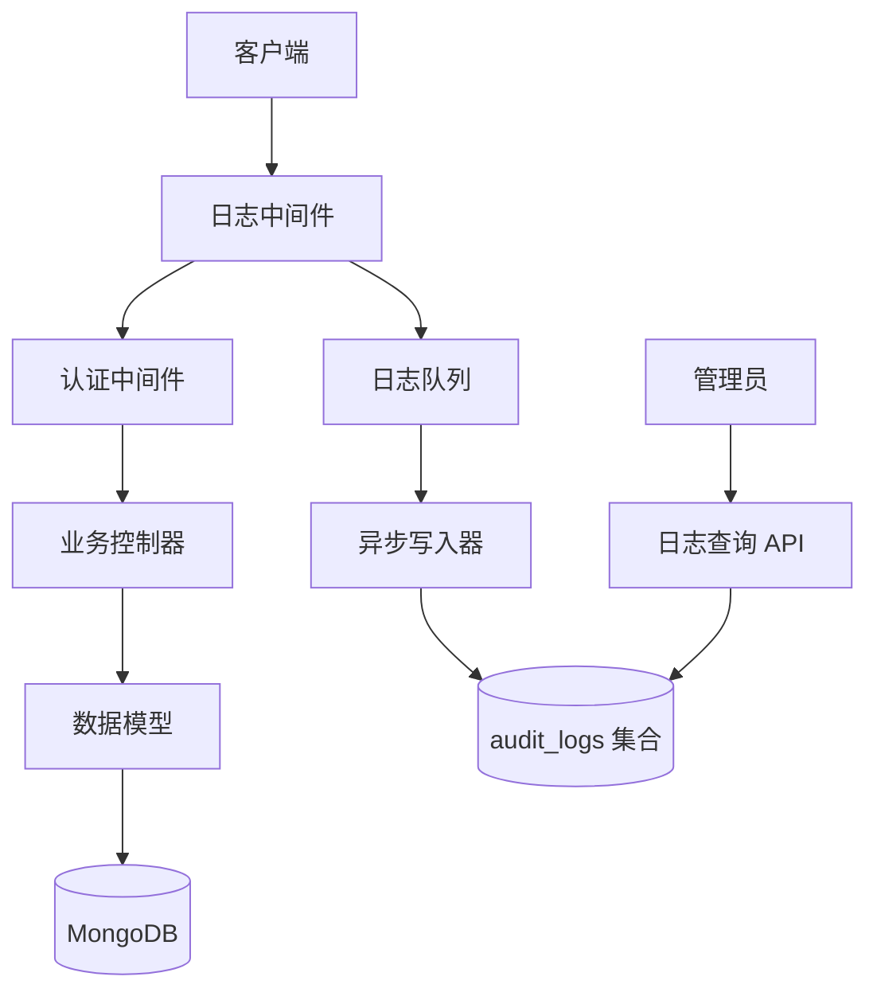
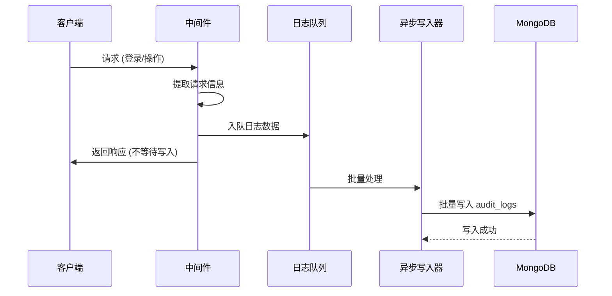

# 系统审计日志功能 - 技术方案设计

**创建日期**: 2026-03-19  
**基于需求**: specs/features/系统审计日志.md  
**技术负责人**: AI Assistant

---

## 1. 技术方案概述

### 1.1 方案选择

**核心架构**: 中间件 + 异步写入

**技术选型**:
- **日志存储**: MongoDB（与现有系统一致）
- **日志中间件**: Express 中间件（自动拦截请求）
- **设备解析**: useragent 库（解析 User-Agent）
- **IP 获取**: Express req.ip（自动获取）
- **写入方式**: 异步批量写入（不影响主流程性能）

**方案优势**:
1. ✅ 与现有技术栈完全兼容
2. ✅ 异步写入，性能影响 < 10%
3. ✅ 自动拦截，无需修改现有业务代码
4. ✅ 灵活的查询和统计能力

---

## 2. 系统架构

### 2.1 整体架构图



### 2.2 数据流图



---

## 3. 数据库设计

### 3.1 集合结构

**集合名称**: `audit_logs`

**Schema 设计**:

```javascript
const mongoose = require('mongoose');

const auditLogSchema = new mongoose.Schema({
  // 基本信息
  actionType: {
    type: String,
    required: true,
    enum: ['LOGIN', 'LOGOUT', 'CREATE', 'UPDATE', 'DELETE', 'QUERY', 'SYSTEM_EVENT', 'ERROR'],
    index: true  // 用于按类型查询
  },
  
  // 用户信息
  userId: {
    type: mongoose.Schema.Types.ObjectId,
    ref: 'User',
    index: true  // 用于按用户查询
  },
  username: String,
  phone: String,  // 脱敏处理：138****8000
  
  // 时间信息
  actionTime: {
    type: Date,
    default: Date.now,
    index: -1  // 时间倒序索引
  },
  
  // 操作结果
  success: {
    type: Boolean,
    default: true
  },
  failReason: String,
  
  // 设备信息
  ipAddress: {
    type: String,
    index: true
  },
  userAgent: String,
  deviceInfo: {
    device: String,  // PC, Mobile, Tablet
    os: String,      // Windows, iOS, Android
    browser: String, // Chrome, Safari
    version: String
  },
  
  // 资源信息
  resourceType: {
    type: String,
    index: true  // User, Video, Project 等
  },
  resourceId: mongoose.Schema.Types.ObjectId,
  resourceInfo: String,  // 资源描述，如视频标题
  
  // 操作参数（脱敏后）
  actionParams: {
    type: Object,
    default: {}
  },
  
  // 变更内容（仅 UPDATE 操作）
  changes: {
    before: Object,
    after: Object
  },
  
  // 异常信息（仅 ERROR 操作）
  errorMessage: String,
  errorStack: String,
  
  // 日志级别
  level: {
    type: String,
    enum: ['INFO', 'WARNING', 'ERROR'],
    default: 'INFO'
  },
  
  // 元数据
  createdAt: {
    type: Date,
    default: Date.now
  }
}, {
  timestamps: true,  // 自动添加 createdAt 和 updatedAt
  collection: 'audit_logs'
});

// 复合索引：优化常用查询
auditLogSchema.index({ actionTime: -1, actionType: 1 });
auditLogSchema.index({ userId: 1, actionTime: -1 });
auditLogSchema.index({ resourceType: 1, actionTime: -1 });

module.exports = mongoose.model('AuditLog', auditLogSchema);
```

### 3.2 索引策略

```javascript
// 单字段索引
db.audit_logs.createIndex({ actionTime: -1 });           // 时间排序
db.audit_logs.createIndex({ userId: 1 });                // 按用户查询
db.audit_logs.createIndex({ actionType: 1 });            // 按类型查询
db.audit_logs.createIndex({ resourceType: 1 });          // 按资源类型查询
db.audit_logs.createIndex({ ipAddress: 1 });             // 按 IP 查询

// 复合索引（覆盖常用查询场景）
db.audit_logs.createIndex({ actionTime: -1, actionType: 1 });  // 时间 + 类型
db.audit_logs.createIndex({ userId: 1, actionTime: -1 });      // 用户 + 时间
db.audit_logs.createIndex({ resourceType: 1, actionTime: -1 }); // 资源 + 时间

// 文本索引（支持关键词搜索）
db.audit_logs.createIndex({ 
  username: "text", 
  phone: "text", 
  actionType: "text",
  resourceInfo: "text",
  errorMessage: "text"
});
```

---

## 4. API 接口设计

### 4.1 日志查询 API

#### GET /api/audit-logs

**描述**: 查询审计日志列表（分页）

**请求参数**:
```javascript
{
  query: {
    startTime: String,      // 可选，ISO 格式：2026-03-19T00:00:00.000Z
    endTime: String,        // 可选
    userId: String,         // 可选
    actionType: String,     // 可选，LOGIN|CREATE|UPDATE|DELETE
    resourceType: String,   // 可选
    success: Boolean,       // 可选
    keyword: String         // 可选，全文搜索
  },
  pagination: {
    page: Number,           // 默认 1
    limit: Number           // 默认 20，最大 100
  }
}
```

**响应格式**:
```javascript
{
  "success": true,
  "data": {
    "logs": [...],
    "pagination": {
      "total": 1000,
      "page": 1,
      "limit": 20,
      "totalPages": 50
    }
  }
}
```

**权限**: 需要管理员权限

---

#### GET /api/audit-logs/:id

**描述**: 获取单条日志详情

**响应格式**:
```javascript
{
  "success": true,
  "data": {
    "_id": "xxx",
    "actionType": "LOGIN",
    "userId": "xxx",
    "username": "张三",
    // ... 完整字段
  }
}
```

**权限**: 需要管理员权限

---

### 4.2 日志统计 API

#### GET /api/audit-logs/statistics/overview

**描述**: 获取日志统计数据

**响应格式**:
```javascript
{
  "success": true,
  "data": {
    "today": {
      "loginCount": 150,
      "operationCount": 500,
      "errorCount": 5
    },
    "last7Days": {
      "dates": ["2026-03-13", ..., "2026-03-19"],
      "loginCounts": [100, 120, ...],
      "operationCounts": [400, 450, ...]
    },
    "topUsers": [
      { "userId": "xxx", "username": "张三", "operationCount": 50 }
    ],
    "actionTypeDistribution": {
      "LOGIN": 300,
      "CREATE": 100,
      "UPDATE": 200,
      "DELETE": 50
    }
  }
}
```

**权限**: 需要管理员权限

---

### 4.3 日志导出 API

#### POST /api/audit-logs/export

**描述**: 导出日志数据为 CSV 文件

**请求参数**:
```javascript
{
  startTime: String,
  endTime: String,
  actionType: String,
  userId: String
  // 其他筛选条件
}
```

**响应**: 文件下载

**Content-Type**: `text/csv`  
**Content-Disposition**: `attachment; filename="audit-logs-20260319.csv"`

**CSV 格式**:
```csv
时间，操作类型，用户，手机号，IP 地址，设备，资源类型，操作结果，失败原因
2026-03-19 10:30:00,LOGIN，张三，138****8000,192.168.1.100,iPhone/Safari,,,成功，
2026-03-19 10:31:00,CREATE，李四，139****9000,192.168.1.101,PC/Chrome,Video，成功，
```

**权限**: 需要管理员权限

---

### 4.4 日志管理 API

#### DELETE /api/audit-logs/cleanup

**描述**: 清理指定时间前的日志

**请求参数**:
```javascript
{
  beforeDate: String  // ISO 格式，清理该日期之前的日志
}
```

**响应**:
```javascript
{
  "success": true,
  "data": {
    "deletedCount": 5000,
    "beforeDate": "2025-03-19T00:00:00.000Z"
  }
}
```

**权限**: 需要超级管理员权限

**安全限制**: 
- 至少保留最近 7 天的日志
- 需要二次确认
- 记录清理操作本身到日志

---

## 5. 核心模块设计

### 5.1 日志中间件

**文件路径**: `backend/middlewares/auditLog.js`

**核心代码结构**:

```javascript
const AuditLog = require('../models/AuditLog');
const useragent = require('useragent');
const logQueue = [];
const BATCH_SIZE = 10;
const FLUSH_INTERVAL = 5000; // 5 秒

/**
 * 提取请求信息
 */
function extractRequestInfo(req) {
  return {
    ipAddress: req.ip || req.connection.remoteAddress,
    userAgent: req.get('User-Agent') || '',
    deviceInfo: parseUserAgent(req.get('User-Agent'))
  };
}

/**
 * 解析 User-Agent
 */
function parseUserAgent(uaString) {
  const agent = useragent.parse(uaString);
  return {
    device: getDeviceType(agent),
    os: `${agent.os.family} ${agent.os.version}`,
    browser: `${agent.family} ${agent.version}`,
    version: agent.version
  };
}

/**
 * 判断设备类型
 */
function getDeviceType(agent) {
  const ua = agent.source.toLowerCase();
  if (/mobile|android|iphone|ipad/.test(ua)) {
    return 'Mobile';
  } else if (/tablet|ipad/.test(ua)) {
    return 'Tablet';
  }
  return 'PC';
}

/**
 * 脱敏处理
 */
function desensitize(data) {
  if (!data) return data;
  
  // 手机号脱敏：13800138000 -> 138****8000
  if (data.phone) {
    data.phone = data.phone.replace(/(\d{3})\d{4}(\d{4})/, '$1****$2');
  }
  
  // 身份证脱敏
  if (data.idCard) {
    data.idCard = data.idCard.replace(/(\d{6})\d{8}(\d{4})/, '$1********$2');
  }
  
  // 密码不记录
  delete data.password;
  
  return data;
}

/**
 * 日志入队
 */
function enqueueLog(logData) {
  logQueue.push({
    ...logData,
    createdAt: new Date()
  });
  
  // 达到批次大小时立即写入
  if (logQueue.length >= BATCH_SIZE) {
    flushLogs();
  }
}

/**
 * 批量写入日志
 */
async function flushLogs() {
  if (logQueue.length === 0) return;
  
  const logsToWrite = [...logQueue];
  logQueue.length = 0;
  
  try {
    await AuditLog.insertMany(logsToWrite, { ordered: false });
    console.log(`[AuditLog] 成功写入 ${logsToWrite.length} 条日志`);
  } catch (error) {
    console.error('[AuditLog] 批量写入失败:', error);
    // 降级：单条重试
    for (const log of logsToWrite) {
      try {
        await new AuditLog(log).save();
      } catch (e) {
        console.error('[AuditLog] 单条写入失败:', e);
      }
    }
  }
}

/**
 * 定时刷新
 */
setInterval(flushLogs, FLUSH_INTERVAL);

/**
 * 中间件主函数
 */
const auditLogMiddleware = (req, res, next) => {
  // 保存原始响应方法
  const originalSend = res.send;
  const originalJson = res.json;
  
  // 拦截响应
  res.send = function(data) {
    // 记录日志（异步，不阻塞）
    process.nextTick(() => {
      const logData = {
        actionType: getActionType(req),
        userId: req.user?._id,
        username: req.user?.name,
        phone: req.user?.phone,
        actionTime: new Date(),
        success: res.statusCode < 400,
        failReason: res.statusCode >= 400 ? '操作失败' : null,
        ...extractRequestInfo(req),
        resourceType: getResourceType(req),
        resourceId: getResourceId(req),
        resourceInfo: getResourceInfo(req, data),
        actionParams: desensitize(req.body),
        level: res.statusCode >= 400 ? 'WARNING' : 'INFO'
      };
      
      enqueueLog(logData);
    });
    
    return originalSend.call(this, data);
  };
  
  res.json = function(data) {
    // 类似处理
    process.nextTick(() => {
      const logData = {
        // ... 同上
      };
      
      enqueueLog(logData);
    });
    
    return originalJson.call(this, data);
  };
  
  next();
};

module.exports = auditLogMiddleware;
```

---

### 5.2 登录日志记录

**修改文件**: `backend/controllers/userController.js`

**修改点**:

```javascript
// 在 adminLogin 方法中添加
const auditLogMiddleware = require('../middlewares/auditLog');

exports.adminLogin = async (req, res) => {
  try {
    const { username, password } = req.body;
    
    // ... 现有登录逻辑 ...
    
    const user = await User.findOne({ phone: username });
    
    if (!user) {
      // 记录失败日志（立即写入，不等待批量）
      await AuditLog.create({
        actionType: 'LOGIN',
        username: username,
        phone: username.replace(/(\d{3})\d{4}(\d{4})/, '$1****$2'),
        actionTime: new Date(),
        success: false,
        failReason: '用户名或密码错误',
        ipAddress: req.ip,
        userAgent: req.get('User-Agent'),
        deviceInfo: parseUserAgent(req.get('User-Agent')),
        level: 'WARNING'
      });
      
      return res.status(400).json({ 
        success: false, 
        message: '用户名或密码错误' 
      });
    }
    
    // 验证密码...
    const isPasswordValid = await bcrypt.compare(password, user.password);
    
    if (!isPasswordValid) {
      // 记录失败日志
      await AuditLog.create({
        actionType: 'LOGIN',
        userId: user._id,
        username: user.name,
        phone: user.phone.replace(/(\d{3})\d{4}(\d{4})/, '$1****$2'),
        actionTime: new Date(),
        success: false,
        failReason: '密码错误',
        ipAddress: req.ip,
        userAgent: req.get('User-Agent'),
        deviceInfo: parseUserAgent(req.get('User-Agent')),
        level: 'WARNING'
      });
      
      return res.status(400).json({ 
        success: false, 
        message: '用户名或密码错误' 
      });
    }
    
    // 登录成功，生成 Token...
    const token = jwt.sign({ userId: user._id, role: user.role }, config.jwtSecret);
    
    // 记录成功日志（异步）
    process.nextTick(() => {
      enqueueLog({
        actionType: 'LOGIN',
        userId: user._id,
        username: user.name,
        phone: user.phone.replace(/(\d{3})\d{4}(\d{4})/, '$1****$2'),
        actionTime: new Date(),
        success: true,
        ipAddress: req.ip,
        userAgent: req.get('User-Agent'),
        deviceInfo: parseUserAgent(req.get('User-Agent')),
        level: 'INFO'
      });
    });
    
    res.json({ 
      success: true, 
      token, 
      user: {
        _id: user._id,
        name: user.name,
        phone: user.phone,
        role: user.role
      }
    });
    
  } catch (error) {
    // 记录异常日志
    await AuditLog.create({
      actionType: 'LOGIN',
      username: req.body.username,
      actionTime: new Date(),
      success: false,
      failReason: error.message,
      errorMessage: error.message,
      errorStack: error.stack,
      ipAddress: req.ip,
      userAgent: req.get('User-Agent'),
      level: 'ERROR'
    });
    
    res.status(500).json({ 
      success: false, 
      message: error.message 
    });
  }
};
```

---

### 5.3 数据操作日志记录

**修改文件**: `backend/controllers/*.js`（所有控制器）

**通用模式**:

```javascript
// 以 videoController.js 为例
const AuditLog = require('../models/AuditLog');

exports.uploadVideo = async (req, res) => {
  try {
    const { title, url, thumbnail, duration, project } = req.body;
    
    // ... 现有上传逻辑 ...
    
    const video = new Video(videoData);
    await video.save();
    
    // 记录创建日志
    process.nextTick(() => {
      enqueueLog({
        actionType: 'CREATE',
        userId: req.user._id,
        username: req.user.name,
        phone: req.user.phone.replace(/(\d{3})\d{4}(\d{4})/, '$1****$2'),
        actionTime: new Date(),
        success: true,
        resourceType: 'Video',
        resourceId: video._id,
        resourceInfo: video.title,
        actionParams: {
          title: video.title,
          duration: video.duration,
          project: video.project
        },
        level: 'INFO'
      });
    });
    
    res.json({ success: true, video });
    
  } catch (error) {
    // 记录异常日志
    process.nextTick(() => {
      enqueueLog({
        actionType: 'CREATE',
        userId: req.user?._id,
        username: req.user?.name,
        actionTime: new Date(),
        success: false,
        failReason: error.message,
        resourceType: 'Video',
        errorMessage: error.message,
        level: 'ERROR'
      });
    });
    
    res.status(500).json({ success: false, message: error.message });
  }
};
```

---

### 5.4 日志查询控制器

**新建文件**: `backend/controllers/auditLogController.js`

```javascript
const AuditLog = require('../models/AuditLog');
const { Parser } = require('json2csv');

/**
 * 查询日志列表
 */
exports.getLogs = async (req, res) => {
  try {
    const {
      startTime,
      endTime,
      userId,
      actionType,
      resourceType,
      success,
      keyword,
      page = 1,
      limit = 20
    } = req.query;
    
    // 构建查询条件
    const query = {};
    
    if (startTime || endTime) {
      query.actionTime = {};
      if (startTime) query.actionTime.$gte = new Date(startTime);
      if (endTime) query.actionTime.$lte = new Date(endTime);
    }
    
    if (userId) query.userId = userId;
    if (actionType) query.actionType = actionType;
    if (resourceType) query.resourceType = resourceType;
    if (success !== undefined) query.success = success === 'true';
    
    // 关键词搜索
    if (keyword) {
      query.$text = { $search: keyword };
    }
    
    // 分页
    const skip = (page - 1) * limit;
    
    // 查询
    const [logs, total] = await Promise.all([
      AuditLog.find(query)
        .sort({ actionTime: -1 })
        .skip(skip)
        .limit(parseInt(limit))
        .lean(),
      AuditLog.countDocuments(query)
    ]);
    
    res.json({
      success: true,
      data: {
        logs,
        pagination: {
          total,
          page: parseInt(page),
          limit: parseInt(limit),
          totalPages: Math.ceil(total / limit)
        }
      }
    });
    
  } catch (error) {
    console.error('查询日志失败:', error);
    res.status(500).json({ 
      success: false, 
      message: error.message 
    });
  }
};

/**
 * 获取日志详情
 */
exports.getLogById = async (req, res) => {
  try {
    const log = await AuditLog.findById(req.params.id);
    
    if (!log) {
      return res.status(404).json({ 
        success: false, 
        message: '日志不存在' 
      });
    }
    
    res.json({ 
      success: true, 
      data: log 
    });
    
  } catch (error) {
    res.status(500).json({ 
      success: false, 
      message: error.message 
    });
  }
};

/**
 * 获取统计数据
 */
exports.getStatistics = async (req, res) => {
  try {
    const now = new Date();
    const todayStart = new Date(now.getFullYear(), now.getMonth(), now.getDate());
    const sevenDaysAgo = new Date(todayStart);
    sevenDaysAgo.setDate(sevenDaysAgo.getDate() - 7);
    
    // 今日统计
    const todayLoginCount = await AuditLog.countDocuments({
      actionType: 'LOGIN',
      actionTime: { $gte: todayStart }
    });
    
    const todayOperationCount = await AuditLog.countDocuments({
      actionType: { $in: ['CREATE', 'UPDATE', 'DELETE'] },
      actionTime: { $gte: todayStart }
    });
    
    const todayErrorCount = await AuditLog.countDocuments({
      level: 'ERROR',
      actionTime: { $gte: todayStart }
    });
    
    // 最近 7 天趋势
    const last7DaysStats = await AuditLog.aggregate([
      {
        $match: {
          actionTime: { $gte: sevenDaysAgo }
        }
      },
      {
        $group: {
          _id: {
            date: { $dateToString: { format: "%Y-%m-%d", date: "$actionTime" } },
            actionType: "$actionType"
          },
          count: { $sum: 1 }
        }
      },
      {
        $group: {
          _id: "$_id.date",
          loginCounts: {
            $sum: { $cond: [{ $eq: ["$_id.actionType", "LOGIN"] }, "$count", 0] }
          },
          operationCounts: {
            $sum: { $cond: [{ $in: ["$_id.actionType", ["CREATE", "UPDATE", "DELETE"]] }, "$count", 0] }
          }
        }
      },
      { $sort: { _id: 1 } }
    ]);
    
    // 活跃用户 Top 10
    const topUsers = await AuditLog.aggregate([
      {
        $match: {
          actionTime: { $gte: sevenDaysAgo },
          userId: { $ne: null }
        }
      },
      {
        $group: {
          _id: "$userId",
          username: { $first: "$username" },
          operationCount: { $sum: 1 }
        }
      },
      { $sort: { operationCount: -1 } },
      { $limit: 10 }
    ]);
    
    // 操作类型分布
    const actionTypeDistribution = await AuditLog.aggregate([
      {
        $match: {
          actionTime: { $gte: sevenDaysAgo }
        }
      },
      {
        $group: {
          _id: "$actionType",
          count: { $sum: 1 }
        }
      }
    ]);
    
    res.json({
      success: true,
      data: {
        today: {
          loginCount: todayLoginCount,
          operationCount: todayOperationCount,
          errorCount: todayErrorCount
        },
        last7Days: {
          dates: last7DaysStats.map(s => s._id),
          loginCounts: last7DaysStats.map(s => s.loginCounts || 0),
          operationCounts: last7DaysStats.map(s => s.operationCounts || 0)
        },
        topUsers,
        actionTypeDistribution: actionTypeDistribution.reduce((acc, item) => {
          acc[item._id] = item.count;
          return acc;
        }, {})
      }
    });
    
  } catch (error) {
    console.error('获取统计数据失败:', error);
    res.status(500).json({ 
      success: false, 
      message: error.message 
    });
  }
};

/**
 * 导出日志
 */
exports.exportLogs = async (req, res) => {
  try {
    const {
      startTime,
      endTime,
      actionType,
      userId
    } = req.body;
    
    // 构建查询条件
    const query = {};
    if (startTime) query.actionTime.$gte = new Date(startTime);
    if (endTime) query.actionTime.$lte = new Date(endTime);
    if (actionType) query.actionType = actionType;
    if (userId) query.userId = userId;
    
    // 查询数据
    const logs = await AuditLog.find(query)
      .sort({ actionTime: -1 })
      .lean();
    
    // 转换为 CSV 格式
    const fields = [
      'actionTime',
      'actionType',
      'username',
      'phone',
      'ipAddress',
      'deviceInfo.device',
      'deviceInfo.browser',
      'resourceType',
      'resourceInfo',
      'success',
      'failReason'
    ];
    
    const parser = new Parser({ fields });
    const csv = parser.parse(logs);
    
    // 设置响应头
    const fileName = `audit-logs-${new Date().toISOString().slice(0, 10)}.csv`;
    res.setHeader('Content-Type', 'text/csv');
    res.setHeader('Content-Disposition', `attachment; filename="${fileName}"`);
    
    res.send(csv);
    
  } catch (error) {
    console.error('导出日志失败:', error);
    res.status(500).json({ 
      success: false, 
      message: error.message 
    });
  }
};

/**
 * 清理日志
 */
exports.cleanupLogs = async (req, res) => {
  try {
    const { beforeDate } = req.body;
    
    if (!beforeDate) {
      return res.status(400).json({ 
        success: false, 
        message: '请指定清理日期' 
      });
    }
    
    const before = new Date(beforeDate);
    const sevenDaysAgo = new Date();
    sevenDaysAgo.setDate(sevenDaysAgo.getDate() - 7);
    
    // 至少保留 7 天
    if (before < sevenDaysAgo) {
      return res.status(400).json({ 
        success: false, 
        message: '至少保留最近 7 天的日志' 
      });
    }
    
    // 执行清理
    const result = await AuditLog.deleteMany({
      actionTime: { $lt: before }
    });
    
    // 记录清理操作本身
    process.nextTick(() => {
      enqueueLog({
        actionType: 'SYSTEM_EVENT',
        userId: req.user._id,
        username: req.user.name,
        actionTime: new Date(),
        success: true,
        resourceInfo: `清理日志：删除 ${result.deletedCount} 条 ${beforeDate} 之前的日志`,
        level: 'INFO'
      });
    });
    
    res.json({
      success: true,
      data: {
        deletedCount: result.deletedCount,
        beforeDate: before
      }
    });
    
  } catch (error) {
    console.error('清理日志失败:', error);
    res.status(500).json({ 
      success: false, 
      message: error.message 
    });
  }
};
```

---

## 6. 异常处理方案

### 6.1 数据库连接失败

**场景**: MongoDB 不可用

**处理方案**:
```javascript
// 降级到文件存储
const fs = require('fs');
const path = require('path');

async function flushLogs() {
  try {
    await AuditLog.insertMany(logsToWrite);
  } catch (error) {
    if (error.name === 'MongoServerError') {
      // MongoDB 不可用，写入文件
      const logFile = path.join(__dirname, '../logs/audit-' + new Date().toISOString().slice(0, 10) + '.json');
      const logData = logsToWrite.map(log => JSON.stringify(log)).join('\n');
      fs.appendFileSync(logFile, logData + '\n');
      console.log('[AuditLog] MongoDB 不可用，已降级到文件存储');
    }
  }
}
```

### 6.2 日志队列溢出

**场景**: 并发量过大，队列积压

**处理方案**:
```javascript
const MAX_QUEUE_SIZE = 1000;

function enqueueLog(logData) {
  if (logQueue.length >= MAX_QUEUE_SIZE) {
    // 队列已满，立即写入
    flushLogs();
  }
  logQueue.push(logData);
}
```

### 6.3 敏感信息泄露

**场景**: 日志中包含密码等敏感信息

**处理方案**:
```javascript
function desensitize(data) {
  if (!data) return data;
  
  const sensitiveFields = ['password', 'token', 'secret', 'accessToken', 'refreshToken'];
  
  // 删除敏感字段
  sensitiveFields.forEach(field => {
    delete data[field];
  });
  
  // 手机号脱敏
  if (data.phone) {
    data.phone = data.phone.replace(/(\d{3})\d{4}(\d{4})/, '$1****$2');
  }
  
  return data;
}
```

---

## 7. 性能优化方案

### 7.1 异步写入

- 使用队列批量写入，减少数据库 IO 次数
- 不阻塞主流程，响应时间增加 < 10%

### 7.2 索引优化

- 创建复合索引覆盖常用查询
- 使用文本索引支持全文搜索

### 7.3 数据归档

```javascript
// 定期归档历史数据（后续实现）
async function archiveOldLogs() {
  const threeMonthsAgo = new Date();
  threeMonthsAgo.setMonth(threeMonthsAgo.getMonth() - 3);
  
  const oldLogs = await AuditLog.find({
    actionTime: { $lt: threeMonthsAgo }
  });
  
  // 导出到文件
  // 从数据库删除
}
```

---

## 8. 验收标准映射

| 验收标准 | 技术实现点 | 状态 |
|----------|------------|------|
| AC-001: 记录登录日志 | userController.adminLogin + AuditLog 模型 | ✅ 覆盖 |
| AC-002: 记录创建操作 | 各控制器的 CREATE 操作 + 中间件 | ✅ 覆盖 |
| AC-003: 记录修改操作 | 各控制器的 UPDATE 操作 + 中间件 | ✅ 覆盖 |
| AC-004: 记录删除操作 | 各控制器的 DELETE 操作 + 中间件 | ✅ 覆盖 |
| AC-005: 记录系统事件 | AuditLog.create + SYSTEM_EVENT 类型 | ✅ 覆盖 |
| AC-006: 记录异常错误 | try-catch + ERROR 级别 | ✅ 覆盖 |
| AC-007: 按时间查询 | getLogs API + actionTime 索引 | ✅ 覆盖 |
| AC-008: 按用户查询 | getLogs API + userId 索引 | ✅ 覆盖 |
| AC-009: 按类型查询 | getLogs API + actionType 索引 | ✅ 覆盖 |
| AC-010: 关键词搜索 | getLogs API + 文本索引 | ✅ 覆盖 |
| AC-011: 导出日志 | exportLogs API + json2csv | ✅ 覆盖 |
| AC-012: 日志统计 | getStatistics API + 聚合查询 | ✅ 覆盖 |
| AC-013: 手动清理 | cleanupLogs API + 权限控制 | ✅ 覆盖 |
| AC-014: 性能要求 | 异步写入 + 批量处理 | ✅ 覆盖 |
| AC-015: 安全性要求 | desensitize 函数 + 权限验证 | ✅ 覆盖 |

---

## 9. 依赖库

**需要安装的 npm 包**:

```json
{
  "dependencies": {
    "useragent": "^2.3.0",
    "json2csv": "^6.0.0-alpha.2"
  }
}
```

**安装命令**:
```bash
npm install useragent json2csv
```

---

## 10. 文件清单

### 新建文件:
1. `backend/models/AuditLog.js` - 日志数据模型
2. `backend/middlewares/auditLog.js` - 日志中间件
3. `backend/controllers/auditLogController.js` - 日志查询控制器
4. `backend/routes/auditLog.js` - 日志路由

### 修改文件:
1. `backend/server.js` - 注册中间件和路由
2. `backend/controllers/userController.js` - 添加登录日志
3. `backend/controllers/videoController.js` - 添加操作日志
4. `backend/controllers/*.js` - 其他控制器

---

## 11. 下一步

技术方案已完成，下一步将：

1. **任务规划**（feature-task-planning）
   - 拆分为可执行的开发任务
   - 定义任务依赖关系
   - 估算工作量

2. **TDD 实现**（feature-implementation）
   - 按阶段编写测试
   - 实现功能代码
   - 确保测试通过

---

**技术负责人确认**: ✅  
**方案评审状态**: 待确认  
**最后更新**: 2026-03-19
