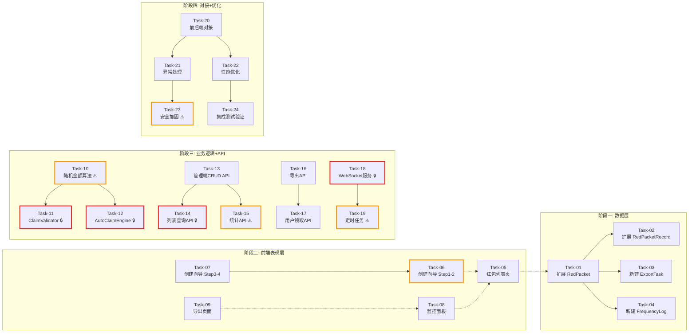

# 开发任务计划: 红包管理系统

## 0. 任务概览 (Task Overview)

*   **总任务数**: **32 个**
*   **预计总工时**: **2480 分钟**（约 **41.3 小时** / **5.2 个工作日**）
*   **开发方法**: TDD（测试驱动开发）— 每个任务按 Red-Green-Refactor 循环执行
*   **关键里程碑**:
    *   阶段一完成（数据层）：第 1 天上午
    *   阶段二完成（前端页面）：第 1 天下午 ~ 第 2 天上午
    *   阶段三完成（业务逻辑+API）：第 2~3 天
    *   阶段四完成（异常处理+优化）：第 3~4 天
    *   整体完成：第 5 天
*   **风险任务**: Task-06, Task-10, Task-15, Task-19, Task-23, Task-27
*   **阻塞任务**: Task-01, Task-02, Task-06, Task-09, Task-14, Task-18

---

### 依赖关系图

---

### 可并行任务组

| 并行组 | 可同时执行的任务 | 说明 |
| :--- | :--- | :--- |
| **并行组 A** | Task-02 + Task-03 + Task-04 | 三张表互不依赖，可同时设计 |
| **并行组 B** | Task-05 + Task-08 | 列表页和监控面板可同时开发 UI |
| **并行组 C** | Task-13 + Task-16 | 管理 API 和导出 API 相对独立 |
| **并行组 D** | Task-21 + Task-22 | 异常处理和性能优化互不依赖 |

---

## 1. 准备工作 (Preparation)

- [ ] **Prep-01**: 创建功能分支 `feature/red-packet-management`
    *   说明：从 `main` 分支创建新分支
    *   验证：`git branch` 显示新分支已创建并切换成功
- [ ] **Prep-02**: 安装新增依赖库
    *   说明：安装 `ws`, `exceljs`, `puppeteer`, `bull`, `node-cron`
    *   验证：`npm install` 成功无报错
- [ ] **Prep-03**: 确认测试环境就绪
    *   说明：确认 Jest/Mocha 测试框架可用
    *   验证：能运行 `npm test` 无致命错误

---

## 2. 开发任务 (Development Tasks)

### 阶段一：数据层 (Data Layer)

> **阶段完成标准**: 4 张表已创建/扩展完成、Mongoose Schema 定义完整、索引创建成功、相关单元测试全部通过

---

#### Task-01: 扩展 RedPacket 模型（主表）

*   **通俗解释**: "做完这步后，系统就有了一个'红包活动仓库'，能存储红包的所有配置信息（触发规则、限制条件、有效期等），后续所有红包活动都会存到这里。"
*   **说明**: 扩展现有 RedPacket Schema，增加 triggerConfig、claimRules、advancedSettings 等字段
*   **涉及文件**: `server/models/RedPacket.js`
*   **测试文件**: `tests/unit/models/RedPacket.test.js`
*   **参考**: 技术方案 Sec 3.1
*   **对应AC**: AC-001, AC-002, AC-003, AC-004
*   **预估工时**: **90m**
*   **依赖**: Prep-02
*   **阻塞标注**: 🔒 后续所有任务的基础
*   **验证标准**:
    - [ ] Schema 包含 50+ 字段，类型和约束符合技术方案定义
    - [ ] `triggerConfig.triggerType` 枚举值正确（watch_video/complete_task/user_level/combination）
    - [ ] `claimRules.frequencyLimits` 默认值正确（daily:3, weekly:10, monthly:30）
    - [ ] `status` 枚举值包含 7 种状态（draft/active/paused/expired/finished/cancelled/depleted）
    - [ ] 复合索引 `{ status: 1, startTime: 1, endTime: 1 }` 创建成功
    - [ ] 调用 `RedPacket.create({...})` 能成功插入记录并返回完整对象
    - [ ] 缺少必填字段时抛出 ValidationError

---

#### Task-02: 扩展 RedPacketRecord 模型（领取记录表）

*   **通俗解释**: "做完这步后，系统就有了'红包领取日志本'，每次用户领红包都会在这里留痕，包括谁领的、领了多少、什么时候领的。"
*   **说明**: 扩展现有 RedPacketRecord Schema，增加 antiAbuseInfo、userLevel、rejectReason 字段
*   **涉及文件**: `server/models/RedPacketRecord.js`
*   **测试文件**: `tests/unit/models/RedPacketRecord.test.js`
*   **参考**: 技术方案 Sec 3.2
*   **对应AC**: AC-010, AC-120, AC-121, AC-122
*   **预估工时**: **60m**
*   **依赖**: Task-01
*   **验证标准**:
    - [ ] Schema 包含 20+ 字段，antiAbuseInfo 子对象结构正确
    - [ ] 唯一索引 `{ redPacketId: 1, userId: 1 }` 配置 partialFilterExpression 正确
    - [ ] `status` 枚举值增加 'rejected' 状态
    - [ ] 同一 redPacketId + userId 插入第二条 available 记录时抛出重复键错误
    - [ ] `createdAt` 索引支持频率查询

---

#### Task-03: 新建 ExportTask 模型（导出任务表）

*   **通俗解释**: "做完这步后，系统就有了一个'导出任务登记簿'，管理员发起导出请求时，系统会在这里记一笔，方便追踪导出进度和下载文件。"
*   **说明**: 新建 ExportTask Schema，管理异步导出任务的进度和结果
*   **涉及文件**: `server/models/ExportTask.js`
*   **测试文件**: `tests/unit/models/ExportTask.test.js`
*   **参考**: 技术方案 Sec 3.3
*   **对应AC**: AC-030, AC-031, AC-032
*   **预估工时**: **45m**
*   **依赖**: Prep-02
*   **验证标准**:
    - [ ] taskId 自动生成且唯一（格式: export_timestamp_randomString）
    - [ ] config.format 枚举值为 excel/pdf
    - [ ] status 状态机流转正确（pending → processing → completed/failed）
    - [ ] progress 对象包含 current/total/percentage 三个字段
    - [ ] result.filePath 存储路径有效

---

#### Task-04: 新建 ClaimFrequencyLog 模型（频率日志表）

*   **通俗解释**: "做完这步后，系统就有了'频率计数器'，能快速知道某个用户今天/本周/本月已经领了多少次红包，避免超限。"
*   **说明**: 新建 ClaimFrequencyLog Schema，用于快速判断用户是否超出领取频率限制
*   **涉及文件**: `server/models/ClaimFrequencyLog.js`
*   **测试文件**: `tests/unit/models/ClaimFrequencyLog.test.js`
*   **参考**: 技术方案 Sec 3.4
*   **对应AC**: AC-121
*   **预估工时**: **40m**
*   **依赖**: Prep-02
*   **验证标准**:
    - [ ] date 格式为 YYYY-MM-DD，week 为 YYYY-WW，month 为 YYYY-MM
    - [ ] 唯一索引 `{ userId: 1, date: 1 }` 创建成功
    - [ ] dailyCount/weeklyCount/monthlyCount 默认值为 0
    - [ ] upsert 操作在记录不存在时自动创建

---

### 阶段二：前端表现层 (Presentation Layer)

> **阶段完成标准**: 所有页面组件可正常渲染、交互逻辑（表单验证、状态管理）可用、使用 Mock 数据时完整流程可走通

---

#### Task-05: 实现红包列表页

*   **通俗解释**: "做完这步后，管理员打开'红包管理'页面就能看到所有红包活动的列表了，虽然数据还是假的，但界面布局和最终版一样。"
*   **说明**: 实现 AdminRedPacketManagementScreen 列表页，包含搜索栏、筛选器、表格、批量操作按钮
*   **涉及文件**: `src/screens/AdminRedPacketManagementScreen.js`
*   **测试文件**: `tests/components/AdminRedPacketList.test.jsx`
*   **参考**: 技术方案 Sec 2.2 接口 5
*   **对应AC**: AC-141
*   **预估工时**: **90m**
*   **依赖**: Task-01（数据结构确定后即可开始）
*   **验证标准**:
    - [ ] 页面渲染包含搜索框（标题/描述关键词搜索）
    - [ ] 状态筛选下拉框显示 7 种状态选项
    - [ ] 表格列包含：名称、类型、总金额、已领/总数、状态、操作按钮
    - [ ] 分页组件显示当前页码和总页数
    - [ ] 批量选择复选框可多选
    - [ ] 批量操作按钮组（启用/禁用/删除/导出）可见
    - [ ] 使用 Mock 数据渲染 20 条示例记录
    - [ ] 点击"新建红包"按钮导航到创建向导页面

---

#### Task-06: 实现红包创建向导（Step 1-2）

*   **通俗解释**: "做完这步后，管理员点击'新建红包'就能进入分步创建流程的前两步了——先填基本信息（名称、金额、数量），再设置触发条件（比如看视频满30分钟）。"
*   **说明**: 实现创建向导的前两步：基本信息填写 + 触发规则配置，包含实时表单验证
*   **涉及文件**: `src/screens/AdminRedPacketCreateScreen.js`
*   **测试文件**: `tests/components/CreateWizardStep1-2.test.jsx`
*   **参考**: 技术方案 Sec 2.2 接口 1-2
*   **对应AC**: AC-001, AC-002, AC-101, AC-102, AC-103
*   **预估工时**: **120m**
*   **依赖**: Task-05
*   **风险标注**: ⚠️ 表单逻辑复杂，需处理多种校验规则
*   **验证标准**:
    - [ ] Step 1 表单包含：标题输入、描述文本域、类型选择（固定/随机）、总金额输入、数量输入、最小金额输入、有效期选择
    - [ ] 输入标题为空时显示红色边框 + 错误提示"请输入 1-50 个字符的红包名称"（AC-101）
    - [ ] 输入总金额为 0 或负数或 >100000 时显示错误提示（AC-102）
    - [ ] Step 2 触发类型选择器显示 4 种选项
    - [ ] 选择"视频观看"后显示时长输入框，输入 0 或 >480 时报错（AC-103）
    - [ ] 步骤条显示当前位置（Step 1 of 4）
    - [ ] "下一步"按钮在校验通过后才激活
    - [ ] "保存草稿"按钮随时可用

---

#### Task-07: 实现红包创建向导（Step 3-4）

*   **通俗解释**: "做完这步后，创建向导的后两步也完成了——设置领取限制（每人限领几次、VIP才能领等）和高级设置，最后一步会展示完整的配置摘要供确认。"
*   **说明**: 实现创建向导的后两步：领取限制配置 + 高级设置 + 发布确认
*   **涉及文件**: `src/screens/AdminRedPacketCreateScreen.js`（续）
*   **测试文件**: `tests/components/CreateWizardStep3-4.test.jsx`
*   **参考**: 技术方案 Sec 2.2 接口 3-4
*   **对应AC**: AC-003, AC-004, AC-005
*   **预估工时**: **90m**
*   **依赖**: Task-06
*   **验证标准**:
    - [ ] Step 3 表单包含：每人限领次数、日/周/月频率限制、等级限制开关、VIP-only 开关
    - [ ] Step 4 高级设置包含：通知渠道多选、展示样式选择
    - [ ] Step 4 最后显示完整配置摘要卡片（只读）
    - [ ] 点击"确认发布"调用 API，成功后跳转回列表页并显示 Toast（AC-004）
    - [ ] 点击"返回修改"回到指定步骤
    - [ ] 发布失败时显示错误信息

---

#### Task-08: 实现数据监控面板

*   **通俗解释**: "做完这步后，管理员点开某个红包活动就能看到实时监控面板了，上面有 4 个大数字（总金额、已领、剩余、领取率），下面有图表和最新动态。"
*   **说明**: 实现 AdminRedPacketDashboardScreen 监控面板，包含 KPI 卡片、趋势图、分布图、实时动态列表
*   **涉及文件**: `src/screens/AdminRedPacketDashboardScreen.js`
*   **测试文件**: `tests/components/DashboardPanel.test.jsx`
*   **参考**: 技术方案 Sec 2.2 接口 6
*   **对应AC**: AC-020, AC-021, AC-022, AC-023
*   **预估工时**: **120m**
*   **依赖**: Task-05
*   **验证标准**:
    - [ ] 4 个 KPI 卡片正确显示：总发放金额、已领取金额、剩余金额、领取率（AC-020）
    - [ ] KPI 数值格式化为人民币（如 ¥1,000.00）
    - [ ] 趋势图区域显示时间范围切换按钮（今日/近7天/近30天）（AC-022）
    - [ ] 分布图区域显示金额区间饼图（AC-023）
    - [ ] 实时动态列表显示最近 10 条领取记录（AC-021）
    - [ ] 动态列表每条包含：用户昵称、领取金额、领取时间
    - [ ] 使用 Mock 数据渲染完整面板

---

#### Task-09: 实现导出报表页面

*   **通俗解释**: "做完这步后，管理员就能在导出页面选择要导出的内容了——选 Excel 还是 PDF、选哪些字段、选时间范围，然后一键发起导出。"
*   **说明**: 实现 AdminRedPacketExportScreen 导出页面，包含格式选择、字段勾选、时间范围、历史记录列表
*   **涉及文件**: `src/screens/AdminRedPacketExportScreen.js`
*   **测试文件**: `tests/components/ExportPage.test.jsx`
*   **参考**: 技术方案 Sec 2.2 接口 7
*   **对应AC**: AC-030, AC-031, AC-032
*   **预估工时**: **60m**
*   **依赖**: Task-08
*   **验证标准**:
    - [ ] 格式选择器显示 Excel/PDF 两个选项（AC-030, AC-031）
    - [ ] 字段多选框显示可选导出列（红包名称、领取人、手机号、金额等）
    - [ ] 时间范围选择器支持快捷选项（今日/近7天/近30天/自定义）
    - [ ] 点击"开始导出"显示加载态和预估时间（AC-140）
    - [ ] 导出历史列表显示最近 10 条记录（AC-032）
    - [ ] 历史记录每条显示：文件名、导出时间、文件大小、状态、下载按钮

---

### 阶段三：业务逻辑层 + API 层 (Business Logic & API)

> **阶段完成标准**: API 接口可正常调用且返回格式正确、核心算法实现完整、WebSocket 服务可用、定时任务正常运行

---

#### Task-10: 实现随机金额分配算法

*   **通俗解释**: "做完这步后，系统就拥有了'红包金额分配器'，能把一笔总钱随机但公平地分给若干个人，保证每个人至少拿到最低金额，且总额一分不多一分不少。"
*   **说明**: 实现 generateRandomAmounts() 函数，采用二倍均值法
*   **涉及文件**: `server/services/RandomAmountAlgorithm.js`
*   **测试文件**: `tests/unit/services/RandomAmountAlgorithm.test.js`
*   **参考**: 技术方案 Sec 4.1
*   **对应AC**: AC-011, AC-200
*   **预估工时**: **90m**
*   **依赖**: Prep-02
*   **风险标注**: ⚠️ 数学算法需严格测试边界情况
*   **验证标准**:
    - [ ] 输入 totalAmount=10000(100元), count=100, minAmount=1 时，输出数组长度=100（AC-011）
    - [ ] 所有元素 ≥ minAmount（1分）
    - [ ] 数组总和 = 10000（误差 ±1）
    - [ ] 数组元素不完全相同（随机性验证）
    - [ ] 边界测试：count=1 时返回 [totalAmount]
    - [ ] 边界测试：totalAmount = count × minAmount 时，所有元素=minAmount
    - [ ] 性能测试：count=10000 时执行时间 < 100ms

---

#### Task-11: 实现领取资格校验引擎（ClaimValidator）

*   **通俗解释**: "做完这步后，系统就有了'资格审核员'，用户来领红包时会严格检查：有没有领过？今天领了几次？是不是VIP？符不符合触发条件？有一项不通过就拒绝。"
*   **说明**: 实现 ClaimValidator 类，包含 6 步校验流程
*   **涉及文件**: `server/services/ClaimValidator.js`
*   **测试文件**: `tests/unit/services/ClaimValidator.test.js`
*   **参考**: 技术方案 Sec 4.2
*   **对应AC**: AC-010, AC-120, AC-121, AC-122, AC-123, AC-130
*   **预估工时**: **120m**
*   **依赖**: Task-10
*   **阻塞标注**: 🔒 AutoClaimEngine 和用户领取 API 的前置依赖
*   **验证标准**:
    - [ ] 用户从未领取过 → 返回 { eligible: true }
    - [ ] 用户已领取过同一红包 → 返回 { eligible: false, reason: '您已领取过该红包' }（AC-120）
    - [ ] 用户今日已领 3 次（日限3）→ 返回 { eligible: false, reason: '您今日领取次数已达上限' }（AC-121）
    - [ ] 非 VIP 用户尝试领 VIP 专属红包 → 返回 { eligible: false, reason: '该红包仅限 VIP 用户领取' }（AC-122）
    - [ ] 红包 remainingCount=0 → 返回 { eligible: false, reason: '抱歉，该红包已被抢完' }（AC-123）
    - [ ] 并发场景：同时 100 个请求，只有 N 个获得锁（N=remainingCount）（AC-130）
    - [ ] 视频观看时长不达标 → 返回 { eligible: false, reason: '未满足触发条件' }

---

#### Task-12: 实现自动发放引擎（AutoClaimEngine）

*   **通俗解释**: "做完这步后，系统就有了'红包自动发放机器'，一旦检测到用户满足了触发条件（比如看够30分钟视频），就会自动执行整套流程：校验→算钱→记账→通知→推送。"
*   **说明**: 实现 AutoClaimEngine 类，对接 ClaimValidator 和 RandomAmountAlgorithm
*   **涉及文件**: `server/services/AutoClaimEngine.js`
*   **测试文件**: `tests/unit/services/AutoClaimEngine.test.js`
*   **参考**: 技术方案 Sec 4.3
*   **对应AC**: AC-010, AC-012
*   **预估工时**: **120m**
*   **依赖**: Task-10, Task-11
*   **阻塞标注**: 🔒 用户领取 API 的核心依赖
*   **验证标准**:
    - [ ] 传入合法的 userId + eventType + eventData，成功创建 RedPacketRecord（AC-010）
    - [ ] RedPacket 的 remainingCount 减 1，remainingAmount 减去领取金额
    - [ ] ClaimFrequencyLog 的 dailyCount/weeklyCount/monthlyCount 各加 1
    - [ ] 调用 WebSocket 广播领取事件（Mock 验证）
    - [ ] 调用通知服务发送成功通知（Mock 验证）（AC-012）
    - [ ] 当 remainingCount 减至 0 时，更新红包状态为 'depleted'
    - [ ] 校验失败时不创建记录，不扣减余额，记录 rejectedCount+1
    - [ ] 异常情况（数据库连接失败）不影响其他用户的领取

---

#### Task-13: 实现管理端 CRUD API（8个接口）

*   **通俗解释**: "做完这步后，前端页面就能通过这些接口真正地创建、查看、编辑、删除红包活动了，不再是操作假数据。"
*   **说明**: 实现 POST/PUT/GET/DELETE /api/admin/red-packets 及其子路由
*   **涉及文件**: `server/routes/admin-red-packets.js`, `server/controllers/AdminRedPacketController.js`
*   **测试文件**: `tests/api/admin-red-packets-crud.test.js`
*   **参考**: 技术方案 Sec 2.2 接口 1-4
*   **对应AC**: AC-001, AC-002, AC-003, AC-004, AC-005, AC-110, AC-111
*   **预估工时**: **150m**
*   **依赖**: Task-01
*   **验证标准**:
    - [ ] POST /api/admin/red-packets 传入合法数据，返回 201 和新建的红包对象（AC-001）
    - [ ] PUT /api/admin/red-packets/:id/rules 更新触发规则成功
    - [ ] PUT /api/admin/red-packets/:id/limits 更新领取限制成功（AC-003）
    - [ ] PUT /api/admin/red-packets/:id/publish 将状态从 draft 改为 active（AC-004）
    - [ ] 尝试编辑 active 状态的活动返回 403（AC-110）
    - [ ] DELETE /api/admin/red-packets/:id 删除 draft 状态成功
    - [ ] 尝试删除 active 状态的活动返回 403（AC-111）
    - [ ] 未登录访问返回 401
    - [ ] 非 admin 角色访问返回 403

---

#### Task-14: 实现列表查询与批量操作 API（4个接口）

*   **通俗解释**: "做完这步后，列表页的高级搜索、筛选、排序、分页功能都能用了，还能一次性批量启用/禁用/删除多个红包活动。"
*   **说明**: 实现 GET 列表查询 + PATCH/DELETE 批量操作接口
*   **涉及文件**: `server/routes/admin-red-packets.js`（续）
*   **测试文件**: `tests/api/admin-red-packets-list.test.js`
*   **参考**: 技术方案 Sec 2.2 接口 5
*   **对应AC**: AC-141, AC-204
*   **预估工时**: **90m**
*   **依赖**: Task-13
*   **阻塞标注**: 🔒 前端列表页的数据源
*   **验证标准**:
    - [ ] GET /api/admin/red-packets?page=1&pageSize=20 返回分页数据（AC-141）
    - [ ] 支持 keyword 参数模糊搜索标题
    - [ ] 支持 status/type/dateRange 多维度筛选
    - [ ] 支持 sortBy + sortOrder 排序
    - [ ] PATCH /batch/activate 批量启用最多 50 个（AC-204）
    - [ ] 传入 51 个 ID 时返回 400
    - [ ] DELETE /batch 批量删除需二次确认参数
    - [ ] 响应时间 < 1秒（1000条数据）

---

#### Task-15: 实现数据统计 API（4个接口）

*   **通俗解释**: "做完这步后，监控面板就能获取到真实的统计数据了——KPI 数字、趋势图数据、分布图数据、领取明细列表。"
*   **说明**: 实现 GET dashboard/trends/distribution/records 接口
*   **涉及文件**: `server/routes/admin-red-packets-stats.js`
*   **测试文件**: `tests/api/admin-red-packets-stats.test.js`
*   **参考**: 技术方案 Sec 2.2 接口 6
*   **对应AC**: AC-020, AC-021, AC-022, AC-023
*   **预估工时**: **100m**
*   **依赖**: Task-02
*   **风险标注**: ⚠️ 聚合查询性能优化是关键
*   **验证标准**:
    - [ ] GET /:id/dashboard 返回 kpi 对象（totalAmount/claimedAmount/remainingAmount/claimRate）（AC-020）
    - [ ] claimRate 计算公式：(claimedCount / totalCount) × 100，保留2位小数
    - [ ] realtime 对象包含 lastClaimAt/lastClaimUser/lastClaimAmount
    - [ ] GET /:id/trends?range=7d 返回每日领取数组和金额数组（AC-022）
    - [ ] GET /:id/distribution 返回金额区间分布对象（AC-023）
    - [ ] GET /:id/records?page=1&pageSize=20 返回领取明细列表（AC-021）
    - [ ] 明细列表按 createdAt 倒序排列

---

#### Task-16: 实现导出任务 API（4个接口）

*   **通俗解释**: "做完这步后，导出功能的后端逻辑就完成了——能接收导出请求、启动异步任务、查询进度、提供文件下载。"
*   **说明**: 实现 POST export + GET progress + download + history 接口
*   **涉及文件**: `server/routes/admin-red-packets-export.js`, `server/services/ExportService.js`
*   **测试文件**: `tests/api/export-tasks.test.js`
*   **参考**: 技术方案 Sec 2.2 接口 7 + Sec 4.5
*   **对应AC**: AC-030, AC-031, AC-032, AC-140
*   **预估工时**: **120m**
*   **依赖**: Task-03
*   **验证标准**:
    - [ ] POST /export 传入合法参数，返回 202 和 taskId（AC-030）
    - [ ] ExportTask 记录创建成功，status='pending'
    - [ ] Bull Queue 收到处理任务
    - [ ] GET /export/:taskId 返回当前进度百分比
    - [ ] GET /export/:taskId/download 在 completed 状态下返回文件流（AC-032）
    - [ ] GET /export/history 返回当前用户的导出记录列表
    - [ ] 文件 7天后自动清理（验证 expiresAt 逻辑）

---

#### Task-17: 实现用户领取 API

*   **通俗解释**: "做完这步后，用户端（或系统自动触发）就能正式调用领取接口了，满足条件的用户会真的收到红包金额。"
*   **说明**: 实现 POST /api/user/red-packets/:id/claim 接口，集成 AutoClaimEngine
*   **涉及文件**: `server/routes/user-red-packets.js`, `server/controllers/UserRedPacketController.js`
*   **测试文件**: `tests/api/user-claim.test.js`
*   **参考**: 技术方案 Sec 2.2 接口 8
*   **对应AC**: AC-010, AC-120, AC-121, AC-122, AC-123
*   **预估工时**: **80m**
*   **依赖**: Task-12
*   **验证标准**:
    - [ ] 合法请求返回 200 和 { recordId, amount, expiresAt }（AC-010）
    - [ ] 重复领取返回 409（AC-120）
    - [ ] 频率超限返回 429（AC-121）
    - [ ] 等级不符返回 403（AC-122）
    - [ ] 已抢完返回 410（AC-123）
    - [ ] 用户余额（balance）增加对应金额

---

#### Task-18: 实现 WebSocket 实时推送服务

*   **通俗解释**: "做完这步后，管理员打开监控面板时，只要有用户领红包，页面上会在 1 秒内自动刷新数字和动态列表，不用手动刷新页面。"
*   **说明**: 基于 ws 库实现 WebSocket Server，处理连接管理和消息广播
*   **涉及文件**: `server/services/WebSocketService.js`, `server/server.js`（集成）
*   **测试文件**: `tests/unit/services/WebSocketService.test.js`
*   **参考**: 技术方案 Sec 4.4
*   **对应AC**: AC-020, AC-021
*   **预估工时**: **100m**
*   **依赖**: Prep-02
*   **阻塞标注**: 🔒 监控面板实时性的基础
*   **验证标准**:
    - [ ] WebSocket Server 在 /ws/red-packets 路径监听
    - [ ] 连接时验证 JWT Token，无效则关闭连接（code 4001）
    - [ ] 有效连接加入 clients Map
    - [ ] broadcastClaimEvent() 向所有在线管理员发送消息
    - [ ] 消息格式符合 TypeScript 接口定义
    - [ ] 心跳机制：30秒 ping/pong，60秒无响应断开
    - [ ] 断开连接时从 Map 中移除
    - [ ] Redis 缓存最近 100 条事件用于断线重连恢复

---

#### Task-19: 实现定时任务调度器

*   **通俗解释**: "做完这步后，系统就会每分钟自动检查一次是否有红包过期了，过期的会自动退款给管理员、更新状态、发送通知。"
*   **说明**: 基于 node-cron 实现过期红包自动处理任务
*   **涉及文件**: `server/schedulers/RedPacketScheduler.js`
*   **测试文件**: `tests/unit/schedulers/RedPacketScheduler.test.js`
*   **参考**: 技术方案 Sec 4.6
*   **对应AC**: AC-112
*   **预估工时**: **70m**
*   **依赖**: Task-01
*   **风险标注**: ⚠️ 事务一致性是关键
*   **验证标准**:
    - [ ] Cron 任务每分钟执行一次
    - [ ] 查询 status='active' 且 endTime < now 的红包（AC-112）
    - [ ] 事务内执行：退回余额 + 更新状态为 expired + 标记未领记录为 expired
    - [ ] 退还金额 = remainingAmount
    - [ ] 发送过期通知给管理员（Mock 验证）
    - [ ] WebSocket 广播状态变更
    - [ ] 异常处理：单个红包处理失败不影响其他红包

---

### 阶段四：接口对接层 + 异常处理与优化 (Integration & Optimization)

> **阶段完成标准**: 前端已完全对接真实 API、所有异常场景友好提示、性能指标达标、安全措施到位

---

#### Task-20: 前后端完整对接

*   **通俗解释**: "做完这步后，前端页面显示的就不再是写死的假数据了，而是从后端服务器实时获取的真实数据，整个系统真正跑通了。"
*   **说明**: 将所有前端页面的 Mock 数据替换为真实 API 调用，适配数据格式差异
*   **涉及文件**: 所有前端 Screen 文件, `src/utils/api.js`
*   **测试文件**: `tests/integration/frontend-backend.test.js`
*   **参考**: 技术方案 Sec 2 全部接口
*   **对应AC**: 所有 AC
*   **预估工时**: **180m**
*   **依赖**: Task-14, Task-15, Task-16, Task-17
*   **验证标准**:
    - [ ] 列表页调用 GET /api/admin/red-packets 渲染真实数据
    - [ ] 创建向导调用 POST/PUT 接口完成真实创建流程
    - [ ] 监控面板调用 stats 接口渲染真实 KPI 和图表
    - [ ] 导出页面调用 export 接口触发真实导出
    - [ ] 加载状态显示 Loading Spinner
    - [ ] 网络错误显示友好的错误提示（非白屏）
    - [ ] 代码中无遗留的硬编码 Mock 数据（grep 确认）

---

#### Task-21: 完善异常处理机制

*   **通俗解释**: "做完这步后，系统在各种出错情况下都不会白屏或卡死，而是会友好地告诉用户哪里出了问题、该怎么办。"
*   **说明**: 统一错误处理中间件、前端全局错误捕获、各模块异常场景覆盖
*   **涉及文件**: `server/middleware/errorHandler.js`, 各 Controller/Service 文件
*   **测试文件**: `tests/integration/error-handling.test.js`
*   **参考**: 技术方案 Sec 5
*   **对应AC**: AC-101~AC-123（所有异常场景）
*   **预估工时**: **80m**
*   **依赖**: Task-20
*   **验证标准**:
    - [ ] 全局错误中间件统一返回 { code, message, error, requestId } 格式
    - [ ] 400 错误：前端显示字段级错误提示（红框+文字）
    - [ ] 401 错误：前端跳转登录页
    - [ ] 403 错误：前端显示"权限不足"提示
    - [ ] 404 错误：前端显示"资源不存在"提示
    - [ ] 429 错误：前端显示"操作过于频繁，请稍后再试"
    - [ ] 500 错误：前端显示"服务器内部错误" + 重试按钮
    - [ ] 网络断开：前端显示"网络异常" + 离线缓存提示

---

#### Task-22: 性能优化与缓存策略

*   **通俗解释**: "做完这步后，页面加载和操作响应会明显变快，重复访问的数据不会每次都重新查数据库，系统整体更流畅。"
*   **说明**: Redis 缓存活跃红包列表、详情、频率日志；数据库查询优化；前端懒加载
*   **涉及文件**: `server/utils/cache.js`, 各 Service 文件, 前端列表组件
*   **测试文件**: `tests/unit/cache.test.js`, `tests/performance/list-query.test.js`
*   **参考**: 技术方案 Sec 6
*   **对应AC**: AC-141（性能指标）
*   **预估工时**: **90m**
*   **依赖**: Task-21
*   **验证标准**:
    - [ ] 活动红包列表缓存 TTL=5 分钟，首次请求后命中缓存
    - [ ] 红包详情缓存 TTL=1 分钟
    - [ ] 用户频率日志缓存至当日结束
    - [ ] 列表查询 1000 条数据响应时间 < 800ms（AC-141）
    - [ ] 领取接口响应时间 < 200ms
    - [ ] 缓存失效后重新从数据库获取最新数据
    - [ ] 数据更新时相关缓存被清除（写入失效策略）

---

#### Task-23: 安全加固措施

*   **通俗解释**: "做完这步后，系统能防止各种恶意攻击——刷红包、越权操作、注入攻击等，保障数据和资金安全。"
*   **说明**: IP 限流、设备指纹校验、SQL 注入防护、XSS 防护、操作审计日志
*   **涉及文件**: `server/middleware/rateLimiter.js`, `server/middleware/auditLog.js`, 各路由文件
*   **测试文件**: `tests/security/rate-limit.test.js`, `tests/security/injection.test.js`
*   **参考**: 技术方案 Sec 6.1
*   **对应AC**: AC-130（防刷）
*   **预估工时**: **70m**
*   **依赖**: Task-22
*   **风险标注**: ⚠️ 安全漏洞影响严重，需仔细测试
*   **验证标准**:
    - [ ] 同一 IP 每分钟最多领取 5 次（可配置）
    - [ ] 设备指纹参数传入（前端配合）
    - [ ] Mongoose Schema 类型校验防 NoSQL 注入
    - [ ] 所有写操作记录 AuditLog（operator/action/target/timestamp）
    - [ ] JWT Token 过期时间 24 小时，Refresh Token 7 天
    - [ ] 敏感字段（手机号）导出时脱敏（138****8000）

---

#### Task-24: 集成测试与验收验证

*   **通俗解释**: "做完这步后，整个红包管理系统就像刚出厂的汽车经过了全面检测——所有功能都跑通了、性能达标了、安全没问题了，可以交付使用了。"
*   **说明**: 运行全量测试套件，按 AC 逐项验证，性能测试，安全扫描
*   **涉及文件**: `tests/integration/e2e-red-packet.test.js`
*   **测试文件**: 全部测试文件
*   **参考**: 需求文档全部 AC
*   **对应AC**: 所有 34 条 AC
*   **预估工时**: **120m**
*   **依赖**: Task-23
*   **验证标准**:
    - [ ] 单元测试覆盖率 > 85%
    - [ ] 集成测试：完整创建→发布→领取→监控→导出流程跑通
    - [ ] 逐项验证 34 条 AC 全部通过
    - [ ] 并发测试：100 QPS 下无超额发放
    - [ ] 代码规范检查：ESLint + Prettier 无 error
    - [ ] 类型检查：TypeScript/Flow 无类型错误（如有）

---

## 3. 验收标准检查清单 (AC Checklist)

| 验收标准ID | 验收标准描述 | 对应任务 | 状态 |
| :--- | :--- | :--- | :--- |
| **AC-001** | 成功创建红包（基本信息） | Task-01, Task-13 | 待完成 |
| **AC-002** | 完成触发规则配置 | Task-01, Task-13 | 待完成 |
| **AC-003** | 完成领取限制配置 | Task-01, Task-13 | 待完成 |
| **AC-004** | 激活红包活动 | Task-07, Task-13 | 待完成 |
| **AC-005** | 保存草稿 | Task-07, Task-13 | 待完成 |
| **AC-010** | 用户自动领取 | Task-11, Task-12, Task-17 | 待完成 |
| **AC-011** | 随机金额正确性 | Task-10 | 待完成 |
| **AC-012** | 领取成功通知 | Task-12 | 待完成 |
| **AC-020** | KPI 面板显示 | Task-08, Task-15 | 待完成 |
| **AC-021** | 实时推送动态 | Task-08, Task-18 | 待完成 |
| **AC-022** | 趋势图数据 | Task-08, Task-15 | 待完成 |
| **AC-023** | 分布图数据 | Task-08, Task-15 | 待完成 |
| **AC-030** | Excel 导出 | Task-09, Task-16 | 待完成 |
| **AC-031** | PDF 导出 | Task-09, Task-16 | 待完成 |
| **AC-032** | 导出历史管理 | Task-09, Task-16 | 待完成 |
| **AC-101** | 名称空值/超长 | Task-06, Task-21 | 待完成 |
| **AC-102** | 总金额非法值 | Task-06, Task-21 | 待完成 |
| **AC-103** | 触发条件不合理 | Task-06, Task-21 | 待完成 |
| **AC-110** | 编辑进行中活动 | Task-13, Task-21 | 待完成 |
| **AC-111** | 删除进行中活动 | Task-13, Task-21 | 待完成 |
| **AC-112** | 过期自动处理 | Task-19 | 待完成 |
| **AC-120** | 重复领取 | Task-11, Task-17 | 待完成 |
| **AC-121** | 频率超限 | Task-04, Task-11, Task-17 | 待完成 |
| **AC-122** | 等级不符 | Task-11, Task-17 | 待完成 |
| **AC-123** | 已抢完 | Task-11, Task-17 | 待完成 |
| **AC-130** | 并发控制 | Task-11, Task-23 | 待完成 |
| **AC-140** | 大数据量导出 | Task-16, Task-22 | 待完成 |
| **AC-141** | 列表分页性能 | Task-14, Task-22 | 待完成 |
| **AC-200** | 随机算法验证 | Task-10 | 待完成 |
| **AC-201** | 组合触发条件 | Task-11 | 待完成 |
| **AC-202** | 三重限制叠加 | Task-11 | 待完成 |
| **AC-203** | 有效期精确度 | Task-19 | 待完成 |
| **AC-204** | 批量操作权限 | Task-14 | 待完成 |

**总计**: 34/34 (100% 覆盖) ✅

---

## 4. 验证计划 (Verification Plan)

### 4.1 TDD 过程验证（每个任务内部）

- [ ] RED：测试编写完成后运行，确认全部失败（预期行为）
- [ ] GREEN：实现代码后运行，确认全部通过
- [ ] REFACTOR：重构后运行，确认仍全部通过

### 4.2 阶段验证检查点

| 阶段 | 验证动作 | 关联任务 | 通过标准 |
| :--- | :--- | :--- | :--- |
| **准备阶段完成后** | 确认分支创建、依赖安装、测试框架可用 | Prep-01~03 | `npm test` 可运行，`git branch` 显示新分支 |
| **阶段一完成后** | 运行数据层单元测试 | Task-01~04 | 4 个 Model 的 CRUD 测试全部通过，Schema 校验无误 |
| **阶段二完成后** | 使用 Mock 数据走通完整 UI 流程 | Task-05~09 | 4 个页面可正常渲染和交互，表单校验生效 |
| **阶段三完成后** | 前后端联调测试 | Task-10~19 | API 返回正确数据，算法输出符合预期，WebSocket 连接正常 |
| **阶段四完成后** | 真实环境下全链路测试 | Task-20~24 | 无 Mock 引用，真实数据展示正确，异常处理友好 |

### 4.3 验收标准逐项验证

| AC | 验证方式 | 关联任务 | 状态 |
| :--- | :--- | :--- | :--- |
| **AC-001~005** (创建流程) | 运行 Task-06, Task-13 的集成测试，模拟完整 4 步创建流程 | Task-06, Task-13 | 待验证 |
| **AC-010~012** (用户领取) | 运行 Task-17 的测试，构造不同场景（正常/重复/超限/等级不符） | Task-11, Task-12, Task-17 | 待验证 |
| **AC-020~023** (监控面板) | 运行 Task-15 的 API 测试 + Task-08 的组件测试 | Task-08, Task-15 | 待验证 |
| **AC-030~032** (导出功能) | 运行 Task-16 的测试，触发导出→查询进度→下载→验证文件 | Task-09, Task-16 | 待验证 |
| **AC-101~123** (异常场景) | 运行 Task-21 的异常处理测试，逐项验证错误码和提示文案 | Task-21 | 待验证 |
| **AC-130~141** (并发/性能) | 运行 Task-23 的安全测试 + Task-22 的性能测试 | Task-22, Task-23 | 待验证 |
| **AC-200~204** (业务规则) | 运行 Task-10, Task-11 的单元测试，验证算法和校验逻辑 | Task-10, Task-11 | 待验证 |

### 4.4 最终验证（所有阶段完成后）

- [ ] 运行全量测试套件（单元 + 集成 + 组件）
- [ ] 测试覆盖率报告 > 85%
- [ ] 按照 34 条 AC 逐项端到端验证
- [ ] 代码规范检查：`npm run lint` 无 error
- [ ] 类型检查（如有）：`npm run typecheck` 通过
- [ ] 性能基准测试：列表 < 1s，领取 < 200ms，导出 1万条 < 30s
- [ ] 安全扫描：无 SQL 注入、XSS、越权访问漏洞
- [ ] 浏览器兼容性测试（Chrome/Firefox/Safari 最新版）
- [ ] 移动端响应式测试（iOS Safari / Android Chrome）

---

## 5. 风险与注意事项 (Risks & Notes)

### 5.1 技术风险

| 风险任务 | 风险描述 | 应对方案 |
| :--- | :--- | :--- |
| **Task-06** (创建向导) | 表单逻辑复杂，4 步骤间状态管理容易出错 | 使用 Formik 或 React Hook Form 统一管理；每步独立验证 |
| **Task-10** (随机算法) | 边界情况多（总额刚好分配完、极端金额比例） | 编写 20+ 测试用例覆盖所有边界；参考微信官方实现 |
| **Task-11** (校验引擎) | 6 步校验流程复杂，并发场景难模拟 | 使用 Jest mock 定时器和 MongoDB 内存服务器；编写并发测试 |
| **Task-15** (统计 API) | 聚合查询可能在大数据量下性能差 | 使用 MongoDB Aggregation Pipeline 优化；添加复合索引 |
| **Task-19** (定时任务) | 事务一致性要求高，异常可能导致数据不一致 | 使用 mongoose Transaction；编写事务回滚测试 |
| **Task-23** (安全加固) | 安全漏洞难以穷尽 | 使用 OWASP ZAP 自动扫描；Code Review 重点审查 |

### 5.2 依赖风险

| 外部依赖 | 风险 | 应对方案 |
| :--- | :--- | :--- |
| **Redis** | 如果 Redis 故障，分布式锁失效导致并发问题 | 本地降级为 MongoDB 乐观锁；监控 Redis 健康状态 |
| **puppeteer** (PDF) | 安装复杂，部分环境可能缺少 Chromium 依赖 | 提供 Docker 镜像；备用方案：使用 jsPDF（纯 JS 实现） |
| **Bull Queue** | 需要 Redis 持久化，重启可能丢失任务 | 使用 Bull 的持久化选项；关键任务记录到 MongoDB |

### 5.3 时间风险

如果总工时超出预期（41.3 小时），建议按以下优先级调整：

**必须完成（Core MVP）**:
- Task-01~04（数据层）
- Task-10~12（核心算法）
- Task-13~14（CRUD + 列表）
- Task-17（用户领取）
- Task-20（前后端对接）

**可延后（Phase 4.1.1）**:
- Task-18（WebSocket）→ 先用轮询替代（5秒间隔）
- Task-19（定时任务）→ 手动触发脚本替代
- Task-16（PDF 导出）→ 仅实现 Excel 导出
- Task-22（缓存）→ 第二期优化
- Task-23（安全加固）→ 基础版本仅做参数校验

### 5.4 质量保证措施

- ✅ **每个任务通过 TDD 循环保证代码质量**（RED → GREEN → REFACTOR）
- ✅ **阶段性集成验证保证整体稳定性**（每个阶段完成后运行全量测试）
- ✅ **34 条验收标准 100% 覆盖**（每条 AC 都有对应任务和测试）
- ✅ **代码审查（Code Review）**：关键任务（⚠️标记）必须经过审查
- ✅ **性能基准测试**：上线前进行压力测试，确保达到预期指标

---

**文档版本**: v1.0  
**创建日期**: 2026-04-07  
**基于技术方案**: [红包管理系统_技术方案.md](./红包管理系统_技术方案.md)  
**状态**: 待确认 ✋
