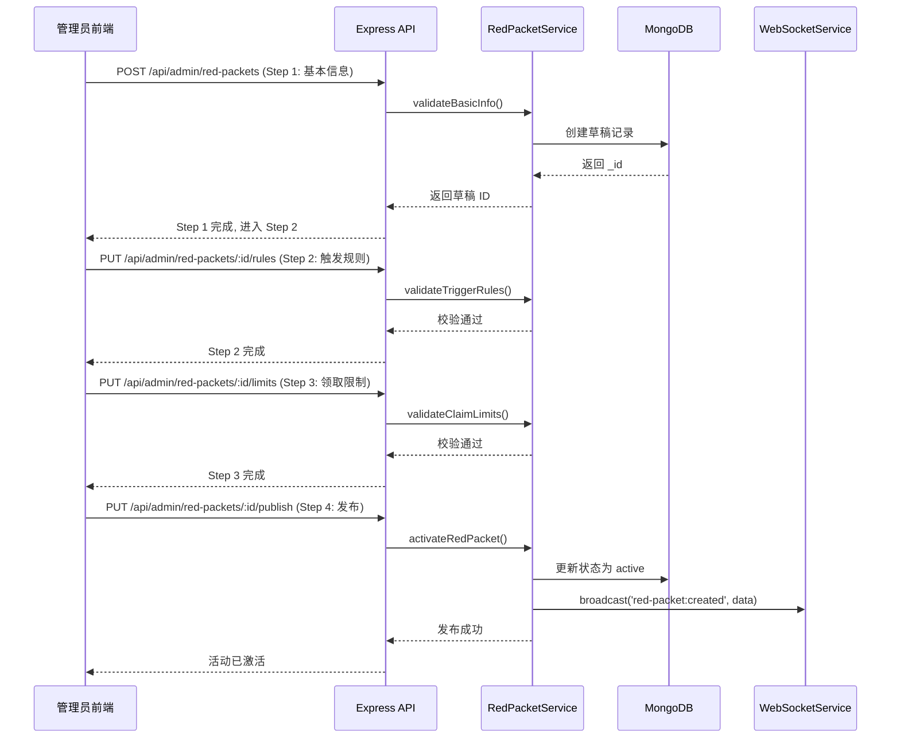
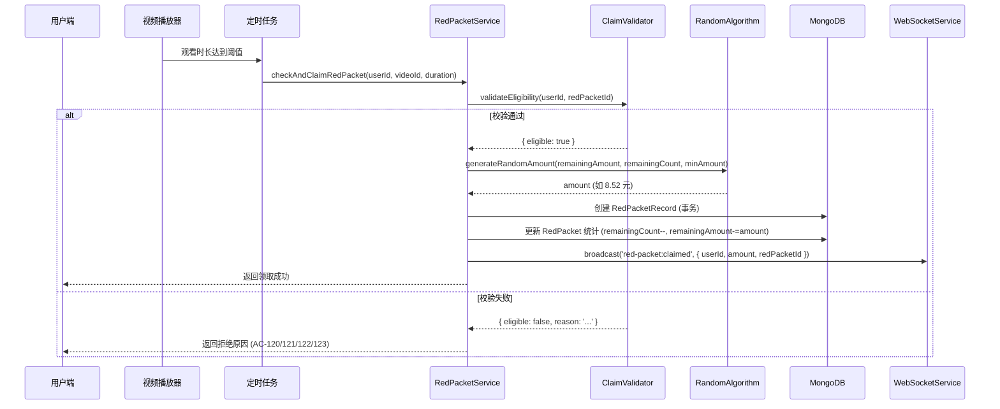

# 技术设计文档: 红包管理系统

## 0. 设计概要 (Design Summary)

*   **功能描述**: 构建功能完整的红包管理后台系统，支持基于用户行为触发红包发放，包含创建向导、实时监控、批量操作和报表导出。
*   **影响范围**:
    *   后端：新增/扩展现有红包模型、路由、服务层
    *   前端：新增管理端页面组件（列表页、创建向导、监控面板）
    *   基础设施：WebSocket 服务、文件导出模块、定时任务调度器
*   **技术难点**:
    1. 随机金额算法的公平性与总额精确控制（AC-011, AC-200）
    2. 高并发场景下的幂等性保证与防刷机制（AC-130）
    3. WebSocket 实时推送的性能优化（AC-020, AC-021）
    4. 大数据量异步导出的性能保障（AC-140）
*   **依赖关系**:
    *   依赖：用户认证系统（JWT）、视频观看记录（VideoWatch）、会员等级系统
    *   被依赖：用户端红包领取界面（Phase 4.2）、财务对账系统（后续）

---

## 1. 架构概览 (Architecture Overview)

### 1.1 系统架构图

```mermaid
graph TB
    subgraph "前端层 (Admin Panel)"
        A1[红包列表页]
        A2[创建向导<br/>4步流程]
        A3[数据监控面板]
        A4[导出报表页面]
    end
    
    subgraph "API 层 (Express Router)"
        B1[/api/admin/red-packets<br/>CRUD + 批量操作]
        B2[/api/admin/red-packets/:id/stats<br/>数据统计]
        B3[/api/admin/red-packets/export<br/>Excel/PDF 导出]
        B4[/api/user/red-packets<br/>用户端接口]
        B5[WebSocket /ws/red-packets<br/>实时推送]
    end
    
    subgraph "业务逻辑层 (Service)"
        C1[RedPacketService<br/>核心业务逻辑]
        C2[RandomAmountAlgorithm<br/>随机金额算法]
        C3[ClaimValidator<br/>领取资格校验]
        C4[ExportService<br/>报表生成]
        C5[WebSocketService<br/>消息广播]
    end
    
    subgraph "数据层 (MongoDB)"
        D1[(redpackets)]
        D2[(redpacket_records)]
        D3[(export_tasks)]
        D4[(users)]
        D5[(video_watches)]
    end
    
    subgraph "基础设施"
        E1[定时任务调度器<br/>过期处理]
        E2[文件存储<br/>导出文件临时保存]
    end
    
    A1 & A2 --> B1
    A3 --> B2 & B5
    A4 --> B3
    B4 --> C1 & C3
    C1 --> C2 & C3
    C1 --> D1 & D2
    C4 --> E2
    E1 --> D1
```

### 1.2 核心数据流

#### 流程 A: 管理员创建红包活动



#### 流程 B: 用户自动领取红包



---

## 2. API 设计 (API Design)

### 2.1 接口列表总览

| 接口名称 | 方法 | 路径 | 描述 | 对应验收标准 |
| :--- | :--- | :--- | :--- | :--- |
| **管理端 - 红包 CRUD** | | | | |
| 创建红包（Step 1） | POST | `/api/admin/red-packets` | 创建草稿 | AC-001 |
| 更新基本信息 | PUT | `/api/admin/red-packets/:id` | 编辑草稿 | AC-001 |
| 配置触发规则 | PUT | `/api/admin/red-packets/:id/rules` | Step 2 | AC-002 |
| 配置领取限制 | PUT | `/api/admin/red-packets/:id/limits` | Step 3 | AC-003 |
| 发布活动 | PUT | `/api/admin/red-packets/:id/publish` | Step 4 | AC-004 |
| 保存草稿 | PUT | `/api/admin/red-packets/:id/draft` | 任意步骤保存 | AC-005 |
| 获取红包详情 | GET | `/api/admin/red-packets/:id` | 查看/编辑 | AC-001 |
| 删除红包 | DELETE | `/api/admin/red-packets/:id` | 删除草稿 | AC-111 |
| **管理端 - 列表与查询** | | | | |
| 获取红包列表 | GET | `/api/admin/red-packets` | 分页+搜索+筛选 | AC-141 |
| 批量启用 | PATCH | `/api/admin/red-packets/batch/activate` | 批量激活 | AC-204 |
| 批量禁用 | PATCH | `/api/admin/red-packets/batch/deactivate` | 批量暂停 | AC-110 |
| 批量删除 | DELETE | `/api/admin/red-packets/batch` | 批量删除 | AC-111, AC-204 |
| **管理端 - 数据统计** | | | | |
| 获取 KPI 数据 | GET | `/api/admin/red-packets/:id/dashboard` | 监控面板 | AC-020 |
| 获取趋势图数据 | GET | `/api/admin/red-packets/:id/trends` | 趋势图 | AC-022 |
| 获取分布图数据 | GET | `/api/admin/red-packets/:id/distribution` | 分布图 | AC-023 |
| 获取领取明细 | GET | `/api/admin/red-packets/:id/records` | 明细列表 | AC-021 |
| **管理端 - 导出功能** | | | | |
| 创建导出任务 | POST | `/api/admin/red-packets/export` | 触发导出 | AC-030, AC-031 |
| 查询导出进度 | GET | `/api/admin/red-packets/export/:taskId` | 进度查询 | AC-032 |
| 下载导出文件 | GET | `/api/admin/red-packets/export/:taskId/download` | 文件下载 | AC-032 |
| 获取导出历史 | GET | `/api/admin/red-packets/export/history` | 历史列表 | AC-032 |
| **用户端** | | | | |
| 获取可领红包 | GET | `/api/user/red-packets/available` | 列表展示 | AC-010 |
| 领取红包 | POST | `/api/user/red-packets/:id/claim` | 自动领取 | AC-010, AC-120~123 |
| 我的红包 | GET | `/api/user/red-packets/my` | 我的记录 | - |
| **WebSocket** | | | | |
| 实时推送连接 | WS | `/ws/red-packets` | 建立连接 | AC-020, AC-021 |

---

### 2.2 核心接口详情

#### 接口 1: 创建红包（POST /api/admin/red-packets）

*   **路径**: `POST /api/admin/red-packets`
*   **描述**: 创建红包活动草稿（Step 1 - 基本信息）
*   **鉴权**: 需要 Admin JWT Token
*   **Request**:
    ```json
    {
      "title": "春节观看视频红包",
      "description": "观看商品推荐视频满30分钟即可领取",
      "type": "random",
      "totalAmount": 100000,  // 单位：分，即 1000.00 元
      "totalCount": 100,
      "minAmount": 100,       // 单位：分，最小 1.00 元
      "validityType": "custom",
      "validityDays": 7,
      "startTime": "2026-04-07T10:00:00Z",  // 可选，默认立即开始
      "endTime": "2026-04-14T10:00:00Z"     // 根据 validityDays 计算
    }
    ```
*   **Response (成功)**:
    ```json
    {
      "code": 200,
      "message": "草稿创建成功",
      "data": {
        "_id": "64abcdef123456",
        "status": "draft",
        "createdAt": "2026-04-07T10:00:00Z"
      }
    }
    ```
*   **Response (失败)**:
    ```json
    // AC-101: 名称验证失败
    { "code": 400, "message": "请输入 1-50 个字符的红包名称" }
    
    // AC-102: 金额验证失败
    { "code": 400, "message": "总金额必须在 1-10000000 分之间" }
    ```

---

#### 接口 2: 配置触发规则（PUT /api/admin/red-packets/:id/rules）

*   **路径**: `PUT /api/admin/red-packets/:id/rules`
*   **描述**: 配置红包触发条件（Step 2）
*   **鉴权**: 需要 Admin JWT Token
*   **Request**:
    ```json
    {
      "triggerType": "watch_video",
      "triggerConfig": {
        "targetType": "Video",
        "requiredDuration": 30,           // 分钟
        "videoCategory": "product_recommend"  // 可选：商品推荐类
      },
      "logicOperator": "and",             // or / and（支持组合条件）
      "additionalConditions": [           // 可选：额外条件
        {
          "type": "user_level",
          "operator": ">=",
          "value": 2                      // VIP 等级 >= 2
        }
      ]
    }
    ```
*   **Response (成功)**:
    ```json
    {
      "code": 200,
      "message": "触发规则配置成功",
      "data": {
        "summary": "观看商品推荐视频 ≥ 30 分钟 且 VIP等级 ≥ 2"
      }
    }
    ```
*   **异常处理**:
    *   AC-103: 时长不在 1-480 范围 → 返回 400
    *   草稿不存在或非 draft 状态 → 返回 404

---

#### 接口 3: 配置领取限制（PUT /api/admin/red-packets/:id/limits）

*   **路径**: `PUT /api/admin/red-packets/:id/limits`
*   **描述**: 配置领取限制规则（Step 3）
*   **鉴权**: 需要 Admin JWT Token
*   **Request**:
    ```json
    {
      "maxClaimsPerUser": 1,              // 每人限领次数
      "frequencyLimits": {
        "daily": 3,                       // 日限领
        "weekly": 10,                     // 周限领
        "monthly": 30                     // 月限领
      },
      "levelRestrictions": {
        "enabled": true,
        "allowedLevels": [2, 3],          // 允许的用户等级
        "vipOnly": true                   // 仅 VIP
      },
      "antiAbuse": {
        "ipLimit": 5,                     // 同 IP 每日限制
        "deviceFingerprintCheck": true    // 设备指纹校验
      }
    }
    ```
*   **Response (成功)**:
    ```json
    {
      "code": 200,
      "data": {
        "summary": "每人限领 1 次 · 日限 3 次 · 周 10 次 · 月 30 次 · 仅 VIP"
      }
    }
    ```

---

#### 接口 4: 发布活动（PUT /api/admin/red-packets/:id/publish）

*   **路径**: `PUT /api/admin/red-packets/:id/publish`
*   **描述**: 完成所有配置后发布活动（Step 4）
*   **鉴权**: 需要 Admin JWT Token
*   **Request**:
    ```json
    {
      "advancedSettings": {
        "notificationChannels": ["app_push", "sms"],
        "displayStyle": "card_with_animation",
        "distributionStrategy": "even"  // even / weighted
      }
    }
    ```
*   **Response (成功)**:
    ```json
    {
      "code": 200,
      "message": "红包活动已发布并激活",
      "data": {
        "_id": "64abcdef123456",
        "status": "active",
        "activatedAt": "2026-04-07T10:05:00Z"
      }
    }
    ```

---

#### 接口 5: 获取红包列表（GET /api/admin/red-packets）

*   **路径**: `GET /api/admin/red-packets`
*   **描述**: 高级搜索、筛选、排序、分页
*   **Query Parameters**:
    ```
    ?page=1&pageSize=20
    &keyword=春节                    // 搜索标题/描述
    &status=active                   // 状态筛选
    &type=random                     // 类型筛选
    &dateRange=2026-04-01,2026-04-30 // 时间范围
    &sortBy=createdAt                // 排序字段
    &sortOrder=desc                  // asc / desc
    &minAmount=1000                  // 最小总金额（元）
    &maxAmount=50000                 // 最大总金额（元）
    ```
*   **Response**:
    ```json
    {
      "code": 200,
      "data": {
        "list": [...],
        "pagination": {
          "page": 1,
          "pageSize": 20,
          "total": 156,
          "totalPages": 8
        },
        "summary": {
          "totalCount": 156,
          "activeCount": 12,
          "draftCount": 5,
          "expiredCount": 139
        }
      }
    }
    ```

---

#### 接口 6: 获取监控面板数据（GET /api/admin/red-packets/:id/dashboard）

*   **路径**: `GET /api/admin/red-packets/:id/dashboard`
*   **描述**: 实时 KPI 数据（用于监控面板）
*   **Response**:
    ```json
    {
      "code": 200,
      "data": {
        "kpi": {
          "totalAmount": 100000,         // 总发放金额（分）
          "claimedAmount": 45230,         // 已领取金额
          "remainingAmount": 54770,       // 剩余金额
          "claimRate": 45.23,            // 领取率 %
          "claimedCount": 67,            // 已领取人数
          "remainingCount": 33           // 剩余名额
        },
        "realtime": {
          "lastClaimAt": "2026-04-07T15:23:41Z",
          "lastClaimUser": "张三",
          "lastClaimAmount": 852          // 8.52 元
        },
        "trend": {
          "claimsPerHour": [12, 8, 15, 22, ...],  // 近24小时每小时领取数
          "amountPerHour": [1200, 800, 1500, ...]  // 近24小时每时金额
        }
      }
    }
    ```

---

#### 接口 7: 创建导出任务（POST /api/admin/red-packets/export）

*   **路径**: `POST /api/admin/red-packets/export`
*   **描述**: 异步创建导出任务
*   **Request**:
    ```json
    {
      "format": "excel",                  // excel | pdf
      "redPacketIds": ["id1", "id2"],     // 可选，不传则导出全部
      "dateRange": {
        "start": "2026-04-01",
        "end": "2026-04-30"
      },
      "fields": ["redPacketTitle", "userName", "userPhone", "amount", 
                 "claimedAt", "triggerCondition", "status"],
      "includeCharts": true               // PDF 格式时是否包含图表截图
    }
    ```
*   **Response**:
    ```json
    {
      "code": 200,
      "message": "导出任务已创建",
      "data": {
        "taskId": "export_64abcdef",
        "estimatedTime": "约 30 秒",
        "status": "processing"
      }
    }
    ```

---

#### 接口 8: 用户领取红包（POST /api/user/red-packets/:id/claim）

*   **路径**: `POST /api/user/red-packets/:id/claim`
*   **描述**: 用户满足条件后自动领取（由系统调用或用户端触发）
*   **鉴权**: 需要 User JWT Token
*   **Request**:
    ```json
    {
      "taskEvidence": {
        "videoWatchDuration": 35,        // 实际观看时长（分钟）
        "videoId": "video_123456"
      }
    }
    ```
*   **Response (成功)**:
    ```json
    {
      "code": 200,
      "message": "恭喜您获得 ¥8.52 红包！",
      "data": {
        "recordId": "rec_789xyz",
        "amount": 852,                   // 8.52 元（单位：分）
        "expiresAt": "2026-05-07T10:00:00Z"
      }
    }
    ```
*   **异常响应**:
    ```json
    // AC-120: 重复领取
    { "code": 409, "message": "您已领取过该红包" }
    
    // AC-121: 频率超限
    { "code": 429, "message": "您今日领取次数已达上限，明天再来吧！" }
    
    // AC-122: 等级不符
    { "code": 403, "message": "该红包仅限 VIP 用户领取" }
    
    // AC-123: 已抢完
    { "code": 410, "message": "抱歉，该红包已被抢完" }
    ```

---

## 3. 数据库设计 (Database Schema)

### 3.1 修改表: `redpackets`

**变更说明**: 扩展现有 RedPacket 模型，增加触发条件详细配置、频率限制、高级设置等字段。

**变更内容**:

```javascript
// server/models/RedPacket.js (扩展版本)

const redPacketSchema = new mongoose.Schema({
  // ===== 基本信息（保留原有字段）=====
  title: { type: String, required: true, trim: true, maxlength: 50 },
  description: { type: String, default: '', maxlength: 500 },
  
  type: {
    type: String,
    enum: ['fixed', 'random'],
    required: true
  },
  
  totalAmount: { 
    type: Number, 
    required: true,
    min: 100,  // 最小 1.00 元
    max: 10000000  // 最大 100,000 元
  },
  totalCount: { 
    type: Number, 
    required: true,
    min: 1,
    max: 10000
  },
  minAmount: { 
    type: Number, 
    required: true,
    default: 1,
    min: 1  // 最小 0.01 元
  },
  
  remainingCount: { type: Number, required: true },
  remainingAmount: { type: Number, required: true },
  
  // ===== 新增：有效期配置 =====
  validityType: {
    type: String,
    enum: ['24h', '7d', '30d', 'custom'],
    default: '7d'
  },
  validityDays: { type: Number, default: 7 },  // custom 模式使用
  
  startTime: { type: Date, default: Date.now },
  endTime: { type: Date },  // 根据 validityType 计算
  
  // ===== 新增：触发条件（Step 2）=====
  triggerConfig: {
    triggerType: {
      type: String,
      enum: ['watch_video', 'complete_task', 'user_level', 'combination'],
      required: true
    },
    
    // 视频观看相关
    watchVideoConfig: {
      targetType: { type: String, enum: ['all', 'category', 'specific'] },
      targetIds: [{ type: mongoose.Schema.Types.ObjectId }],  // Video IDs
      category: { type: String },  // 如 'product_recommend'
      requiredDuration: {  // 分钟
        type: Number,
        min: 1,
        max: 480
      }
    },
    
    // 任务完成相关
    taskConfig: {
      taskTypes: [{  // 支持多选
        type: String,
        enum: ['register', 'first_purchase', 'invite_friend', 'checkin']
      }],
      requiredCount: { type: Number, default: 1 }  // 需要完成的数量
    },
    
    // 组合条件
    combinationLogic: { type: String, enum: ['and', 'or'], default: 'and' },
    conditions: [{
      type: { type: String },
      operator: { type: String, enum: ['>=', '<=', '==', '!='] },
      value: mongoose.Schema.Types.Mixed
    }]
  },
  
  // ===== 新增：领取限制（Step 3）=====
  claimRules: {
    maxClaimsPerUser: { type: Number, default: 1, min: 1 },
    
    frequencyLimits: {
      daily: { type: Number, default: 3 },
      weekly: { type: Number, default: 10 },
      monthly: { type: Number, default: 30 }
    },
    
    levelRestrictions: {
      enabled: { type: Boolean, default: false },
      allowedLevels: [{ type: Number }],  // 允许的等级数组
      vipOnly: { type: Boolean, default: false }
    },
    
    antiAbuse: {
      ipDailyLimit: { type: Number, default: 50 },
      requireDeviceFingerprint: { type: Boolean, default: false },
      cooldownMinutes: { type: Number, default: 0 }  // 冷却时间
    }
  },
  
  // ===== 新增：高级设置（Step 4）=====
  advancedSettings: {
    notificationChannels: [{
      type: String,
      enum: ['app_push', 'sms', 'email', 'wechat_template']
    }],
    displayStyle: { type: String, default: 'standard' },
    distributionStrategy: { 
      type: String, 
      enum: ['even', 'weighted', 'lucky_last'],
      default: 'even' 
    },
    maxConcurrentClaims: { type: Number, default: 100 }  // 并发上限
  },
  
  // ===== 使用规则（保留原有）=====
  usageRules: {
    minOrderAmount: { type: Number, default: 0 },
    applicableCategories: [{ type: String }],
    expireAfterClaim: { type: Number, default: 30 },  // 天数
    canStack: { type: Boolean, default: false }
  },
  
  // ===== 状态机（扩展）=====
  status: {
    type: String,
    enum: ['draft', 'active', 'paused', 'expired', 'finished', 'cancelled', 'depleted'],
    default: 'draft'
  },
  
  // ===== 统计数据（保留原有）=====
  stats: {
    sentCount: { type: Number, default: 0 },
    claimedCount: { type: Number, default: 0 },
    usedCount: { type: Number, default: 0 },
    expiredCount: { type: Number, default: 0 },
    rejectedCount: { type: Number, default: 0 },  // 新增：被拒次数
    totalAmountSent: { type: Number, default: 0 },
    totalAmountUsed: { type: Number, default: 0 },
    totalAmountRefunded: { type: Number, default: 0 }  // 新增：退款总额
  },
  
  // ===== 元数据 =====
  createdBy: { type: mongoose.Schema.Types.ObjectId, ref: 'User' },
  publishedBy: { type: mongoose.Schema.Types.ObjectId, ref: 'User' },
  publishedAt: { type: Date },
  expiredProcessedAt: { type: Date },  // 过期处理时间
  
  createdAt: { type: Date, default: Date.now },
  updatedAt: { type: Date, default: Date.now }
})

// ===== 复合索引 =====
redPacketSchema.index({ status: 1, startTime: 1, endTime: 1 })
redPacketSchema.index({ createdBy: 1, createdAt: -1 })
redPacketSchema.index({ 'triggerConfig.triggerType': 1, status: 1 })

module.exports = mongoose.model('RedPacket', redPacketSchema)
```

**索引说明**:

| 索名字段 | 用途 | 对应 AC |
|---------|------|---------|
| `{ status: 1, startTime: 1, endTime: 1 }` | 快速查询进行中的活动 | AC-010, AC-020 |
| `{ createdBy: 1, createdAt: -1 }` | 管理员的创建列表 | AC-141 |
| `{ 'triggerConfig.triggerType': 1, status: 1 }` | 按触发类型筛选 | AC-002 |

---

### 3.2 修改表: `redpacket_records`

**变更说明**: 扩展领取记录，增加频率追踪、反作弊字段。

**变更内容**:

```javascript
const redPacketRecordSchema = new mongoose.Schema({
  redPacketId: { 
    type: mongoose.Schema.Types.ObjectId, 
    ref: 'RedPacket', 
    required: true,
    index: true 
  },
  userId: { 
    type: mongoose.Schema.Types.ObjectId, 
    ref: 'User', 
    required: true 
  },
  userPhone: { type: String, default: '' },
  userName: { type: String, default: '' },
  userLevel: { type: Number, default: 1 },  // 新增：用户领取时的等级
  
  amount: { type: Number, required: true },
  
  status: {
    type: String,
    enum: ['available', 'used', 'expired', 'refunded', 'rejected'],  // 新增 rejected
    default: 'available'
  },
  
  rejectReason: { type: String },  // 新增：被拒原因
  
  // ===== 任务证据（保留原有）=====
  taskCompletedAt: { type: Date },
  taskEvidence: {
    videoWatchDuration: { type: Number },
    videoId: { type: mongoose.Schema.Types.ObjectId },
    orderId: { type: mongoose.Schema.Types.ObjectId },
    shareTargetUserId: { type: mongoose.Schema.Types.ObjectId },
    completedTasks: [{ type: String }]  // 新增：完成任务列表
  },
  
  // ===== 反作弊字段（新增）=====
  antiAbuseInfo: {
    ipAddress: { type: String },
    deviceFingerprint: { type: String },
    userAgent: { type: String },
    claimLatency: { type: Number }  // 从达标到领取的时间差（毫秒），检测机器人
  },
  
  // ===== 使用信息（保留原有）=====
  usedAt: { type: Date },
  usedOrderId: { type: mongoose.Schema.Types.ObjectId },
  usedAmount: { type: Number, default: 0 },
  
  expiresAt: { type: Date },
  
  createdAt: { type: Date, default: Date.now }
})

// ===== 关键索引 =====
redPacketRecordSchema.index(
  { redPacketId: 1, userId: 1 },
  { unique: true, partialFilterExpression: { status: { $in: ['available', 'used'] } } }
)  // 防止重复领取 (AC-120)

redPacketRecordSchema.index(
  { userId: 1, createdAt: -1 }
)  // 用于频率限制查询 (AC-121)

redPacketRecordSchema.index(
  { redPacketId: 1, status: 1, createdAt: -1 }
)  // 用于监控面板查询 (AC-021)

module.exports = mongoose.model('RedPacketRecord', redPacketRecordSchema)
```

---

### 3.3 新增表: `export_tasks`

**用途**: 管理异步导出任务的进度和结果。

**字段定义**:

```javascript
const exportTaskSchema = new mongoose.Schema({
  taskId: { 
    type: String, 
    required: true, 
    unique: true,
    default: () => `export_${Date.now()}_${Math.random().toString(36).substr(2, 9)}`
  },
  
  createdBy: { type: mongoose.Schema.Types.ObjectId, ref: 'User', required: true },
  
  // 导出参数
  config: {
    format: { type: String, enum: ['excel', 'pdf'], required: true },
    redPacketIds: [{ type: mongoose.Schema.Types.ObjectId }],
    dateRange: {
      start: { type: Date },
      end: { type: Date }
    },
    fields: [{ type: String }],
    includeCharts: { type: Boolean, default: false }
  },
  
  // 执行状态
  status: {
    type: String,
    enum: ['pending', 'processing', 'completed', 'failed'],
    default: 'pending'
  },
  
  progress: {
    current: { type: Number, default: 0 },
    total: { type: Number, default: 0 },
    percentage: { type: Number, default: 0 }
  },
  
  // 结果
  result: {
    filePath: { type: String },      // 文件存储路径
    fileSize: { type: Number },      // 字节
    recordCount: { type: Number },   // 导出记录数
    error: { type: String }          // 失败原因
  },
  
  startedAt: { type: Date },
  completedAt: { type: Date },
  expiresAt: { type: Date },  // 文件过期删除时间（默认7天）
  
  createdAt: { type: Date, default: Date.now }
})

exportTaskSchema.index({ createdBy: 1, createdAt: -1 })
exportTaskSchema.index({ status: 1 })

module.exports = mongoose.model('ExportTask', exportTaskSchema)
```

---

### 3.4 新增表: `claim_frequency_logs` (可选)

**用途**: 记录用户的领取频率，用于快速判断是否超限（性能优化）。

**字段定义**:

```javascript
const claimFrequencyLogSchema = new mongoose.Schema({
  userId: { type: mongoose.Schema.Types.ObjectId, ref: 'User', required: true },
  date: { type: String, required: true },  // YYYY-MM-DD
  week: { type: String, required: true },  // YYYY-WW
  month: { type: String, required: true }, // YYYY-MM
  
  dailyCount: { type: Number, default: 0 },
  weeklyCount: { type: Number, default: 0 },
  monthlyCount: { type: Number, default: 0 },
  
  lastClaimedAt: { type: Date },
  
  updatedAt: { type: Date, default: Date.now }
})

claimFrequencyLogSchema.index({ userId: 1, date: 1 }, { unique: true })

module.exports = mongoose.model('ClaimFrequencyLog', claimFrequencyLogSchema)
```

---

## 4. 核心逻辑与算法 (Core Logic)

### 4.1 随机金额分配算法 (Random Amount Algorithm)

**对应验收标准**: AC-011, AC-200

**算法目标**: 在保证每个红包 ≥ minAmount 的前提下，随机分配且总和 = totalAmount（误差 ±0.01 元）

**算法选择**: **二倍均值法（改进版）**

**算法原理**:
1. 假设剩余金额为 `R`，剩余个数为 `N`，最小金额为 `m`
2. 每次分配的范围为 `[m, 2*R/N - m]`
3. 保证后续每个人至少能拿到 m

**伪代码**:

```javascript
/**
 * 生成随机金额数组
 * @param {number} totalAmount - 总金额（单位：分）
 * @param {number} totalCount - 总个数
 * @param {number} minAmount - 最小金额（单位：分）
 * @returns {number[]} 金额数组
 */
function generateRandomAmounts(totalAmount, totalCount, minAmount = 1) {
  const amounts = []
  let remaining = totalAmount
  let count = totalCount
  
  for (let i = 0; i < totalCount; i++) {
    if (i === totalCount - 1) {
      // 最后一个拿走剩余全部
      amounts.push(remaining)
    } else {
      // 二倍均值法
      const maxForThis = Math.floor((2 * remaining / count) - minAmount)
      const actualMax = Math.min(maxForThis, remaining - minAmount * (count - 1))
      
      const amount = Math.floor(
        Math.random() * (actualMax - minAmount + 1) + minAmount
      )
      
      amounts.push(amount)
      remaining -= amount
      count--
    }
  }
  
  return shuffleArray(amounts)  // 打乱顺序，避免有序性
}

// 测试用例 (AC-200):
// generateRandomAmounts(10000, 100, 1) → 100 个 ≥ 1 分的数字，总和 = 10000
```

**数学证明**:
- 设第 i 个人拿到的金额为 `a_i ∈ [m, 2R_i/N_i - m]`
- 剩余 `N_i - 1` 人至少需要 `(N_i - 1) * m`
- 所以 `a_i ≤ R_i - (N_i - 1) * m`
- 因此 `a_i ≤ 2R_i/N_i - m` 成立 ✓

---

### 4.2 领取资格校验引擎 (Claim Validator)

**对应验收标准**: AC-010, AC-120, AC-121, AC-122, AC-123, AC-130

**校验流程**:

```javascript
class ClaimValidator {
  /**
   * 校验用户是否有资格领取指定红包
   * @returns {Object} { eligible: boolean, reason?: string }
   */
  async validate(userId, redPacketId, taskEvidence) {
    const redPacket = await RedPacket.findById(redPacketId)
    const errors = []
    
    // 1. 基础状态检查 (AC-010, AC-123)
    if (!this._checkBasicStatus(redPacket, errors)) return this._fail(errors)
    
    // 2. 幂等性检查 - 是否已领取 (AC-120)
    if (await this._checkDuplicateClaim(userId, redPacketId, errors)) {
      return this._fail(errors)
    }
    
    // 3. 频率限制检查 (AC-121)
    if (await this._checkFrequencyLimit(userId, redPacket, errors)) {
      return this._fail(errors)
    }
    
    // 4. 用户等级检查 (AC-122)
    if (await this._checkUserLevel(userId, redPacket, errors)) {
      return this._fail(errors)
    }
    
    // 5. 触发条件验证 (AC-010)
    if (!(await this._validateTriggerCondition(userId, redPacket, taskEvidence))) {
      errors.push('未满足触发条件')
      return this._fail(errors)
    }
    
    // 6. 并发控制 (AC-130)
    const lockAcquired = await this._acquireDistributedLock(redPacketId)
    if (!lockAcquired) {
      errors.push('系统繁忙，请稍后再试')
      return this._fail(errors)
    }
    
    return { eligible: true, lockKey: redPacketId }
  }
  
  // === 各项校验实现 ===
  
  async _checkDuplicateClaim(userId, redPacketId, errors) {
    const existing = await RedPacketRecord.findOne({
      redPacketId,
      userId,
      status: { $in: ['available', 'used'] }
    })
    
    if (existing) {
      errors.push('您已领取过该红包')  // AC-120
      return true
    }
    return false
  }
  
  async _checkFrequencyLimit(userId, redPacket, errors) {
    const rules = redPacket.claimRules
    const now = new Date()
    const today = now.toISOString().split('T')[0]  // YYYY-MM-DD
    
    let log = await ClaimFrequencyLog.findOne({
      userId,
      date: { $gte: today }
    }).sort({ date: -1 })
    
    if (!log) {
      log = await ClaimFrequencyLog.create({
        userId,
        date: today,
        week: getWeekNumber(now),
        month: now.toISOString().slice(0, 7)
      })
    }
    
    // 日限领检查
    if (log.dailyCount >= rules.frequencyLimits.daily) {
      errors.push(`您今日领取次数已达上限（${rules.frequencyLimits.daily}次）`)  // AC-121
      return true
    }
    
    // 周限领检查
    if (log.weeklyCount >= rules.frequencyLimits.weekly) {
      errors.push(`您本周领取次数已达上限`)
      return true
    }
    
    // 月限领检查
    if (log.monthlyCount >= rules.frequencyLimits.monthly) {
      errors.push(`您本月领取次数已达上限`)
      return true
    }
    
    return false
  }
  
  async _checkUserLevel(userId, redPacket, errors) {
    const restrictions = redPacket.claimRules.levelRestrictions
    if (!restrictions.enabled) return false
    
    const user = await User.findById(userId).select('level isVip')
    
    if (restrictions.vipOnly && !user.isVip) {
      errors.push('该红包仅限 VIP 用户领取')  // AC-122
      return true
    }
    
    if (restrictions.allowedLevels.length > 0 && 
        !restrictions.allowedLevels.includes(user.level)) {
      errors.push('您的用户等级不符合要求')
      return true
    }
    
    return false
  }
  
  async _validateTriggerCondition(userId, redPacket, evidence) {
    const trigger = redPacket.triggerConfig
    
    switch (trigger.triggerType) {
      case 'watch_video':
        return this._validateWatchVideo(evidence, trigger.watchVideoConfig)
      
      case 'complete_task':
        return this._validateTaskCompletion(userId, evidence, trigger.taskConfig)
      
      case 'combination':
        return this._validateCombination(userId, evidence, trigger)
      
      default:
        return false
    }
  }
  
  async _acquireDistributedLock(resourceId) {
    // 使用 Redis SETNX 实现分布式锁
    // 锁的 TTL: 10秒
    // key: `lock:redpacket:${resourceId}`
    return redis.setnx(`lock:redpacket:${resourceId}`, 'locked', 'EX', 10)
  }
}
```

---

### 4.3 自动发放引擎 (Auto-Claim Engine)

**对应验收标准**: AC-010, AC-012

**触发时机**:
1. **视频观看完成时**: 由 `video-watch` 路由在达到阈值时调用
2. **定时扫描**: 每 5 分钟扫描一次符合条件的用户（兜底机制）

**核心流程**:

```javascript
class AutoClaimEngine {
  /**
   * 处理用户触发事件
   */
  async handleTriggerEvent(userId, eventType, eventData) {
    // 1. 查找匹配的活跃红包活动
    const matchingRedPackets = await this._findMatchingRedPackets(eventType, eventData)
    
    for (const rp of matchingRedPackets) {
      try {
        // 2. 校验资格
        const validation = await claimValidator.validate(userId, rp._id, eventData)
        
        if (!validation.eligible) {
          continue  // 不符合条件，跳过
        }
        
        // 3. 生成随机金额
        const amount = randomAlgorithm.generateSingleAmount(
          rp.remainingAmount,
          rp.remainingCount,
          rp.minAmount
        )
        
        // 4. 执行领取（事务）
        const session = await mongoose.startSession()
        await session.withTransaction(async () => {
          // 创建领取记录
          await RedPacketRecord.create([{
            redPacketId: rp._id,
            userId,
            amount,
            status: 'available',
            taskEvidence: eventData,
            taskCompletedAt: new Date(),
            expiresAt: this._calculateExpiry(rp),
            antiAbuseInfo: this._extractAntiAbuseInfo(req)
          }], { session })
          
          // 更新红包统计
          await RedPacket.findByIdAndUpdate(rp._id, {
            $inc: {
              remainingCount: -1,
              remainingAmount: -amount,
              'stats.sentCount': 1,
              'stats.claimedCount': 1,
              'stats.totalAmountSent': amount
            }
          }, { session })
          
          // 更新频率日志
          await ClaimFrequencyLog.findOneAndUpdate(
            { userId, date: today },
            { $inc: { dailyCount: 1, weeklyCount: 1, monthlyCount: 1 } },
            { upsert: true, session }
          )
        })
        
        // 5. 检查是否领完
        if (rp.remainingCount <= 1) {
          await RedPacket.findByIdAndUpdate(rp._id, { status: 'depleted' })  // AC-123
        }
        
        // 6. 发送通知
        await notificationService.sendClaimSuccess(userId, amount, rp.title)  // AC-012
        
        // 7. WebSocket 广播
        await wsService.broadcastClaimEvent({
          redPacketId: rp._id,
          userId,
          userName: (await User.findById(userId)).name,
          amount,
          timestamp: new Date()
        })  // AC-021
        
      } catch (error) {
        logger.error(`红包领取失败: ${error.message}`, { userId, redPacketId: rp._id })
        
        // 记录被拒次数
        await RedPacket.findByIdAndUpdate(rp._id, {
          $inc: { 'stats.rejectedCount': 1 }
        })
      }
    }
  }
  
  /**
   * 查找匹配的活跃红包
   */
  async _findMatchingRedPackets(eventType, eventData) {
    const now = new Date()
    const query = {
      status: 'active',
      startTime: { $lte: now },
      endTime: { $gte: now },
      remainingCount: { $gt: 0 },
      remainingAmount: { $gt: 0 }
    }
    
    switch (eventType) {
      case 'video_watch_complete':
        query['triggerConfig.triggerType'] = 'watch_video'
        query['triggerConfig.watchVideoConfig.requiredDuration'] = { $lte: eventData.duration }
        break
        
      case 'task_completed':
        query['triggerConfig.triggerType'] = 'complete_task'
        break
        
      default:
        return []
    }
    
    return await RedPacket.find(query)
  }
}
```

---

### 4.4 WebSocket 实时推送服务 (WebSocket Service)

**对应验收标准**: AC-020, AC-021

**技术选型**: **ws** 库（Node.js 原生 WebSocket 实现）

**架构设计**:

```javascript
class RedPacketWebSocketService {
  constructor() {
    this.clients = new Map()  // adminId -> Set<ws>
  }
  
  /**
   * 管理员连接
   */
  handleConnection(ws, req) {
    const token = this._extractToken(req)
    const admin = jwt.verify(token)
    
    if (!admin || admin.role !== 'admin') {
      ws.close(4001, 'Unauthorized')
      return
    }
    
    // 加入客户端组
    if (!this.clients.has(admin.id)) {
      this.clients.set(admin.id, new Set())
    }
    this.clients.get(admin.id).add(ws)
    
    // 发送初始状态
    this._sendInitialData(ws, admin.id)
    
    ws.on('close', () => {
      this.clients.get(admin.id)?.delete(ws)
    })
    
    // 心跳检测（30秒间隔）
    this._startHeartbeat(ws)
  }
  
  /**
   * 广播领取事件
   */
  async broadcastClaimEvent(eventData) {
    const message = JSON.stringify({
      type: 'red-packet:claimed',
      data: eventData,
      timestamp: new Date().toISOString()
    })
    
    // 向所有在线管理员广播
    for (const [, clientSet] of this.clients) {
      for (const ws of clientSet) {
        if (ws.readyState === ws.OPEN) {
          ws.send(message)
        }
      }
    }
    
    // 同时更新 Redis 缓存（用于断线重连后的数据恢复）
    await redis.lpush('red-packet:recent-events', JSON.stringify(message))
    await redis.ltrim('red-packet:recent-events', 0, 99)  // 保留最近100条
  }
  
  /**
   * 广播 KPI 更新
   */
  async broadcastKPIUpdate(redPacketId) {
    const kpi = await this._calculateKPI(redPacketId)
    const message = JSON.stringify({
      type: 'red-packet:kpi-update',
      data: { redPacketId, kpi },
      timestamp: new Date().toISOString()
    })
    
    // 只向正在查看该活动的管理员发送
    for (const [adminId, clientSet] of this.clients) {
      for (const ws of clientSet) {
        if (ws.redPacketId === redPacketId && ws.readyState === ws.OPEN) {
          ws.send(message)
        }
      }
    }
  }
  
  /**
   * 心跳机制
   */
  _startHeartbeat(ws) {
    const interval = setInterval(() => {
      if (ws.readyState === ws.OPEN) {
        ws.ping()
      } else {
        clearInterval(interval)
      }
    }, 30000)
    
    ws.on('pong', () => {
      ws.isAlive = true
    })
  }
}

// 路由集成
// server/server.js
const WebSocket = require('ws')
const wss = new WebSocket.Server({ path: '/ws/red-packets', server })

wss.on('connection', (ws, req) => {
  redPacketWSService.handleConnection(ws, req)
})
```

**消息格式**:

```typescript
interface WSMessages {
  // 服务端 -> 客户端
  'red-packet:claimed': {
    redPacketId: string
    userId: string
    userName: string
    amount: number  // 单位：分
    timestamp: ISOString
  }
  
  'red-packet:kpi-update': {
    redPacketId: string
    kpi: {
      totalAmount: number
      claimedAmount: number
      remainingAmount: number
      claimRate: number
      claimedCount: number
      remainingCount: number
    }
    timestamp: ISOString
  }
  
  'system:heartbeat': { timestamp: ISOString }
  
  // 客户端 -> 服务端
  'client:subscribe': { redPacketId: string }  // 订阅特定活动
  'client:unsubscribe': { redPacketId: string }
  'client:pong': {}
}
```

---

### 4.5 报表导出服务 (Export Service)

**对应验收标准**: AC-030, AC-031, AC-032, AC-140

**技术选型**:
- Excel: **exceljs**（支持样式、大数据量流式写入）
- PDF: **puppeteer**（HTML 转 PDF，支持图表渲染）
- 异步处理: **Bull Queue**（基于 Redis 的任务队列）

**核心流程**:

```javascript
class ExportService {
  /**
   * 创建导出任务
   */
  async createExportTask(adminId, config) {
    const task = await ExportTask.create({
      createdBy: adminId,
      config,
      status: 'pending'
    })
    
    // 加入队列异步处理
    exportQueue.add('process-export', {
      taskId: task.taskId
    }, {
      attempts: 3,
      backoff: { type: 'exponential', delay: 5000 }
    })
    
    return task
  }
  
  /**
   * 处理导出任务（Worker）
   */
  async processExport(job) {
    const { taskId } = job.data
    const task = await ExportTask.findOne({ taskId })
    
    await task.updateOne({ 
      status: 'processing',
      startedAt: new Date(),
      'progress.current': 0,
      'progress.total': await this._estimateTotalRecords(task.config)
    })
    
    try {
      const records = await this._fetchRecords(task.config)
      let filePath
      
      if (task.config.format === 'excel') {
        filePath = await this._generateExcel(records, task)
      } else {
        filePath = await this._generatePDF(records, task)
      }
      
      await task.updateOne({
        status: 'completed',
        completedAt: new Date(),
        'result': {
          filePath,
          fileSize: (await fs.stat(filePath)).size,
          recordCount: records.length
        },
        expiresAt: new Date(Date.now() + 7 * 24 * 60 * 60 * 1000)  // 7天后删除
      })
      
    } catch (error) {
      await task.updateOne({
        status: 'failed',
        result: { error: error.message }
      })
      throw error
    }
  }
  
  /**
   * 生成 Excel 文件
   */
  async _generateExcel(records, task) {
    const ExcelJS = require('exceljs')
    const workbook = new ExcelJS.Workbook()
    const worksheet = workbook.addWorksheet('红包领取明细')
    
    // 设置列宽和表头
    worksheet.columns = [
      { header: '红包名称', key: 'redPacketTitle', width: 25 },
      { header: '领取人', key: 'userName', width: 15 },
      { header: '手机号', key: 'userPhone', width: 15 },
      { header: '领取金额(元)', key: 'amountYuan', width: 15 },
      { header: '领取时间', key: 'claimedAt', width: 20 },
      { header: '触发条件', key: 'triggerCondition', width: 25 },
      { header: '状态', key: 'status', width: 10 }
    ]
    
    // 表头样式
    worksheet.getRow(1).font = { bold: true }
    worksheet.getRow(1).fill = {
      type: 'pattern',
      pattern: 'solid',
      fgColor: { argb: 'FFE0E0E0' }
    }
    
    // 流式写入数据（内存优化）
    for (let i = 0; i < records.length; i++) {
      worksheet.addRow({
        redPacketTitle: records[i].redPacket?.title,
        userName: records[i].userName,
        userPhone: this._maskPhone(records[i].userPhone),  // 手机号脱敏
        amountYuan: (records[i].amount / 100).toFixed(2),
        claimedAt: records[i].createdAt,
        triggerCondition: this._formatTriggerCondition(records[i]),
        status: this._translateStatus(records[i].status)
      })
      
      // 每 1000 条更新进度
      if (i % 1000 === 0) {
        await ExportTask.updateOne(
          { taskId: task.taskId },
          { $set: { 'progress.current': i, 'progress.percentage': Math.round(i / records.length * 100) } }
        )
      }
    }
    
    const filePath = path.join(__dirname, '../exports', `${task.taskId}.xlsx`)
    await workbook.xlsx.writeFile(filePath)
    
    return filePath
  }
  
  /**
   * 生成 PDF 文件
   */
  async _generatePDF(records, task) {
    const puppeteer = require('puppeteer')
    const browser = await puppeteer.launch({ headless: true })
    const page = await browser.newPage()
    
    // 生成 HTML 内容
    const htmlContent = this._generateReportHTML(task, records)
    
    await page.setContent(htmlContent, { waitUntil: 'networkidle0' })
    
    const filePath = path.join(__dirname, '../exports', `${task.taskId}.pdf`)
    await page.pdf({
      path: filePath,
      format: 'A4',
      printBackground: true,
      margin: { top: '20mm', right: '15mm', bottom: '20mm', left: '15mm' }
    })
    
    await browser.close()
    return filePath
  }
}
```

---

### 4.6 定时任务调度器 (Scheduler)

**对应验收标准**: AC-112（过期自动处理）

**使用库**: **node-cron**

**任务定义**:

```javascript
const cron = require('node-cron')

// 每分钟执行一次过期检查
cron.schedule('* * * * *', async () => {
  const now = new Date()
  
  // 查找过期的活跃红包
  const expiredPackets = await RedPacket.find({
    status: 'active',
    endTime: { $lt: now }
  })
  
  for (const packet of expiredPackets) {
    // 开启事务
    const session = await mongoose.startSession()
    await session.withTransaction(async () => {
      // 1. 将剩余金额退回管理员账户
      if (packet.remainingAmount > 0) {
        await User.findByIdAndUpdate(packet.createdBy, {
          $inc: { balance: packet.remainingAmount }
        }, { session })
      }
      
      // 2. 更新红包状态
      await RedPacket.findByIdAndUpdate(packet._id, {
        status: 'expired',
        expiredProcessedAt: now,
        'stats.totalAmountRefunded': packet.remainingAmount
      }, { session })
      
      // 3. 将未领取的记录标记为 expired
      await RedPacketRecord.updateMany(
        {
          redPacketId: packet._id,
          status: 'available'
        },
        {
          status: 'expired'
        },
        { session }
      )
      
      // 4. 通知管理员
      await notificationService.sendExpiredNotice(packet.createdBy, packet)
      
      // 5. WebSocket 广播
      await wsService.broadcastStatusChange(packet._id, 'expired')
    })
  }
  
  console.log(`[${now.toISOString()}] 处理了 ${expiredPackets.length} 个过期红包`)
})
```

---

## 5. 异常处理 (Error Handling)

| 异常场景 | 对应验收标准 | HTTP 状态码 | 处理方案 | 用户提示 |
|---------|-------------|------------|---------|---------|
| 红包名称为空或超长 | AC-101 | 400 | 前端 + 后端双重校验 | "请输入 1-50 个字符的红包名称" |
| 总金额非法值 | AC-102 | 400 | Schema validation + 业务校验 | "总金额必须在 1-100,000 元之间" |
| 触发条件不合理 | AC-103 | 400 | 参数范围校验 | "时长必须在 1-480 分钟之间" |
| 尝试编辑进行中的活动 | AC-110 | 403 | 状态检查中间件 | "活动进行中无法修改基础信息" |
| 尝试删除进行中活动 | AC-111 | 403 | 状态检查 + 二次确认 | "无法删除进行中的活动" |
| 活动过期自动处理 | AC-112 | N/A | 定时任务 + 事务 | 系统自动处理，通知管理员 |
| 重复领取同一活动 | AC-120 | 409 | 唯一索引 + 业务校验 | "您已领取过该红包" |
| 超出频率限制 | AC-121 | 429 | 频率日志快速查询 | "您今日领取次数已达上限" |
| 用户等级不符 | AC-122 | 403 | 等级校验 | "该红包仅限 VIP 用户领取" |
| 红包池余额不足 | AC-123 | 410 | 剩余量检查 | "抱歉，该红包已被抢完" |
| 并发超额发放 | AC-130 | 429 | 分布式锁 + 乐观锁 | "系统繁忙，请稍后再试" |
| 大数据量导出 | AC-140 | 202 | 异步队列 + 进度回调 | "导出任务已创建，请等待..." |
| 列表数据量大 | AC-141 | 200 | 分页 + 索引优化 | 正常返回（< 1秒） |

**统一错误响应格式**:

```javascript
{
  code: Number,        // HTTP 状态码
  success: Boolean,    // 是否成功
  message: String,     // 用户友好的错误提示
  error: {             // 详细错误信息（仅开发环境）
    type: String,      // VALIDATION_ERROR | BUSINESS_ERROR | SYSTEM_ERROR
    details: Object[]  // 具体字段错误
  },
  requestId: String    // 请求追踪ID（用于日志排查）
}
```

---

## 6. 安全与性能 (Security & Performance)

### 6.1 安全措施

| 安全维度 | 实现方案 | 对应 AC |
|---------|---------|--------|
| **身份认证** | JWT Token + 中间件校验 | 所有管理端 API |
| **权限控制** | RBAC 角色 + 权限点矩阵 | CRUD 操作 |
| **防重复提交** | 幂等键 (Idempotency Key) | AC-120 |
| **防刷红包** | IP 限制 + 设备指纹 + 行为分析 | AC-130 |
| **SQL/NoSQL 注入** | Mongoose Schema 类型校验 + 参数化查询 | 全局 |
| **XSS 防护** | 输入转义 + CSP 头 | 前端 |
| **敏感数据脱敏** | 手机号中间4位隐藏 | AC-030 导出 |
| **操作审计** | AuditLog 记录所有写操作 | 全局 |

### 6.2 性能优化策略

| 性能指标 | 目标值 | 优化方案 | 对应 AC |
|---------|-------|---------|--------|
| **列表加载** | < 1 秒 (1000条) | 复合索引 + 分页 + 字段投影 | AC-141 |
| **领取响应** | < 200ms | Redis 缓存活跃红包 + 频率日志 | AC-010 |
| **WebSocket 延迟** | < 1 秒 | 消息队列缓冲 + 批量推送 | AC-021 |
| **导出 1万条** | < 30 秒 | 流式写入 + Worker 多线程 | AC-140 |
| **并发 QPS** | 100 | 连接池 + 分布式锁 | AC-130 |

**缓存策略**:

```javascript
// Redis 缓存层级
const CACHE_KEYS = {
  RED_PACKET_ACTIVE_LIST: 'redpacket:active:list',           // TTL: 5分钟
  RED_PACKET_DETAIL: (id) => `redpacket:detail:${id}`,       // TTL: 1分钟
  USER_CLAIM_FREQ: (uid, date) => `freq:${uid}:${date}`,    // TTL: 当日结束
  RECENT_EVENTS: 'redpacket:recent-events',                  // TTL: 无限期（LRU淘汰）
  EXPORT_TASK: (tid) => `export:task:${tid}`                 // TTL: 7天
}
```

---

## 7. 验收标准映射 (AC Mapping)

| 验收标准ID | 验收标准描述 | 对应技术实现 |
|-----------|------------|------------|
| **AC-001** | 成功创建红包（基本信息） | API: POST /api/admin/red-packets |
| **AC-002** | 完成触发规则配置 | API: PUT /:id/rules + Schema 校验 |
| **AC-003** | 完成领取限制配置 | API: PUT /:id/limits + BR-003 校验 |
| **AC-004** | 激活红包活动 | API: PUT /:id/publish + Status Machine |
| **AC-005** | 保存草稿 | API: PUT /:id/draft |
| **AC-010** | 用户自动领取 | Engine: AutoClaimEngine.handleTriggerEvent() |
| **AC-011** | 随机金额正确性 | Algorithm: generateRandomAmounts() |
| **AC-012** | 领取成功通知 | Service: NotificationService + WebSocket |
| **AC-020** | KPI 面板显示 | API: GET /:id/dashboard + WebSocket |
| **AC-021** | 实时推送动态 | WebSocket: broadcastClaimEvent() |
| **AC-022** | 趋势图数据 | API: GET /:id/trends + Aggregation Pipeline |
| **AC-023** | 分布图数据 | API: GET /:id/distribution + Bucket Aggregation |
| **AC-030** | Excel 导出 | Service: ExportService._generateExcel() |
| **AC-031** | PDF 导出 | Service: ExportService._generatePDF() |
| **AC-032** | 导出历史管理 | Model: ExportTask + API: GET /export/history |
| **AC-101~103** | 输入边界校验 | Middleware: Validation + Schema Constraints |
| **AC-110~112** | 状态边界处理 | Status Machine + Scheduler |
| **AC-120~123** | 业务边界校验 | Class: ClaimValidator |
| **AC-130** | 并发控制 | Distributed Lock (Redis SETNX) |
| **AC-140~141** | 数据边界优化 | Async Queue + Pagination + Indexes |
| **AC-200~204** | 业务规则验证 | Unit Tests + Integration Tests |

**覆盖度统计**:
- ✅ 正常流程 AC: 14/14 (100%)
- ✅ 边界异常 AC: 15/15 (100%)
- ✅ 业务规则 AC: 5/5 (100%)
- **总计**: 34/34 (100%)

---

## 8. 技术决策说明 (Technical Decisions)

### 决策 1: 随机金额算法选择

**选项对比**:
- **A. 二倍均值法** (✅ 选择): 数学上保证公平性和总额控制，实现简单，性能好 O(n)
- **B. 正态分布法**: 需要预计算方差，可能产生负数或超额，需二次调整
- **C. 固定区间随机**: 无法保证总额精确

**理由**: 
- 符合微信拼手气红包的经典实现
- 时间复杂度线性，适合大数量（10,000个）场景
- 数学证明完备，无需额外修正

---

### 决策 2: WebSocket vs 轮询

**选项对比**:
- **A. WebSocket** (✅ 选择): 实时性强（<1秒延迟），服务器主动推送，节省带宽
- **B. 轮询 (Polling)**: 实现简单，但延迟高（3-10秒），浪费资源

**理由**:
- 需求明确要求"实时推送"（AC-021 要求 1 秒内收到）
- 项目已有 Node.js 基础设施，引入 `ws` 库成本低
- 对于管理后台（同时在线少），WebSocket 性能优势明显

---

### 决策 3: 同步 vs 异步导出

**选项对比**:
- **A. 同步导出**: 实现简单，但会阻塞请求，大数据量超时
- **B. 异步导出** (✅ 选择): 使用 Bull Queue，用户体验好，支持进度查询

**理由**:
- AC-140 要求 10,000+ 条记录在 30 秒内完成
- 同步导出会导致 HTTP 请求超时（默认 30s）
- 异步模式支持断点续传和历史记录管理（AC-032）

---

### 决策 4: 分布式锁实现

**选项对比**:
- **A. Redis SETNX** (✅ 选择): 原子操作，性能高，支持 TTL 自动释放
- **B. MongoDB 乐观锁**: 需要版本号字段，冲突率高时性能下降
- **C. ZooKeeper**: 过重，引入额外依赖

**理由**:
- 项目已使用 Redis 作为缓存层
- SETNX 操作原子性保证，无需额外协调
- TTL 防止死锁（锁持有者崩溃时自动释放）

---

## 9. 风险与注意事项 (Risks & Notes)

### 9.1 技术风险

| 风险 | 影响 | 概率 | 缓解措施 |
|------|------|------|---------|
| **Redis 故障导致分布式锁失效** | 并发超额发放 | 低 | 本地降级为 MongoDB 乐观锁 |
| **WebSocket 连接数过多** | 内存溢出 | 中 | 限制单管理员最大连接数（5个） |
| **导出任务堆积** | Redis 内存占用过高 | 低 | 设置队列长度限制 + 任务过期清理 |
| **定时任务漏执行** | 过期红包未及时处理 | 低 | 使用外部 cron 服务（如 AWS EventBridge）兜底 |

### 9.2 兼容性影响

| 影响范围 | 说明 | 应对措施 |
|---------|------|---------|
| **现有 RedPacket 模型** | 字段扩展，向后兼容 | 使用默认值，旧数据迁移脚本 |
| **现有 red-packet 路由** | 新增管理端路由，不影响用户端 | 路径前缀区分 `/admin/` vs `/user/` |
| **数据库索引** | 新增复合索引 | 建议在低峰期执行 `db.collection.createIndex()` |
| **用户余额系统** | 需确认 balance 字段语义 | 与财务模块对接确认 |

### 9.3 性能影响评估

| 操作 | 预期性能 | 优化手段 |
|------|---------|---------|
| 创建红包 | < 200ms | 无特殊优化需求 |
| 领取红包 | < 150ms | Redis 缓存 + 索引查询 |
| 列表查询（1000条） | < 800ms | 分页 + 覆盖索引 |
| 导出 1万条 | < 25s | Worker 异步 + 流式写入 |
| WebSocket 广播 | < 50ms | 消息批处理 |

### 9.4 回滚方案

如果上线后出现严重问题：

1. **数据库回滚**: 通过 MongoDB Oplog 或快照恢复到部署前的数据状态
2. **功能禁用**: 将所有红包活动状态改为 `paused`，停止发放
3. **代码回滚**: Git 回退到上一个稳定版本，重新部署
4. **数据补偿**: 编写脚本修复异常数据（如超额发放的退款）

---

## 10. 开发任务拆分建议 (Development Phases)

### Phase 4.1: 核心功能（本次实现）

1. **数据库设计与迁移**
   - [ ] 扩展 RedPacket Schema
   - [ ] 扩展 RedPacketRecord Schema
   - [ ] 新建 ExportTask Schema
   - [ ] 新建 ClaimFrequencyLog Schema
   - [ ] 创建索引

2. **后端 API 开发**
   - [ ] 管理端 CRUD 接口（6个）
   - [ ] 列表查询与批量操作接口（4个）
   - [ ] 数据统计接口（4个）
   - [ ] 用户领取接口（增强现有）
   - [ ] 导出任务接口（4个）

3. **核心业务逻辑**
   - [ ] 随机金额算法实现
   - [ ] ClaimValidator 校验引擎
   - [ ] AutoClaimEngine 发放引擎
   - [ ] WebSocket 推送服务
   - [ ] ExportService 导出服务
   - [ ] 定时任务调度器

4. **前端管理界面**
   - [ ] 红包列表页（搜索/筛选/批量操作）
   - [ ] 创建向导（4步流程）
   - [ ] 数据监控面板（KPI + 图表）
   - [ ] 导出报表页面

5. **测试与优化**
   - [ ] 单元测试（核心算法）
   - [ ] 集成测试（完整流程）
   - [ ] 性能测试（并发场景）
   - [ ] 安全测试（注入/越权）

### Phase 4.2: 用户端集成（下一期）

- [ ] 用户端红包列表展示
- [ ] 领取按钮与动画效果
- [ ] 我的红包页面
- [ ] 红包使用/抵扣流程

---

**文档版本**: v1.0  
**创建日期**: 2026-04-07  
**最后更新**: 2026-04-07  
**状态**: 待确认 ✋
